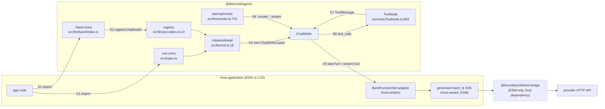
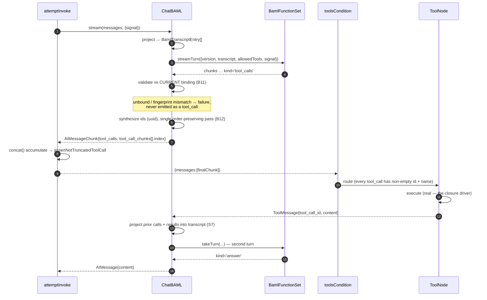
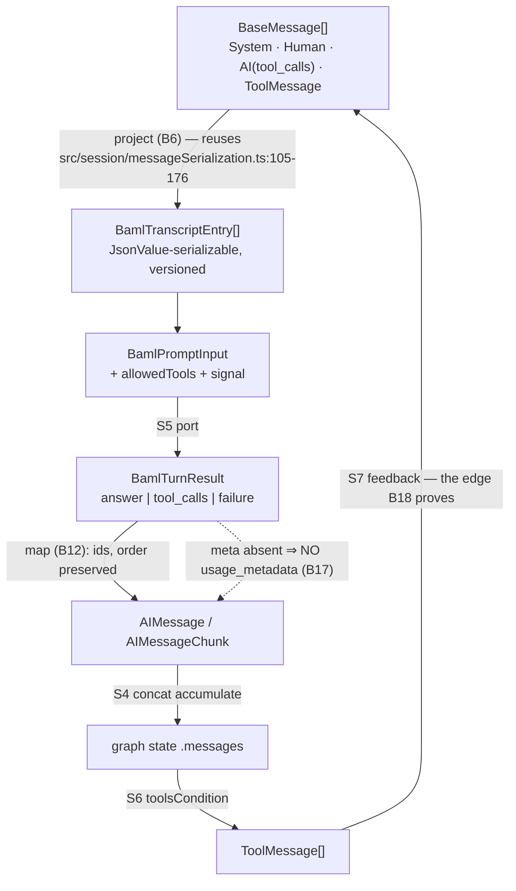

# `Providers.BAML` — TDD Implementation Plan (rev 3)

> **Revision 3** adds the System Map: context/sequence/data-flow diagrams and
> EBNF grammar for the contracts crossing each of the seven seams.
>
> **Revision 2** incorporates the plan review. All ten critical issues are
> resolved; the resolution table below maps each to where. Three findings
> **reversed** a rev-1 decision rather than refining it — flagged 🔄.

## Review resolution

| # | Critical issue | Resolution |
|---|---|---|
| 1 | Public type closure — enum-only slice can't typecheck | **B0** now lands the full typed surface *with* the enum. `ChatModelConstructorMap` is a mapped type over `Providers` (`src/types/llm.ts:200-202`), so `ProviderOptionsMap`/`ChatModelMap` entries are mandatory, not optional. All `as never` removed. |
| 2 | Port can't express its promises | Port replaced by a **versioned object contract** (`BAML_PORT_VERSION`, `BamlPromptInput`, `BamlTurnResult`, `BamlDeclaredTool`, `BamlCallMeta`) carrying declared tools, allowed subset, discriminated results, metadata, and `AbortSignal`. |
| 3 | No turn state machine | Collapsed `selectTools` + `answer` into **one `takeTurn`** returning a discriminated `answer \| tool_calls \| failure`. One provider round-trip per turn — removes the ordering, double-request, and tracing ambiguity entirely. **B7–B10** cover every outcome. |
| 4 | Unbound tool can reach ToolNode | **B11** — selections are validated against the immutable *current binding* before emitting; a declared-but-unbound or schema-incompatible name never becomes a `tool_call`. |
| 5 | Transcript not replay-safe; loop stops early | **B6** versions the transcript on the existing session model (`src/session/types.ts`, `src/session/messageSerialization.ts`). **B18** closes the full loop: user → selection → real ToolNode result → second turn → final answer. |
| 6 | Cancellation, cleanup, concurrency, ordering | **B13** (abort), **B14** (iterator close in `finally`), **B15** (immutable bindings, concurrent invocations), **B12** (order-preserving single-pass partition). |
| 7 | Usage contradiction | 🔄 **Reversed.** Usage is now carried honestly through optional `BamlCallMeta`; when the host supplies none, **no `usage_metadata` is emitted** — never fabricated zeros. B17 asserts absence. Langfuse suite added to gates. |
| 8 | Registry tests order-dependent and mutually impossible | **Registry isolation seam** (`__resetChatModelRegistry` snapshot/restore, test-only export) + one closure test against the production singleton. B2/B2b/B3/B4 no longer collide. |
| 9 | Packaged boundary untested; config desync | **B19** packed-package closure (ESM consumer + NodeNext type consumer against `@librechat/agents/baml`). `circular-deps.test.mjs` 13→14, `typesVersions`, `package-lock.json` all named in *Files touched*. |
| 10 | `withStructuredOutput` trap | **B16** — explicitly gated as unsupported this phase with a typed error; the title-support claim is narrowed to **completion mode** only. |

**Warnings also resolved:** `MISTRALAI` added to B3 (12 of 12 providers, enumerated from the enum). Property domains restricted to valid preconditions. B15 no longer described as synchronous. `functions` documented as non-serializable. Empty-stream outcome defined (B10). Public error classes added (B20). Host documentation added (B21). CJS-clean check added to a release-facing command, not CI-only. `bd init` decision surfaced.

### Three reversals

- 🔄 **`./baml` ships dual CJS+ESM, not ESM-only.** The review is right that rev 1's rationale stopped applying the moment `ChatBAML` imported no bridge. Worse, an ESM-only subpath beside a CJS root creates **two registries** — a real bug. Dual keeps the registry singular per module system. The *host's* generated adapter is still ESM; that is the host's constraint, not ours, and it belongs in docs (B21).
- 🔄 **The optional peer dependency is dropped.** This package never imports the bridge, so declaring a peer on it is metadata that claims a relationship that does not exist. Removed; the host owns the dependency. (Rev-1 B7 deleted.)
- 🔄 **`registerChatModel` stays internal.** Not exported from `src/index.ts`; the "benefits any out-of-tree provider" claim is withdrawn. Promoting it to a supported extension API is a separate, deliberate decision with its own versioning obligations.

---

## Overview

Add BAML as a provider: the registration seam that lets an out-of-tree provider
join the registry without the root barrel naming it, plus a `ChatBAML` that
handles tool-less calls, tool binding against a build-time-frozen union, and the
full tool loop.

Twenty-three behaviors (B0–B21, plus B2b). Three are BLOCKING closure tests.
Seven seams, each with a formal contract grammar — see [System Map](#system-map).

## Current State Analysis

`src/llm/providers.ts:22` is a static `Partial<ChatModelConstructorMap>` naming
every provider class; `getChatModelClass` (`:43`) throws
`Unsupported LLM provider: ${provider}` on a miss. `initializeModel`
(`src/llm/init.ts:18`) is the single construction site and only production
`bindTools` call (`:62`). `attemptInvoke` (`src/llm/invoke.ts:702`) is the single
call site — `model.stream()` `:858`, `model.invoke()` `:1042` — and threads
`config.signal` to providers (`:869`, `:1230`).

### Key discoveries

- **`ChatModelConstructorMap` is a mapped type over `Providers`**
  (`src/types/llm.ts:200-202`). Adding an enum member without matching
  `ProviderOptionsMap`/`ChatModelMap` entries is a compile error. This is why B0
  exists.
- **`config/circular-deps.test.mjs:56` asserts exactly 13 package entries**, and
  CI runs it (`.github/workflows/validate.yml:85-92`). A 14th entry breaks it.
- **`toolsCondition` has id-bearing requirements for `invalid_tool_calls`**
  (`src/tools/ToolNode.ts:5144-5160`).
- **A replay-safe message model already exists** — `src/session/types.ts:6-17`
  (`JsonValue`), `src/session/messageSerialization.ts:105-176`. The transcript
  reuses it rather than inventing a second one.
- **The alternate title path calls `withStructuredOutput`**
  (`src/utils/title.ts:42-59`, selected at `src/run.ts:1741-1744`).
- Test style: `@jest/globals`, `@/` aliases, real logic over mocks
  (`AGENTS.md:112-118`). `uuid@^11.1.1` already a dependency.

## The port contract

`ChatBAML` imports no bridge and owns no `.baml` files. It depends on a versioned
port; the host wires its generated SDK in.

```ts
export const BAML_PORT_VERSION = 1 as const;

export interface BamlDeclaredTool {
  readonly name: string;
  /** Stable fingerprint of the compiled schema; enables mismatch detection. */
  readonly schemaFingerprint: string;
}

export interface BamlPromptInput {
  readonly version: typeof BAML_PORT_VERSION;
  /** Versioned, replay-safe projection — see B6. */
  readonly transcript: readonly BamlTranscriptEntry[];
  /** The CURRENT bound subset, never the compiled superset. */
  readonly allowedTools: readonly string[];
  readonly signal?: AbortSignal;
}

export interface BamlCallMeta {
  readonly model?: string;
  readonly finishReason?: string;
  readonly inputTokens?: number;
  readonly outputTokens?: number;
}

export type BamlTurnResult =
  | { readonly kind: 'answer'; readonly text: string; readonly meta?: BamlCallMeta }
  | { readonly kind: 'tool_calls';
      readonly calls: readonly BamlSelectedTool[];
      readonly failures: readonly BamlToolFailure[];
      readonly meta?: BamlCallMeta }
  | { readonly kind: 'failure'; readonly failure: BamlToolFailure; readonly meta?: BamlCallMeta };

export interface BamlFunctionSet {
  readonly version: typeof BAML_PORT_VERSION;
  readonly declaredTools: readonly BamlDeclaredTool[];
  takeTurn(input: BamlPromptInput): Promise<BamlTurnResult>;
  streamTurn(input: BamlPromptInput): AsyncIterable<BamlTurnChunk>;
}
```

**Two contracts the host must honor, both load-bearing:**

1. **`takeTurn` must not reject for a per-tool failure** — failures are values in
   `failures[]`. This routes around upstream bug 1 (`catch` at an `await` site
   drops errors from any spawned task but the first, 60–90%). Verified
   deterministic via result union: 30/30 at four tasks, 20/20 at eight tasks with
   `TaskGroup(3)` and four failures. It rejects only for transport/abort.
2. **`meta` is optional and must never be fabricated.** Absent metadata means the
   chunk carries no `usage_metadata` (B17).

`functions` is executable and therefore **non-serializable** — session/run
reconstruction must re-inject it. Documented in B21.

## System Map

Seven seams. Every shape below is quoted from this repo's source, not inferred —
`node_modules` is not installed, so nothing about LangChain internals is assumed
beyond what existing provider subclasses demonstrate.

### System context



`@librechat/agents` never imports the bridge. The dashed edge is entirely
host-side — which is what keeps the CJS build clean (B19) and lets the whole test
suite run with the bridge absent.

### Registration sequence (B5, B19)

```mermaid
sequenceDiagram
  autonumber
  participant Host
  participant Baml as ./baml entry
  participant Reg as llmProviders
  participant Init as initializeModel
  participant CM as ChatBAML

  Host->>Baml: import '@librechat/agents/baml'
  activate Baml
  Note over Baml: module side-effect —<br/>the only shape that avoids a dynamic import
  Baml->>Reg: registerChatModel(BAML, ChatBAML)
  alt slot empty
    Reg-->>Baml: written once
  else same ctor
    Reg-->>Baml: no-op (idempotent)
  else different ctor
    Reg--xBaml: throw "Provider already registered: baml"
  end
  deactivate Baml

  Host->>Init: initializeModel({provider: BAML, clientOptions})
  Init->>Reg: getChatModelClass(BAML)
  Reg-->>Init: ChatBAML
  Init->>CM: new ChatBAML(clientOptions)
  opt tools.length > 0
    Init->>CM: bindTools(tools)
    CM-->>Init: bound Runnable (new object; receiver unmutated)
  end
  Init-->>Host: Runnable
```

Without the `./baml` import the root can still name `Providers.BAML`, and
`getChatModelClass` throws. B20's `BamlNotRegisteredError` exists to make that
diagnosable rather than cryptic.

### Tool-loop sequence (B18 — the blocking closure)



Red-at-seam: stop projecting prior `ToolMessage`s at S7 and the second turn cannot
see the result — the final answer loses it and B18 goes red.

### Data flow



The cycle `A → … → G → A` is the tool loop. B18 is the only test that traverses
it whole; everything else tests one edge.

---

## Seam grammar

EBNF for what crosses each seam. `?` optional, `*` zero-or-more, `|` alternation.
Terminals in `"quotes"`. Every production is grounded in a cited line.

### S1 — Package boundary (host ↔ published entries)

```ebnf
import-baml     = "import" , "'@librechat/agents/baml'" ;          (* side-effect *)
export-baml     = "ChatBAML" | baml-type ;
baml-type       = "BamlFunctionSet"    | "BamlClientOptions"
                | "BamlPromptInput"    | "BamlTurnResult"
                | "BamlTurnChunk"      | "BamlDeclaredTool"
                | "BamlSelectedTool"   | "BamlToolFailure"
                | "BamlCallMeta"       | "BamlTranscriptEntry"
                | "BAML_PORT_VERSION"  | baml-error ;
baml-error      = "BamlNotRegisteredError" | "BamlUnsupportedError"
                | "BamlToolNotBoundError" | "BamlPortVersionError" ;

exports-entry   = '"./baml"' , "{" , '"import"' , esm-path ,
                                    '"require"' , cjs-path ,      (* dual — rev 2 *)
                                    '"types"'   , dts-path , "}" ;
```
Contract: every referenced type is exported from `./baml`; a compile-only
consumer implements the port with **no** casts (B0). `typesVersions`
(`package.json:78-92`) mirrors the entry. `config/package-entries.mjs` gains the
14th key, and `config/circular-deps.test.mjs:56` moves 13 → 14.

### S2 — Registration (`./baml` ↔ registry)

```ebnf
register        = "registerChatModel" , "(" , provider , "," , ctor , ")" ;
provider        = ? member of Providers, src/common/enum.ts:87 ? ;
ctor            = ? ChatModelConstructorMap[P], src/types/llm.ts:200-202 ? ;

register-effect = write-once | no-op | reject ;
write-once      = ? slot empty  ? ;
no-op           = ? slot holds an identical ctor reference ? ;
reject          = ? slot holds a different ctor ? , "throw" ,
                  '"Provider already registered: "' , provider ;

resolve         = "getChatModelClass" , "(" , provider , ")" ;
resolve-result  = ctor | "throw" , '"Unsupported LLM provider: "' , provider ;
```
Contract: `getChatModelClass` (`src/llm/providers.ts:43-52`) is unchanged;
`llmProviders` stays `Partial<ChatModelConstructorMap>`. Test-only
`__resetChatModelRegistry()` snapshots/restores the map.

### S3 — Construction (`initializeModel` ↔ ChatBAML)

```ebnf
construct       = "new" , ctor , "(" , client-options , ")" ;       (* src/llm/init.ts:31 *)
client-options  = baml-client-options ;
baml-client-options =
      "functions"       , ":" , baml-function-set          (* REQUIRED *)
    , [ "model"         , ":" , string ]
    , [ "_lc_stream_delay" , ":" , number ]
    , base-chat-model-params ;

bind            = "bindTools" , "(" , graph-tools , ")" ;            (* src/llm/init.ts:62 *)
graph-tools     = ? GenericTool[] | BindToolsInput[] | GoogleAIToolType[],
                    src/types/graph.ts:330 ? ;
bind-result     = ? a NEW bound Runnable; receiver unmutated (B15) ? ;
```
Contract: single-argument constructor. `bindTools` is called only for a non-empty
list (`src/llm/init.ts:58-62`). The `override ?? new …` short-circuit at
`src/llm/init.ts:29-31` is preserved verbatim.

### S4 — Invocation (`attemptInvoke` ↔ model) — `t.ChatModel`, `src/types/graph.ts:44-53`

```ebnf
chat-model      = [ "stream" , ":" , stream-fn ] , "invoke" , ":" , invoke-fn ;
stream-fn       = "(" , messages , "," , config? , ")"
                  , "=>" , "Promise<AsyncIterable<AIMessageChunk>>" ;
invoke-fn       = "(" , messages , "," , config? , ")"
                  , "=>" , "Promise<AIMessageChunk>" ;   (* Chunk, not AIMessage *)

ai-message-chunk =
      [ "content"        , ":" , content ]
    , [ "tool_calls"     , ":" , tool-call*      ]
    , [ "tool_call_chunks" , ":" , tool-call-chunk* ]
    , [ "usage_metadata" , ":" , usage ]          (* first chunk only, IFF meta present *)
    , [ "response_metadata" , ":" , object ] ;

tool-call       = "id"   , ":" , non-empty-string        (* src/stream.ts:1693-1702 *)
                , "name" , ":" , non-empty-string
                , "args" , ":" , object
                , "type" , ":" , '"tool_call"' ;
tool-call-chunk = [ "id" ] , [ "name" ] , [ "args" , ":" , string ]
                , "index" , ":" , number ;                (* REQUIRED — src/stream.ts:1760 *)
```
Contract:
- Chunks must survive `concat()` from `@langchain/core/utils/stream`
  (`appendStreamChunk`, `src/llm/invoke.ts:656-672`).
- `attemptInvoke` filters out `tool_calls` entries with a falsy `name`
  (`:1032-1036`, `:1043-1046`) — an unnamed call is silently dropped, so B12 must
  always emit a name.
- `assertNotTruncatedToolCall` (`:1038`, `:1048`) throws `OutputTruncationError`
  when a truncation stop reason coincides with an open tool call.
- `tool_call_chunks[0].index` **must be numeric** or `handleToolCallChunks` is
  never reached (`src/stream.ts:1756-1761`).
- `config.signal` is inspected only for `StreamLimitExceededError`
  (`src/llm/invoke.ts:868-876`, `:1229-1234`); **general abort is the provider's
  responsibility**, threaded as `options.signal` into the port exactly as
  `src/llm/mistral/index.ts:26-30` does. That is what B13 tests.

### S5 — Port (ChatBAML ↔ host adapter)

```ebnf
port            = "version" , ":" , port-version
                , "declaredTools" , ":" , declared-tool*
                , "takeTurn"   , ":" , "(" , prompt-input , ")" , "=>" , "Promise<" , turn-result , ">"
                , "streamTurn" , ":" , "(" , prompt-input , ")" , "=>" , "AsyncIterable<" , turn-chunk , ">" ;

port-version    = "1" ;
declared-tool   = "name" , ":" , string , "schemaFingerprint" , ":" , string ;

prompt-input    = "version"      , ":" , port-version
                , "transcript"   , ":" , transcript-entry*
                , "allowedTools" , ":" , string*        (* CURRENT binding, not the superset *)
                , [ "signal" , ":" , "AbortSignal" ] ;

turn-result     = answer | tool-calls | failure ;
answer          = "kind" , ":" , '"answer"'     , "text"  , ":" , string , [ meta ] ;
tool-calls      = "kind" , ":" , '"tool_calls"' , "calls" , ":" , selected-tool*
                                                , "failures" , ":" , tool-failure* , [ meta ] ;
failure         = "kind" , ":" , '"failure"'    , "failure" , ":" , tool-failure , [ meta ] ;

selected-tool   = "name" , ":" , string , "args" , ":" , object ;
tool-failure    = "code" , ":" , failure-code , "message" , ":" , string , [ "toolName" , ":" , string ] ;
failure-code    = '"unbound"' | '"schema_mismatch"' | '"model_error"' | '"parse_error"' ;
meta            = "meta" , ":" , [ "model" ] , [ "finishReason" ]
                           , [ "inputTokens" ] , [ "outputTokens" ] ;
```
**Two host obligations, both load-bearing:**
1. `takeTurn` / `streamTurn` **must not reject for a per-tool failure** — failures
   are values in `failures[]`. Rejection is reserved for transport and abort.
   Routes around upstream bug 1 (a `catch` at an `await` site drops errors from
   any spawned task but the first, 60–90%). Result-union form measured
   deterministic: 30/30 at four tasks, 20/20 at eight with `TaskGroup(3)`.
2. `meta` is optional and **must never be fabricated**. Absent ⇒ no
   `usage_metadata` emitted (B17). Zeros would corrupt cost accounting.

`version` mismatch ⇒ `BamlPortVersionError` at construction. `functions` is
executable and therefore non-serializable — session restore must re-inject it.

### S6 — Graph routing (ChatBAML ↔ toolsCondition)

```ebnf
route-input     = ? last message of state.messages ? ;
route-decision  = tool-node | "END" ;
tool-node       = ? tool_calls non-empty
                    AND every entry has non-empty id AND non-empty name
                    AND not already in invokedToolIds ? ;    (* ToolNode.ts:5116-5131 *)
```
Contract: id uniqueness across a response is B12's invariant, including the same
tool selected twice. `invalid_tool_calls` carries its own id-bearing requirements
(`src/tools/ToolNode.ts:5144-5160`); this phase does not emit them — rejected
selections become `failures`, never `invalid_tool_calls`.

### S7 — Feedback (ToolNode ↔ next turn)

```ebnf
tool-message    = "tool_call_id" , ":" , non-empty-string
                , "content"      , ":" , content
                , [ "status" , ":" , '"success"' | '"error"' ] ;

feedback        = transcript-entry* ;                    (* B6 projection *)
transcript-entry= "role" , ":" , role
                , "content" , ":" , json-value
                , [ "toolCallId" , ":" , string ]
                , [ "toolCalls"  , ":" , selected-tool* ] ;
role            = '"system"' | '"user"' | '"assistant"' | '"tool"' ;
```
Contract: ordering preserved; every `tool-message.tool_call_id` pairs with the
`toolCalls[].id` emitted in the prior turn. Serialization reuses
`src/session/messageSerialization.ts:105-176` rather than a second model. This is
the edge B18's red-at-seam proof disables.

### Seam → behavior coverage

| Seam | Crosses | Behaviors | Closure |
|---|---|---|---|
| S1 | package boundary | B0, B19, B21 | **B19** |
| S2 | module registration | B1, B2, B2b, B3, B5, B20 | **B5** |
| S3 | construction | B0, B4, B15 | — |
| S4 | invocation | B7–B10, B12, B13, B14, B17 | — |
| S5 | host port | B0, B6, B9, B11, B16, B17 | — |
| S6 | graph routing | B11, B12 | **B18** |
| S7 | tool feedback | B6, B18 | **B18** |

---

## What We're NOT Doing

- No `.baml` files, codegen, or `baml generate` in this repo.
- No runtime-varying tool union (upstream bug 2).
- No prompt caching — `request_body`/`headers` unplumbed on 0.15.0.
- No `withStructuredOutput` — gated as unsupported (B16).
- No promotion of `registerChatModel` to a public extension API.
- Not touching existing `llmProviders` entries or `getChatModelClass`'s signature.

## Testing Strategy

- **Framework**: Jest + ts-jest, `*.test.ts` under `src/`.
- **Registry isolation**: `__resetChatModelRegistry()` — a test-only export that
  snapshots and restores `llmProviders`. Every registry test runs inside it.
  Exactly **one** closure test (B5) runs against the production singleton.
- **Fakes are real implementations of *our* port**, not mocks of BAML:
  `src/llm/baml/__tests__/fakeFunctionSet.ts`.
- **Packed-package tests** (B19) run post-build against a `npm pack` tarball.
- **No `as never`** anywhere — if a fixture needs a cast, the public type is wrong.

## Workflow Closure

Three BLOCKING closure tests. Anchors derive from the research doc's map.

### Closure B5: "importing the baml entry makes BAML usable"  [BLOCKING]

Crosses a module-registration boundary. No async edge → no driver.

- **SOURCE**: none
- **TRIGGER**: `import '@/llm/baml'` (production registration point; boundary = `highest_new_connector`)
- **DRIVERS**: none — synchronous span
- **OBSERVE**: `initializeModel({ provider: Providers.BAML, clientOptions })` (`src/llm/init.ts:18`)
- **FORBIDDEN SPAN**: never import/read/write `llmProviders`; never call `registerChatModel`; never construct `ChatBAML`
- **RED-AT-SEAM**: delete the `registerChatModel(...)` side-effect → `Unsupported LLM provider: baml` → red
- **DRIVABILITY**: registry is the injected store seam; no clock needed
- **EXECUTION**: in-process, no infra; fails closed if the entry does not resolve

### Closure B18: "a tool result feeds the next turn and produces a final answer"  [BLOCKING]

Crosses the graph's conditional-edge boundary **and** a second provider turn.

- **SOURCE (seed only)**: the injected `BamlFunctionSet` scripted responses
- **TRIGGER**: `attemptInvoke({ model, messages, provider: BAML })` (`src/llm/invoke.ts:702`)
- **DRIVERS**: `ToolNode.invoke` is the real synchronous driver for the tool edge — no sleeps, no mocks
- **OBSERVE**: the final `AIMessage.content` after the second turn
- **FORBIDDEN SPAN**: the test never hand-builds `tool_calls`, never calls
  `handleToolCallChunks`, never constructs the `ToolMessage` itself
- **RED-AT-SEAM**: stop projecting prior `ToolMessage`s into the transcript →
  the second turn cannot see the result → final answer lacks it → red
- **DRIVABILITY**: port is the injected seam; `ToolNode` runs real

### Closure B19: "the published subpath registers, from the packed package"  [BLOCKING]

Crosses the **packaging** boundary — the one B5 cannot see, because B5 imports a
source alias and can stay green while `exports`, the tsdown entry, the emitted JS
path, or the declaration path is broken.

- **SOURCE**: a `npm pack` tarball installed into a scratch consumer
- **TRIGGER**: `import '@librechat/agents/baml'` in an ESM consumer
- **DRIVERS**: none
- **OBSERVE**: the root package's `initializeModel` resolves `Providers.BAML` — proving both entries share one registry
- **FORBIDDEN SPAN**: no `@/` aliases, no `src/` paths — published artifacts only
- **EXECUTION**: post-build; **fails closed** if the tarball or entry is missing — never `describe.skip` to green

---

## Behaviors

Full Red/Green/Refactor cycles are given for the load-bearing behaviors. The
rest carry their complete spec (Given/When/Then, files touched, criteria); their
cycles follow the same shape.

### B0 — Public type closure lands with the enum  [replaces rev-1 B1]

**Given** the typed surface is added
**When** `npx tsc --noEmit` runs
**Then** it passes, with no `as never` anywhere

Adding `Providers.BAML` alone is a compile error, because
`ChatModelConstructorMap` is a mapped type over `Providers` requiring
`ProviderOptionsMap[BAML]` and `ChatModelMap[BAML]`. So one slice adds: the enum
member, `BamlClientOptions` (required `functions`; optional `model`,
`_lc_stream_delay`, `BaseChatModelParams`), the `ClientOptions` union member
(`src/types/llm.ts:141`), and both map entries (`:170`, `:185`).

**Edge cases**: absent `functions`; port version mismatch; unknown extra fields.
**Property**: no property — a fixed compile-time assertion.
**Files touched**: `src/common/enum.ts`, `src/types/llm.ts`, `src/llm/baml/types.ts`

#### 🔴 Red
A compile-only consumer that implements `BamlFunctionSet` **with no assertions**:
```ts
// src/llm/baml/__tests__/types.compile.test.ts
const options: BamlClientOptions = { functions: fakeFunctionSet(), model: 'x' };
expect(options.functions.version).toBe(BAML_PORT_VERSION);
```
Red because the types do not exist.

#### 🟢 Green
Add the enum member, the types module, and both map entries.

#### 🔵 Refactor
All BAML types live in one module re-exported from `./baml` — no type is
reachable only via a deep path. Checklist: no duplication (options extend
`BaseChatModelParams` rather than restating it), intent-revealing names, no new
branches, matches `src/types/llm.ts` conventions.

**Success criteria**: `npx tsc --noEmit` clean · `npx eslint src/` clean · no `as never` in the diff

---

### B1 — An unregistered provider stays inert

**Given** `Providers.BAML` exists and nothing registered it
**When** `getChatModelClass(Providers.BAML)`
**Then** throws `Unsupported LLM provider: baml`

Runs inside the registry-isolation seam. **Files**: `src/llm/__tests__/providers.registry.test.ts`

### B2 — Registration makes a provider resolvable

**Given** `registerChatModel(Providers.BAML, Ctor)` inside an isolated registry
**When** `getChatModelClass(Providers.BAML)` **Then** returns `Ctor`

**Files**: `src/llm/providers.ts`, `src/llm/__tests__/providers.registry.test.ts`

```ts
export function registerChatModel<P extends Providers>(
  provider: P,
  ctor: ChatModelConstructorMap[P],
): void {
  const existing = llmProviders[provider];
  if (existing === ctor) return;                                    // idempotent
  if (existing != null) {
    throw new Error(`Provider already registered: ${provider}`);    // never clobber
  }
  llmProviders[provider] = ctor;
}
```

Three explicit states, flat guards, write outside the condition — as the review's
CodeCleanup lens requires.

### B2b — Idempotent, never clobbering

Same ctor twice → silent. Different ctor → throws naming the provider. Built-in →
throws (no special branch needed; built-ins are already in the map).

**Property**: **Invariant** — for any provider **not already registered** and any
ctor, `register(p,c); register(p,c); get(p) === c`. Domain restricted to
unregistered providers — the rev-1 domain "any provider × any class" was false
for populated built-ins.

### B3 — All twelve built-ins undisturbed

Enumerated **from the `Providers` enum itself**, so a future provider cannot skip
the guard. Includes both `MISTRAL` and `MISTRALAI` (`src/llm/providers.ts:28-29`).
One named, type-checked fixture — no copied lists.

### B4 — A registered class flows through `initializeModel`

Instance of the registered ctor, constructed with `clientOptions`; `bindTools`
called only for a non-empty tool list (`src/llm/init.ts:58-62`). Preserves the
`override ?? new ...` short-circuit — explicitly **not** refactored.

### B5 — Importing the baml entry registers the provider  [BLOCKING CLOSURE]

Anchors above. The only test that touches the production singleton.

```ts
// src/llm/baml/index.ts
import { registerChatModel } from '@/llm/providers';
import { Providers } from '@/common';
import { ChatBAML } from './ChatBAML';

/**
 * Registration is a deliberate import side-effect: it is the only shape that
 * keeps the root barrel free of this provider without a dynamic import
 * (AGENTS.md:28). Do not "clean up" this statement.
 */
registerChatModel(Providers.BAML, ChatBAML);
export { ChatBAML };
export * from './types';
```

---

### B6 — The transcript projection is versioned and replay-safe

**Given** an ordered `BaseMessage[]` containing System, Human, AI-with-`tool_calls`, and matching `ToolMessage`s
**When** projected to `BamlTranscriptEntry[]`
**Then** roles, order, `tool_call_id` pairing, and args/results are preserved, and the result is `JsonValue`-serializable

**Edge cases**: empty history; complex content blocks; a `ToolMessage` with no
matching call; reasoning/thinking blocks; media; size bounds.

**Property**: **Roundtrip** — projecting and restoring preserves role order and
every `tool_call_id` pairing. Domain: message sequences built from the existing
session test factories, not raw primitives.

Reuses `src/session/messageSerialization.ts:105-176` rather than inventing a
second serialization model.

**Files**: `src/llm/baml/transcript.ts`, `src/llm/baml/__tests__/transcript.test.ts`

### B7 — Bound turn with no selected tools returns a final answer

**Given** a bound model whose `takeTurn` returns `{ kind: 'answer', text }`
**When** `invoke` **Then** an `AIMessage` with that text and **no** `tool_calls`

The rev-1 gap: a normal agent with tools bound would otherwise never produce text.

### B8 — Unbound turn returns an answer

The `generateTitle` / `generateActivityLabel` shape (`src/run.ts:1708,1996`) —
`initializeModel` with no tools. Real value before any tool machinery.

### B9 — A `failure` result surfaces as a typed error

`{ kind: 'failure' }` → a `BamlTurnError` carrying the failure code, catchable by
`attemptInvoke`'s existing handling.

### B10 — Streaming yields chunks; an empty stream is defined

Chunks concatenate; `getChunkContent` (`src/stream.ts:1286`) reads each. An
**empty** stream resolves to an `AIMessageChunk` with empty content — never
`undefined`, which `attemptInvoke` would otherwise drain to (`src/llm/invoke.ts:1032-1039`).

---

### B11 — Selections are validated against the current binding  [safety]

**Given** a function set declaring `['get_weather','web_search','run_code']`, bound to `['get_weather']`
**When** `takeTurn` returns a selection for `web_search`
**Then** it is **rejected** — recorded as a failure, never emitted as a `tool_call`

**And**: a name that matches but whose `schemaFingerprint` differs is rejected the same way.

The compiled superset is not the bound subset. Without this, a declared-but-unbound
tool routes to `ToolNode` and can reach host dispatch
(`src/tools/ToolNode.ts:4541-4568`).

**Property**: **Invariant** — for any selection set, every emitted `tool_call`
name is a member of the current binding. Domain: subsets of declared names plus
foreign names.

### B12 — Selected tools become `tool_calls` with unique ids, order preserved

Single **order-preserving pass** partitioning `Ok`/`Err` — not `filter` then
`map` then rescan. Ids generated in the transformation body, never inside a
predicate. Ids unique even for the same tool selected twice (`uuid@^11.1.1`).

**Property**: **Invariant** — ids unique across all `tool_calls`; successful
calls preserve source order. Domain: selections of size 0..n with interleaved failures.

### B13 — Abort propagates

Pre-abort → no port call. Mid-request abort → the port's `signal` fires and the
turn rejects. **No follow-on request starts after abort.** `config.signal` is
already threaded (`src/llm/invoke.ts:869`).

### B14 — Streams close cleanly

Consumer early-return and abort both close the async iterator in `finally`; the
injected operation is terminated. No parked iterator outlives the run.

### B15 — Bindings are immutable and invocation-local

Two differently-bound runnables derived from one base model, invoked
**concurrently**, do not cross-contaminate. `bindTools` returns a new binding;
it never mutates the receiver.

**Edge cases**: duplicate names in one `bindTools` call; same name different
schema; heterogeneous `GraphTools` shapes (`src/types/graph.ts:330`) — not a
uniform record.

### B16 — `withStructuredOutput` is explicitly unsupported this phase

**Given** a `ChatBAML`
**When** `withStructuredOutput(schema)`
**Then** throws `BamlUnsupportedError` naming the limitation and the workaround

BaseChatModel's inherited implementation binds a *synthetic* tool, which cannot
exist in a frozen compiled union — it would fail B11 at request time with a
confusing error. Failing at the call site is honest.

**Consequence, stated plainly**: `Run.generateTitle` supports BAML only in
`TitleMethod.COMPLETION` mode (`src/run.ts:1741-1744`), not the structured path.
Documented in B21.

### B17 — Usage metadata is carried, never fabricated

**Given** `meta` present **then** `usage_metadata` on the **first** chunk only,
matching every other provider (`src/llm/stream/chunkAdapters.ts:15-35` preserves
on split; it does not create).
**Given** `meta` absent **then** **no** `usage_metadata` field at all — not zeros.

### B18 — The full tool loop closes  [BLOCKING CLOSURE]

user → selection → **real `ToolNode`** execution → result in the transcript →
second turn → final answer containing the result. Anchors above.

---

### B19 — The published subpath works from a packed package  [BLOCKING CLOSURE]

Post-build, against `npm pack`:
- ESM consumer: `import '@librechat/agents/baml'` then root `initializeModel` resolves BAML — **one registry**
- CJS consumer: same, proving 🔄 the dual-format decision (rev 1's ESM-only subpath beside a CJS root would have created two registries)
- NodeNext type consumer: `BamlClientOptions` resolves through `exports.types` **and** `typesVersions`
- Negative: importing only the root leaves BAML unregistered

**Files touched**: `package.json` (`exports['./baml']` with `import`/`require`/`types`; `typesVersions`), `config/package-entries.mjs`, **`config/circular-deps.test.mjs` (13 → 14)**, `package-lock.json`, `test/package/**`

### B20 — Public errors are actionable

Stable typed errors, not message fragments: `BamlNotRegisteredError` (root
consumer used `Providers.BAML` without importing `./baml`, with the remediation
in the message), `BamlUnsupportedError`, `BamlToolNotBoundError`,
`BamlPortVersionError`.

### B21 — Host documentation ships with the feature

`docs/providers/baml.md`: installing the bridge (host-owned), wiring a generated
adapter to `BamlFunctionSet`, the two host contracts (no rejection for per-tool
failure; never fabricate `meta`), side-effect import order, frozen-tool limits,
`functions` non-serializability across session restore, the completion-mode-only
title caveat, and dual CJS/ESM behavior.

---

## Verification gates

Beyond per-behavior criteria, before this is done:

```
npm install && npm audit          # lockfile changed
npx tsc --noEmit
npx eslint src/
npx jest                          # full suite, bridge NOT installed
npx jest langfuse deterministic-trace-id   # AGENTS.md:155 — providers touch tracing
npm run test:circular-deps        # the 13→14 change
npm run build
npm run check:cjs-clean           # release-facing, not CI-only
node test/package/run.mjs         # B19 packed consumers
```

Langfuse is non-negotiable for a provider (`AGENTS.md:122-157`): a BAML
generation must be a `generation` observation with correct model attribution, and
a tool turn must produce a well-shaped `tool-dispatch` chain.

## Deferred — blocked, not dropped

| Behavior | Blocked by | Unblocks when |
|---|---|---|
| Runtime-varying tool union from `getToolsForBinding()` | upstream bug 2 (`output_format.rs:608`) | panic fixed — `$types: { T: { list: { union } } }` already parses |
| Streamed **tool-argument** deltas → `handleToolCallChunks` | needs the union; `$parse_stream` partials verified working | with bug 2 fixed |
| Prompt caching | `request_body`/`headers` unplumbed | those reach the wire |
| `withStructuredOutput` | frozen union vs. synthetic tool | runtime unions land |
| `registerChatModel` as a public extension API | deliberate scope decision | separate design |

## Decisions needed

1. **`fast-check`?** (tracked as `AF-d9m`) B2b, B3, B6, B11, B12 state real properties. No property
   framework in the repo. Add the dev dependency, or downgrade to table-driven
   examples? I will not add a dependency silently.
2. ~~`bd init`?~~ **Resolved** — beads is initialized. Tracking created:

   | Issue | Scope |
   |---|---|
   | `AF-la1` | epic — Providers.BAML port |
   | `AF-iur` | B0–B5 type closure + registration seam (closure **B5**) |
   | `AF-cob` | B6–B10 transcript + turn state machine |
   | `AF-abc` | B11–B17 tool binding, safety, cancellation, usage |
   | `AF-0km` | B18 full tool-loop closure **[BLOCKING]** |
   | `AF-z59` | B19–B21 packaged boundary, errors, docs (closure **B19**) |
   | `AF-d9m` | decision — fast-check |
   | `AF-ln0` | upstream bug 2 (blocks runtime unions) |
   | `AF-e82` | upstream bug 1 (designed around, not blocking) |

## References

- **Review**: `2026-08-09-15-57-tdd-providers-baml-phase0-REVIEW.md`
- Research: `thoughts/searchable/shared/research/2026-08-09-13-21-llm-interface-baml-integration.md`
- Scope: `thoughts/searchable/shared/plans/2026-08-09-providers-baml-port-scope.md`
- Spike (35+ green offline checks) + upstream issue repros: `../silmari-chat/scripts/baml-toolloop/`
- Patterns: `src/llm/providers.ts:22,43` · `src/llm/init.ts:18,29-31,58-62` · `src/llm/invoke.ts:702,858,869,1032-1039,1042` · `src/stream.ts:1286` · `src/tools/ToolNode.ts:4541-4568,5116,5144-5160` · `src/session/messageSerialization.ts:105-176` · `src/utils/title.ts:42-59` · `config/circular-deps.test.mjs:56` · `package.json:78-92`
