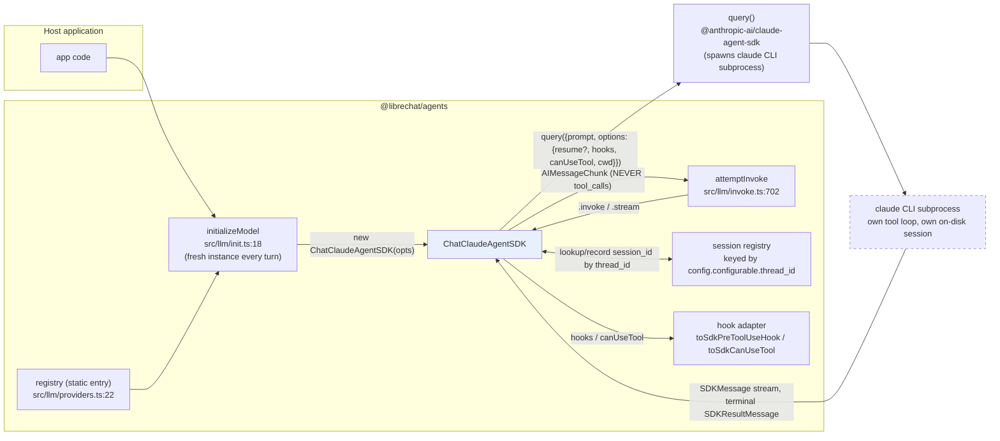
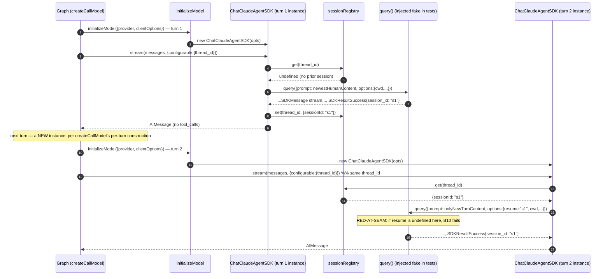
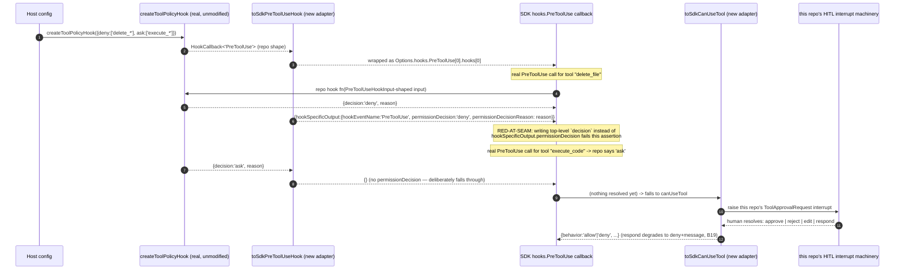

# `Providers.CLAUDE_AGENT_SDK` — TDD Implementation Plan (rev 1)

## Overview

Add the Claude Agent SDK as a `Providers` registry member: a `ChatClaudeAgentSDK`
that occupies the "main agent model" slot (registered statically, like
`CustomAnthropic` — the SDK is a **direct** dependency, not an optional
BAML-style port), where **one provider call is one bounded `claude` CLI
subprocess turn**, not one raw model completion. Unlike every existing provider
in this registry, the subprocess drives its **own** internal tool loop —
`tool_calls` are never emitted to the host graph — and the subprocess is
**stateful across calls** (an on-disk session, resumed by id), while every other
provider in this registry is stateless per call and every model instance in this
graph is reconstructed fresh on every turn (`Graph.ts:createCallModel`). Bridging
that mismatch — not tool binding, not packaging — is this plan's real risk.

Twenty-four behaviors (B0–B23). Two are BLOCKING closure tests: session
continuity across turns (B10) and hook/permission bridging (B17). Grounded in
[the research doc](../research/2026-08-13-10-38-claude-code-sdk-agent-provider.md)
(three architecture decisions + three follow-up design resolutions already made
there) and in the **real, installed SDK's `.d.ts` files** (`@anthropic-ai/claude-agent-sdk@0.3.233`,
verified by `npm pack` + direct extraction — two prior scraped-doc fetches
disagreed with each other on the result-message shape, so this plan does not
cite scraped docs for exact field names anywhere below).

## Current State Analysis

`src/llm/providers.ts:22` is a static `Partial<ChatModelConstructorMap>`; unlike
BAML, this provider is a **direct** dependency (already decided in the research
doc), so it is a plain object-literal entry like `CustomAnthropic`
(`src/llm/providers.ts:30`) — no `registerChatModel` side-effect, no separate
npm subpath, no packaging blocker. `getChatModelClass` (`:79-88`) throws
`Unsupported LLM provider: ${provider}` on a miss. `initializeModel`
(`src/llm/init.ts:18-63`) is the single construction site: `new
(getChatModelClass(provider))(clientOptions ?? {})` (`:31`), `bindTools` called
only for a non-empty tool list (`:58-62`). `attemptInvoke` (`src/llm/invoke.ts:702`)
is the single call site.

### Key discoveries

- **A fresh model instance is constructed on every turn, not once per
  conversation.** `initializeModel(...)` is called from inside
  `createCallModel(agentId)`'s returned node function (`src/graphs/Graph.ts:2400-2406`),
  which LangGraph invokes once per agent-loop turn. Every other provider is
  stateless per call, so this has never mattered before. It matters here:
  there is **no stable JS object** to hold a Claude Agent SDK `session_id`
  across turns — session continuity must be threaded through something that
  outlives the instance.
- **`config.configurable.thread_id` is this codebase's established stable
  per-conversation key**, already read in four places in `Graph.ts`
  (`:1801-1803, 3501, 4132, 4341`) for checkpointing/session purposes. This is
  the anchor the new provider uses to recover session continuity across the
  per-turn instance churn above — see "Session Continuity" below.
- **`zod` v4 compatibility is verified safe, not a blocker.** The installed
  SDK peer-depends on `zod: "^4.0.0"` (verified via `npm pack` + reading the
  real `package.json`, not the scraped doc). This repo currently has zod
  `3.25.67` present **transitively** (not a direct dependency — `grep -n
'"zod"' package.json` returns nothing). Every dependency that touches zod —
  `@langchain/core`, `@langchain/anthropic`, `@langchain/langgraph`,
  `@langchain/openai`, `@anthropic-ai/sdk`, `openai`, `zod-to-json-schema`,
  `@mistralai/mistralai` — already declares `zod: "^3.25.x || ^4.x"`. The
  **only** holdout is `@anthropic-ai/sandbox-runtime` (`zod: "^3.24.1"`,
  no v4 range) — already an optional peer/dev dependency
  (`package.json:271,274,283`), not a runtime requirement. Adding a direct
  `"zod": "^4.0.0"` to `package.json` should hoist a single v4 install for
  everything except sandbox-runtime, which npm nests its own v3 copy for —
  normal resolution, not a BAML-style ESM blocker. Verify with `npm ls zod`
  after install (B0's verification gate), not asserted here as zero-risk.
- **`@modelcontextprotocol/sdk` (the SDK's third peer dependency, `^1.29.0`)
  is not present anywhere in this repo today, even transitively** — a
  genuinely new dependency, confirmed via `package-lock.json` grep.
- **`SDKAssistantMessage.message` is a real Anthropic `BetaMessage`**
  (verified in the SDK's own `.d.ts`, not documented in either scraped-doc
  fetch) — the same content-block family `CustomAnthropic` already parses via
  `_makeMessageChunkFromAnthropicEvent` (`src/llm/anthropic/utils/message_outputs.ts`).
  Real reuse opportunity for B7's chunk translation, not a from-scratch parser.
- **The SDK's `SDKMessage` union has ~40 real variants**, not the 5-6 either
  prior doc-scrape implied (verified against the real `.d.ts`). Only a
  handful matter for host-visible translation (system/init, assistant,
  user/tool-result, partial-assistant, result); the rest are
  progress/telemetry noise the adapter buckets generically rather than
  enumerating exhaustively (B8).
- **No property-testing framework, by ratified decision.** `bd show AF-d9m`
  (closed 2026-08-10): "Ratified by user: no fast-check dependency... use
  table-driven property tests enumerating the stated domains." This plan's
  properties (B3, B11-style) follow that precedent — table-driven, not
  generative.
- Test style: `@jest/globals`, `@/` aliases, real fakes over mocks
  (`AGENTS.md:112-118`; `src/llm/__tests__/providers.registry.test.ts` is the
  live template this plan's registry tests extend directly — read in full,
  not paraphrased, before writing B1-B3).

## Package boundary — no blocker, unlike BAML

Unlike BAML's ESM-only packaging blocker (which forced a side-effect-registered
subpath), this provider is a **direct** dependency added to
`package.json`'s existing `dependencies` block, alongside `@anthropic-ai/sdk`
(`:234`, currently `^0.115.0`, already satisfies the SDK's `>=0.93.0`
peer range). Two new lines: `"@anthropic-ai/claude-agent-sdk": "^0.3.231"`
(pin the verified-live floor from the original research pass; do not float to
`latest` in the diff) and `"zod": "^4.0.0"` (newly direct — see zod finding
above). `@modelcontextprotocol/sdk` resolves transitively through the new
dependency's own peer chain; add it directly only if `npm install --strict-peer-deps`
complains.

No new npm subpath export, no `config/package-entries.mjs` entry, no
`config/circular-deps.test.mjs` count change — this is the same "static
built-in" shape as every provider except BAML.

## Session Continuity — the load-bearing architectural risk

This is the one design point that makes this integration genuinely unlike
every other provider in the registry, and unlike BAML's port pattern too.

**The mismatch.** LangChain's `BaseChatModel` contract hands a provider the
**full** running `BaseMessage[]` transcript on every call — every existing
provider is stateless and re-sends/re-derives everything from that array each
time. The Claude Agent SDK is the opposite: `query()` spawns a **stateful**
subprocess with its own on-disk session; a second turn in the _same_
conversation should call `query()` with `resume: <session_id>` and **only the
new** user-turn content — replaying the full history as a fresh prompt would
both lose the subprocess's own turn/cache continuity and make the model
re-answer/re-tool-call from scratch every turn.

**Why the JS instance can't hold `session_id`.** `createCallModel`
(`src/graphs/Graph.ts:2264`) calls `initializeModel(...)` fresh **inside** the
per-turn node function (`:2400-2406`) — every turn constructs a brand-new
`ChatClaudeAgentSDK`. There is no persistent object to stash `session_id` as
instance state.

**The resolution.** `config.configurable.thread_id` (already `attemptInvoke`'s
`config` parameter, and already read in four other places in `Graph.ts` for
exactly this "stable across turns, absent from the message array" purpose) is
the key into a small, injectable, process-local session registry
(`src/llm/claudeAgentSdk/sessionRegistry.ts`, `Map<threadId, {sessionId, cwd}>`).
On each call: look up `thread_id` → if found, pass `resume: sessionId` and
extract only the messages appended since the last call as the prompt; if not
found, start fresh with the latest human-turn content and record the
resulting `session_id` from the terminal `SDKResultMessage` under that key.

**Explicit limitation, not silently dropped:** this registry is
**process-local** — a host running multiple stateless server processes behind
a load balancer will not get continuity for a thread whose turns land on
different processes unless _that host_ also wires `sessionStore` (already a
thin pass-through per the research doc's resolved design) and persists
`session_id` externally itself. Documented in B23 (host docs), not solved by
this plan — same posture as BAML's port pattern leaving the real bridge to
the host.

## System Map



`tool_calls` never crosses from `CM` back into the graph — this provider's
edge to `ToolNode`/`toolsCondition` is structurally absent, unlike every other
provider (including BAML). `toolsCondition` always routes to `END` for this
provider's output.

### Session continuity sequence (B9, B10, B11 — B10 is the BLOCKING closure)



### Hook bridging sequence (B17-B19 — B17 is the BLOCKING closure)



## Seam grammar (the two novel seams only)

The construction/registration seam (S-REG) and invocation seam (S-INV) are
copies of the well-trodden static-provider pattern (`CustomAnthropic`) — no
fresh formalization needed, see B0-B2. The two genuinely novel seams get full
EBNF; the rest are specified at Given/When/Then grain in the Behaviors section.

### S-SESSION — session continuity (`ChatClaudeAgentSDK` ↔ `sessionRegistry` ↔ `query()`)

```ebnf
session-lookup  = "sessionRegistry.get" , "(" , thread-id , ")" ;
thread-id       = ? config.configurable.thread_id, src/graphs/Graph.ts:1801-1803 ? ;
lookup-result   = session-entry | "undefined" ;
session-entry   = "sessionId" , ":" , string , [ "cwd" , ":" , string ] ;

query-options   = [ "resume" , ":" , session-entry.sessionId ]
                , "cwd"      , ":" , string
                , "abortController" , ":" , AbortController
                , [ "hooks" , ":" , hook-map ]
                , [ "canUseTool" , ":" , CanUseTool ]
                , [ "sessionStore" , ":" , SessionStore ]      (* thin pass-through, B15 *)
                , [ "settingSources" , ":" , "[]" ]            (* multi-tenant isolation, B14 *)
                , [ "env" , ":" , env-map ] ;                  (* REPLACES process.env — must spread it, B14 *)

prompt-content  = ? lookup-result = undefined
                     ? newest-human-turn-content
                     : messages-appended-since-last-call ? ;

session-record  = "sessionRegistry.set" , "(" , thread-id , "," , session-entry , ")" ;
```

Contract: `session-record` fires from the **terminal** `SDKResultMessage.session_id`
only (both `SDKResultSuccess` and `SDKResultError` carry `session_id` —
record it on both, since an errored turn's session may still be resumable).
`prompt-content` on a resumed session **never** includes the full prior
transcript — the subprocess already has it via `resume`.

### S-HOOK — hook bridging (repo `HookCallback<'PreToolUse'|'PostToolUse'>` ↔ SDK `HookCallback`/`CanUseTool`)

```ebnf
repo-pretooluse-out = "decision"? , "reason"? , "updatedInput"? , "allowedDecisions"? ;
                      (* src/hooks/types.ts:370-397, PreToolUseHookOutput *)
decision            = "'allow'" | "'deny'" | "'ask'" ;         (* src/hooks/types.ts:36, ToolDecision *)

sdk-pretooluse-out  = [ "hookSpecificOutput" , ":" ,
                        "hookEventName" , ":" , "'PreToolUse'" ,
                        [ "permissionDecision" , ":" , sdk-decision ] ,
                        [ "permissionDecisionReason" ] ,
                        [ "updatedInput" ] ] ;
sdk-decision        = "'allow'" | "'deny'" | "'ask'" | "'defer'" ; (* real .d.ts: HookPermissionDecision *)

translate-allow     = decision:'allow'  -> permissionDecision:'allow' ;
translate-deny      = decision:'deny'   -> permissionDecision:'deny', permissionDecisionReason: reason ;
translate-ask       = decision:'ask'    -> "{}" ;               (* deliberately omit — see note *)

canUseTool-out      = "behavior" , ":" , "'allow'" , [ "updatedInput" ]
                    | "behavior" , ":" , "'deny'"  , "message" ;
                      (* real .d.ts: PermissionResult — NO third 'ask' branch *)

hitl-resolution     = "'approve'" | "'reject'" | "'edit'" | "'respond'" ;
                      (* src/types/hitl.ts:32-36, ToolApprovalDecisionType *)
translate-approve   = -> behavior:'allow' ;
translate-reject    = -> behavior:'deny', message: reason ;
translate-edit      = -> behavior:'allow', updatedInput: editedArgs ;
translate-respond   = -> behavior:'deny', message: responseText ;  (* degradation — NO SDK analog for "fake success" *)
```

Contract: `translate-ask` is deliberately a no-op (omits `permissionDecision`
entirely) rather than emitting `permissionDecision:'ask'`, because this
repo's research could not confirm from the SDK's docs what a **hook-level**
`'ask'` does procedurally (vs. an _ask rule_) without a live behavioral
check — see B18. Omitting it lets the SDK's own documented evaluation order
(hooks → deny rules → ask rules → permission mode → allow rules →
`canUseTool`) fall through to `canUseTool`, which **is** confirmed (real
`.d.ts`) to be the actual pause/HITL point. `translate-respond`'s degradation
to `deny` + the human's response text as `message` is a deliberate, honest
capability loss — there is no SDK shape for "skip execution, inject a canned
successful result," confirmed against the real `PermissionResult` union
(binary allow/deny only). Field-naming also differs and must be translated,
not just decision values: repo uses `toolName`/`toolInput`/`toolUseId`
(camelCase, `src/hooks/types.ts:79-92`); the real SDK uses
`tool_name`/`tool_input`/`tool_use_id` (snake_case, verified `.d.ts`).

## What We're NOT Doing

- No exposing this repo's local-coding-engine tools (`LocalCodingTools.ts`)
  via `createSdkMcpServer` — pure duplicate of Claude's built-ins, doubles
  policy enforcement for zero new capability (research doc, resolved 2026-08-15).
- No exposing programmatic-tool-calling or subagent delegation via
  `createSdkMcpServer` in this phase — additive, not duplicative, but deferred
  to a follow-up design pass (resolved 2026-08-15); not blocking this plan.
- No routing this provider's tool execution through this repo's `ToolNode` —
  Claude Code drives its own tool loop internally (research doc decision 2).
  `toolsCondition` never sees a `tool_call` from this provider.
- No accepting arbitrary graph-bound tools via `bindTools` in this phase —
  gated with a typed error instead (B3); wiring the graph's _own_ bound tools
  through `createSdkMcpServer` is a distinct, deferred question from "should
  we expose this repo's local-coding-engine tools" (the latter is answered
  no; the former is open — see Decisions Needed).
- No building a subprocess pool, scheduler, or concurrent-session limiter —
  explicitly a hosting-application concern per the SDK's own docs (research
  doc, resolved 2026-08-15).
- No `SessionStore` adapter implementation — accepted as a typed
  pass-through option only; the host owns the real backing store, same
  posture as BAML's port for the bridge package.
- No cross-process/cross-server session continuity — the session registry is
  process-local; documented as a host responsibility (B23), not solved here.
- No forwarding intermediate `SDKAssistantMessage` tool*use/tool_result
  content as host-visible progress events in this phase — only the model's
  own text/thinking commentary and the terminal result are surfaced (B7-B8).
  A `SubagentExecutor`-style `ON*\*\_UPDATE` progress channel is a plausible
  follow-up, not required for a working provider.
- Not touching existing `llmProviders` entries, `getChatModelClass`'s
  signature, or any other provider's behavior.

## Testing Strategy

- **Framework**: Jest + ts-jest, `*.test.ts` under `src/`, matching every
  other provider (including BAML).
- **Fakes are real implementations of the `query()` function signature** —
  an async generator yielding real `SDKMessage`-shaped fixture objects driven
  by the test — never a `jest.mock()` of the SDK package itself. Mirrors
  BAML's `fakeFunctionSet.ts` philosophy (`AGENTS.md:112-118`: real logic
  over mocks). Lives at `src/llm/claudeAgentSdk/__tests__/fakeQuery.ts`.
  `ChatClaudeAgentSDK`'s constructor accepts an internal `queryFn` override
  (defaulting to the real SDK's `query`) **purely as a test seam** — not a
  documented host-configuration option (hosts needing custom subprocess
  spawning already have the SDK's own public `spawnClaudeCodeProcess` option
  for that, passed straight through via `clientOptions`).
- **Properties are table-driven, not generative** — `AF-d9m` (closed
  2026-08-10) ratified no `fast-check` dependency for this repo; domains are
  enumerated explicitly per behavior.
- **No `as never`** anywhere in the diff — if a fixture needs a cast, the
  public type is wrong (same bar as BAML's B0).
- **Registry tests extend the existing template directly**
  (`src/llm/__tests__/providers.registry.test.ts`) rather than duplicating
  its structure in a new file — `BUILT_IN_PROVIDERS` grows to 13 automatically
  once the enum member exists (it's derived from `Object.values(Providers)`),
  so B1's assertion is `toHaveLength(13)`, not a new suite.

## Workflow Closure

Two BLOCKING closure tests. Anchors derive from the System Map above.

### Closure B10: "a second turn in the same conversation resumes the same subprocess session" [BLOCKING]

Crosses the per-turn model-reconstruction boundary (`createCallModel`
constructs a fresh instance every turn) via a store outside that instance —
the exact shape closure tests exist to catch (a naive test could assert
"the session registry has an entry" without ever proving a _second,
independently-constructed_ call actually reads it back and uses it).

- **SOURCE (seed only)**: the injected fake `query`'s scripted `SDKResultSuccess`
  responses (turn 1 returns `session_id: "s1"`; turn 2's fake just needs to
  exist to be called)
- **TRIGGER**: two separate `attemptInvoke({model, messages, provider:
CLAUDE_AGENT_SDK, config: {configurable: {thread_id: "t1"}}})` calls, each
  against a **freshly constructed** `ChatClaudeAgentSDK` instance (via
  `initializeModel`, not reused) — boundary = `highest_new_connector`, since
  this is the seam the whole plan exists to prove
- **DRIVERS**: none — synchronous async/await chain, no timers/queues/retries
- **OBSERVE**: the second fake `query` call's received `options.resume` field
- **FORBIDDEN SPAN**: the test never reads/writes the session registry's
  internal map directly, and never pre-seeds a `ChatClaudeAgentSDK` instance
  with a session id via a constructor param — continuity must flow only
  through the production call path (two real `initializeModel` +
  `attemptInvoke` round trips sharing one `thread_id`)
- **RED-AT-SEAM**: stop calling `sessionRegistry.set(...)` after turn 1 (or
  key the registry by something other than `thread_id`, e.g. a per-instance
  random id) → turn 2's fake `query` receives `resume: undefined` → the
  assertion goes red
- **DRIVABILITY**: the session registry is the injected store seam (accepts
  an explicit registry instance in tests, defaults to a module-level
  singleton in production) — fully synchronous span, no clock needed
- **EXECUTION**: in-process, no infra; fails closed if `resume` is ever
  `undefined` on the second call

### Closure B17: "a real tool-policy hook's decision reaches the SDK in the SDK's own shape" [BLOCKING]

Crosses the repo-hook-system ↔ SDK-hook-system translation boundary. Two
independently-evolving type systems must agree; a test that hand-constructs
the expected SDK output and never touches this repo's real hook config would
pass even if the actual translation were broken.

- **SOURCE (seed only)**: a real, unmodified `createToolPolicyHook({deny:
['delete_*']})` (`src/hooks/createToolPolicyHook.ts:129`, imported and
  called exactly as a host would, no stubbing)
- **TRIGGER**: `toSdkPreToolUseHook(theRealPolicyHook)` (production adapter
  factory, `src/llm/claudeAgentSdk/hookAdapter.ts`) — boundary =
  `highest_new_connector`
- **DRIVERS**: none — synchronous
- **OBSERVE**: invoking the returned SDK-shaped `HookCallback` with a
  `PreToolUseHookInput`-shaped fixture (`tool_name: 'delete_file'`, real SDK
  field names) and reading the returned `SyncHookJSONOutput.hookSpecificOutput.permissionDecision`
- **FORBIDDEN SPAN**: the test never hand-writes the expected
  `{hookSpecificOutput:{permissionDecision:'deny'}}` object and compares it
  against a _re-implementation_ of the mapping logic — it must exercise the
  real `createToolPolicyHook` + real adapter composition end to end
- **RED-AT-SEAM**: change the adapter to write the coarse top-level
  `decision: 'block'|'approve'` field instead of
  `hookSpecificOutput.permissionDecision` → the assertion on the granular
  field goes red (proves the test distinguishes the two real decision
  channels the SDK exposes, not just "some deny signal exists")
- **DRIVABILITY**: pure function composition, no store/clock seam needed
- **EXECUTION**: in-process, no infra

---

## Behaviors

Full Red/Green/Refactor cycles for the load-bearing behaviors (B0, B10, B17);
the rest carry complete Given/When/Then specs, files touched, and success
criteria at the same rigor BAML's plan used for its non-load-bearing behaviors.

### Phase 0 — Type closure & static registration

#### B0 — Public type closure lands with the enum

**Given** the typed surface is added **When** `npx tsc --noEmit` runs **Then**
it passes, with no `as never` anywhere.

`ChatModelConstructorMap` is a mapped type over `Providers`
(`src/types/llm.ts:205-206`) — adding `Providers.CLAUDE_AGENT_SDK` alone is a
compile error until `ProviderOptionsMap`/`ChatModelMap` both gain matching
entries. One slice adds: the enum member (`src/common/enum.ts:100`, after
`BAML`), `ClaudeAgentSDKClientOptions` (`src/llm/claudeAgentSdk/types.ts`),
the `ClientOptions` union member (`src/types/llm.ts:153`), and both map
entries (`:186`, `:202`).

**Edge cases**: missing `cwd` (defaults via `getLocalCwd`); `resume` +
`sessionId` both set (SDK's own precedence, not this provider's concern to
validate); unknown extra fields on `clientOptions`.
**Property**: no property — fixed compile-time assertion.
**Files touched**: `src/common/enum.ts`, `src/types/llm.ts`,
`src/llm/claudeAgentSdk/types.ts`, `package.json`, `package-lock.json`

##### 🔴 Red

```ts
// src/llm/claudeAgentSdk/__tests__/types.compile.test.ts
const options: ClaudeAgentSDKClientOptions = { cwd: '/tmp/x' };
expect(options.cwd).toBe('/tmp/x');
```

Red because `ClaudeAgentSDKClientOptions` and the enum member do not exist.

##### 🟢 Green

Add the enum member, `types.ts`, both map entries, the two new
`package.json` dependency lines (`@anthropic-ai/claude-agent-sdk: ^0.3.231`,
`zod: ^4.0.0`).

##### 🔵 Refactor

`ClaudeAgentSDKClientOptions` extends `BaseChatModelParams` rather than
restating shared fields, matching every sibling `*ClientOptions` type in
`src/types/llm.ts:97-141`. No duplication, no new branches, intent-revealing
field names matching the real SDK's own naming (`cwd`, `resume`,
`sessionId`, `sessionStore`, not renamed equivalents).

**Success criteria**: `npx tsc --noEmit` clean · `npx eslint src/` clean ·
`npm ls zod` shows a single resolved v4 for every consumer except
`@anthropic-ai/sandbox-runtime`'s own nested copy · no `as never` in the diff

---

#### B1 — Resolvable with zero extra imports, unlike BAML

**Given** the enum member and static registry entry exist **When**
`getChatModelClass(Providers.CLAUDE_AGENT_SDK)` is called from an import of
the root barrel alone **Then** it returns `ChatClaudeAgentSDK` — no
`registerChatModel` side-effect import required.

This is the deliberate opposite of BAML's B1 ("an unregistered provider
stays inert") — proving the "direct dependency ⇒ static entry" decision
actually holds, not silently regressing to BAML's opt-in shape.

**Files**: `src/llm/providers.ts` (new object-literal entry, alongside
`CustomAnthropic`), `src/llm/__tests__/providers.registry.test.ts` (extend
existing file, do not create a parallel one)

```ts
// src/llm/providers.ts — one new line in the existing object literal
import { ChatClaudeAgentSDK } from '@/llm/claudeAgentSdk';
export const llmProviders: Partial<ChatModelConstructorMap> = {
  // ...existing entries unchanged...
  [Providers.CLAUDE_AGENT_SDK]: ChatClaudeAgentSDK,
};
```

---

#### B2 — A registered class flows through `initializeModel`

Instance of `ChatClaudeAgentSDK`, constructed with `clientOptions`;
`bindTools` **never** called for an empty tool list — same contract as every
other provider (`src/llm/init.ts:58-62`), unchanged.

**Files**: `src/llm/claudeAgentSdk/ChatClaudeAgentSDK.ts`,
`src/llm/__tests__/providers.registry.test.ts`

---

#### B3 — Binding a non-empty tool list is explicitly gated, not silently ignored

**Given** a `ChatClaudeAgentSDK` **When** `bindTools([anyTool])` **Then**
throws `ClaudeAgentSDKToolsUnsupportedError` naming the limitation.

Mirrors BAML's B16 treatment of `withStructuredOutput` — an operation that
doesn't fit this phase's model, gated honestly at the call site rather than
silently accepting and dropping the tools (which would look like a working
integration until a host discovered its bound tools were never actually
reachable by the model). `initializeModel` calls `bindTools` for **any**
non-empty `tools` array regardless of provider (`src/llm/init.ts:58-62`), so
a host that configures this provider inside a graph with tools bound at the
agent level will hit this immediately and legibly, rather than the model
silently ignoring tools it was told about.

**Edge cases**: empty array (must NOT throw — `initializeModel` never calls
`bindTools` for `[]`, this is enforced by `:58`, not by this provider);
`withStructuredOutput` — also gated, same error class, same reasoning.
**Property**: no property — fixed error-path assertion.
**Files touched**: `src/llm/claudeAgentSdk/ChatClaudeAgentSDK.ts`,
`src/llm/claudeAgentSdk/errors.ts`

---

### Phase 1 — One turn, one bounded subprocess execution

#### B4 — An unbound turn returns a final answer

**Given** a `ChatClaudeAgentSDK` with a fake `queryFn` that yields only a
terminal `SDKResultSuccess{result: "hello"}` **When** `invoke([new
HumanMessage('hi')])` **Then** an `AIMessage` with content `"hello"` and
**no** `tool_calls` field.

Since B3 gates all tool binding, this is not "the no-tools-bound case among
several" (as BAML's B7 was) — it is the **only** invocation shape this
provider has in this phase.

**Files**: `src/llm/claudeAgentSdk/ChatClaudeAgentSDK.ts`,
`src/llm/claudeAgentSdk/__tests__/ChatClaudeAgentSDK.turn.test.ts`

---

#### B5 — Terminal success carries usage from `modelUsage`, never fabricated, and response metadata

**Given** a terminal `SDKResultSuccess` with `modelUsage: {'claude-sonnet-5':
{input_tokens: 100, output_tokens: 20}}`, `total_cost_usd: 0.01`, `session_id:
"s1"`, `num_turns: 3` **When** the stream completes **Then** the final chunk
carries `usage_metadata` derived from `modelUsage` (not the main-loop-only
`usage` field — the real `.d.ts` documents `modelUsage` as "the correct field
for token/cost accounting"), and `response_metadata.session_id`/`num_turns`/
`total_cost_usd` are set.

**Given** a terminal message with an all-zero or absent `modelUsage` for a
model that never actually ran (e.g. `error_max_budget_usd` before any model
call) **Then** no fabricated-zero `usage_metadata` is emitted — matching the
repo-wide convention (`src/llm/stream/chunkAdapters.ts:15-35`) and BAML's B17.

**Property (table-driven, not generative — `AF-d9m`)**: for each of
`{modelUsage present with >0 tokens, modelUsage present but empty object,
modelUsage absent}`, assert `usage_metadata` is present-and-nonzero,
present-and-zero-only-if-genuinely-zero, or absent — three explicit rows, no
generator.

**Files**: `src/llm/claudeAgentSdk/ChatClaudeAgentSDK.ts`,
`src/llm/claudeAgentSdk/usage.ts`

---

#### B6 — Terminal error surfaces as a typed error carrying the real subtype

**Given** a terminal `SDKResultError{subtype: 'error_max_turns', errors:
[...]}` **When** the stream is consumed **Then** a `ClaudeAgentSDKResultError`
is thrown, carrying `subtype` and `errors` verbatim (real subtype values:
`error_during_execution | error_max_turns | error_max_budget_usd |
error_max_structured_output_retries` — verified against the real `.d.ts`, not
either scraped-doc fetch), catchable by `attemptInvoke`'s existing error
handling the same way BAML's `BamlTurnError` is (B9 there).

**Files**: `src/llm/claudeAgentSdk/errors.ts`,
`src/llm/claudeAgentSdk/ChatClaudeAgentSDK.ts`

---

#### B7 — Streaming text/thinking content translates from the real `BetaMessage` shape

**Given** intermediate `SDKAssistantMessage`s whose `message: BetaMessage`
carries `text`/`thinking` content blocks **When** streamed **Then** each
translates to an `AIMessageChunk` content delta, reusing (or closely
mirroring) the existing Anthropic content-block parsing
(`src/llm/anthropic/utils/message_outputs.ts`) rather than a fresh parser —
`message` is verified to be a real `BetaMessage`, not a bespoke shape,
against the actual `.d.ts`.

**Edge cases**: an assistant message with `aborted: true` (truncated by
interrupt — surfaces the partial content, does not throw); an empty stream
(resolves to an `AIMessageChunk` with empty content, never `undefined`,
mirroring BAML's B10 treatment of the same `attemptInvoke` trap at
`src/llm/invoke.ts:1032-1039`).

**Files**: `src/llm/claudeAgentSdk/messages.ts`,
`src/llm/claudeAgentSdk/__tests__/messages.test.ts`

---

#### B8 — `tool_calls` are never emitted, on any chunk, ever — the negative behavior this whole integration hinges on

**Given** a fake `queryFn` whose stream includes real `SDKAssistantMessage`s
containing `tool_use` content blocks (the subprocess genuinely called Bash
internally) and matching `SDKUserMessage`s carrying the tool results **When**
the full stream is consumed **Then** **no** emitted `AIMessageChunk` ever
carries a non-empty `tool_calls` or `tool_call_chunks` field — this
provider's edge to `toolsCondition`/`ToolNode` is structurally absent, so
`toolsCondition` always routes to `END`.

Intermediate `tool_use`/`tool_result` pairs are **not** forwarded as
host-visible content in this phase (see "What We're NOT Doing") — only the
model's own text/thinking commentary (B7) and the terminal result (B4-B6)
are surfaced. This is a deliberate scope line, not an oversight; a future
`SubagentExecutor`-style progress channel is the documented follow-up.

**Property (table-driven)**: for each of `{no tool_use in stream, one
tool_use, three interleaved tool_use/tool_result pairs}`, assert `tool_calls`
is absent from every emitted chunk in all three rows.

**Files**: `src/llm/claudeAgentSdk/messages.ts`,
`src/llm/claudeAgentSdk/__tests__/messages.test.ts`

---

### Phase 2 — Session continuity

#### B9 — A first turn with no prior session starts fresh and records the new session id

**Given** an empty session registry for `thread_id: "t1"` **When**
`stream(messages, {configurable:{thread_id:'t1'}})` completes with a terminal
`SDKResultSuccess{session_id:'s1'}` **Then** `sessionRegistry.get('t1')`
subsequently returns `{sessionId:'s1'}`, and the fake `queryFn`'s received
`options.resume` on this **first** call was `undefined`.

**Files**: `src/llm/claudeAgentSdk/sessionRegistry.ts`,
`src/llm/claudeAgentSdk/ChatClaudeAgentSDK.ts`

---

#### B10 — A second turn in the same thread resumes the recorded session [BLOCKING CLOSURE]

Full spec in Workflow Closure above. Red/Green/Refactor:

##### 🔴 Red

```ts
// src/llm/claudeAgentSdk/__tests__/sessionContinuity.closure.test.ts
const registry = new SessionRegistry();
const calls: Array<{ resume?: string; prompt: unknown }> = [];
const queryFn = fakeQuery(
  [
    { resume: undefined, result: resultSuccess({ session_id: 's1' }) },
    { resume: 's1', result: resultSuccess({ session_id: 's1' }) },
  ],
  calls
);

registerChatModel(Providers.CLAUDE_AGENT_SDK, ChatClaudeAgentSDK); // if not yet static
const config = { configurable: { thread_id: 't1' } };

await attemptInvoke({
  model: initializeModel({
    provider: Providers.CLAUDE_AGENT_SDK,
    clientOptions: { queryFn, sessionRegistry: registry },
  }),
  messages: [new HumanMessage('turn 1')],
  config,
});

await attemptInvoke({
  model: initializeModel({
    provider: Providers.CLAUDE_AGENT_SDK,
    clientOptions: { queryFn, sessionRegistry: registry },
  }), // fresh instance, same registry
  messages: [
    new HumanMessage('turn 1'),
    new AIMessage('reply 1'),
    new HumanMessage('turn 2'),
  ],
  config, // same thread_id
});

expect(calls[1].resume).toBe('s1'); // red until session recording + lookup both exist
```

##### 🟢 Green

`ChatClaudeAgentSDK` reads `config.configurable?.thread_id` in `_generate`/
`_streamResponseChunks`, looks it up in the injected (or module-singleton)
`sessionRegistry`, passes `resume` when found, records `session_id` from the
terminal message on every call (success **and** error — an errored turn's
session may still be resumable).

##### 🔵 Refactor

Extracting "content appended since the last call" is its own pure function
(`extractNewTurnContent(messages, sessionFound)`) — not inlined into
`_generate` — so B9/B10/B11's differing prompt-construction paths (fresh vs.
resumed) stay independently testable and the checklist's "no duplication"
holds between the streaming and non-streaming call sites.

**Success criteria**: `npx jest sessionContinuity.closure` passes with the
real production call path (two `initializeModel` + `attemptInvoke` round
trips, no shortcuts) · deleting the `sessionRegistry.set(...)` call makes it
fail for the documented reason (`resume` becomes `undefined` on call 2)

---

#### B11 — A different thread never resumes another thread's session

**Given** sessions recorded for `thread_id: "t1"` and `"t2"` **When** a call
with `thread_id: "t2"` is made **Then** its `queryFn` call never receives
`t1`'s `session_id` as `resume`.

**Property (table-driven)**: `{same thread twice, two different threads,
missing thread_id (undefined — must not throw, must simply never resume)}`.

**Files**: `src/llm/claudeAgentSdk/sessionRegistry.ts`,
`src/llm/claudeAgentSdk/__tests__/sessionRegistry.test.ts`

---

#### B12 — The session registry is process-local and bounded, by design

**Given** more entries are recorded than the registry's bound (a small LRU,
e.g. 500 threads) **When** the bound is exceeded **Then** the oldest-unused
entry is evicted, not an unbounded memory leak — and eviction degrades to
B9's "fresh start" path, not an error.

**Files touched**: `src/llm/claudeAgentSdk/sessionRegistry.ts`

**Design note, not a test**: this bound is a safety valve for a
long-running host process, not a distributed-cache substitute — cross-process
continuity is out of scope (see "Session Continuity" section and B23).

---

### Phase 3 — Workspace, multi-tenancy, cancellation

#### B13 — `cwd` reuses the local coding engine's workspace resolution exactly

**Given** `clientOptions.workspace` matching `LocalExecutionConfig`'s shape
**When** a `query()` call is constructed **Then** `options.cwd` equals
`getLocalCwd(config)` (`src/tools/local/LocalExecutionEngine.ts:227-229`) —
reused directly, not reimplemented. `additionalDirectories` maps from
`getWorkspaceRoots(config)`'s non-root entries (`:240-260`).

**Explicit non-claim**: this does **not** route Claude Code's own built-in
tool executions (Bash, Read, Write, Edit) through this repo's
`resolveWorkspacePathSafe`/`getWriteRoots`/`getReadRoots` clamp — those run
entirely inside the subprocess, opaque to this library (decision 2). Setting
`cwd`/`additionalDirectories` only tells the SDK **where** its own tools may
operate; it is not this repo's path-safety code enforcing it.

**Files**: `src/llm/claudeAgentSdk/ChatClaudeAgentSDK.ts` (construction of
`Options`, reusing the imported `getLocalCwd`/`getWorkspaceRoots`)

---

#### B14 — Multi-tenant isolation options apply when configured, and `env` is spread correctly

**Given** `clientOptions.multiTenant: true` **When** `query()` is called
**Then** `options.settingSources` is `[]`, `options.env` includes
`CLAUDE_CONFIG_DIR` set to a per-tenant path **and** spreads `process.env`
first (the real `.d.ts` confirms `env` **replaces** the subprocess
environment wholesale, not merges — omitting the spread would silently drop
`PATH`/`HOME`/`ANTHROPIC_API_KEY` from the subprocess), and
`CLAUDE_CODE_DISABLE_AUTO_MEMORY` is `'1'`.

**Edge cases**: `multiTenant` unset (none of the above applied — single-tenant
default, matching every other provider's host-controls-everything posture).

**Files**: `src/llm/claudeAgentSdk/ChatClaudeAgentSDK.ts`

---

#### B15 — `sessionStore`, `resume` override, and `maxTurns` are thin pass-throughs

**Given** `clientOptions.sessionStore`/`resume`/`maxTurns` are set **When**
`query()` is called **Then** they are forwarded verbatim into `Options` — no
adapter, no validation beyond the type system. An explicit `resume` in
`clientOptions` takes precedence over the session registry's own lookup
(explicit host intent wins over this provider's own convenience cache).

**Files**: `src/llm/claudeAgentSdk/ChatClaudeAgentSDK.ts`

---

#### B16 — Abort propagates; no follow-on call after abort

**Given** `config.signal` is already aborted **When** `invoke` is called
**Then** no `query()` call is made. **Given** abort fires mid-stream **Then**
the query's own `AbortController` is signaled and the stream ends without a
follow-on `query()` call. Mirrors BAML's B13 treatment of the same
`config.signal` threading contract (`src/llm/invoke.ts:869`).

**Files**: `src/llm/claudeAgentSdk/ChatClaudeAgentSDK.ts`

---

### Phase 4 — Hook / permission bridging

#### B17 — Allow/deny decisions bridge to the SDK's granular decision channel [BLOCKING CLOSURE]

Full spec in Workflow Closure above. Red/Green/Refactor:

##### 🔴 Red

```ts
// src/llm/claudeAgentSdk/__tests__/hookAdapter.closure.test.ts
const policyHook = createToolPolicyHook({ deny: ['delete_*'] }); // REAL, unmodified
const sdkHook = toSdkPreToolUseHook(policyHook);

const out = await sdkHook(
  {
    hook_event_name: 'PreToolUse',
    tool_name: 'delete_file',
    tool_input: {},
    tool_use_id: 'x',
    session_id: 's',
    transcript_path: '/x',
    cwd: '/x',
  },
  'x',
  { signal: new AbortController().signal }
);

expect(out.hookSpecificOutput?.permissionDecision).toBe('deny'); // real SyncHookJSONOutput shape
```

##### 🟢 Green

`toSdkPreToolUseHook(repoHook)` wraps the repo `HookCallback<'PreToolUse'>`,
translates the real SDK's snake_case `PreToolUseHookInput` into this repo's
camelCase `PreToolUseHookInput` shape, calls the real hook, and writes the
result into `hookSpecificOutput.permissionDecision` (never the coarse
top-level `decision` field).

##### 🔵 Refactor

Field-name translation (`tool_name`→`toolName` etc.) is one small pure
function, not inlined — the same shape is needed again for `PostToolUse` in
B20, so extracting it now avoids duplicating it there.

**Success criteria**: `npx jest hookAdapter.closure` passes calling the real
`createToolPolicyHook`, not a stub

---

#### B18 — A hook-level 'ask' deliberately falls through to `canUseTool`, not a hook-level ask response

**Given** `createToolPolicyHook({ask: ['execute_*']})` returns `{decision:
'ask'}` **When** `toSdkPreToolUseHook` translates it **Then** the returned
SDK hook output omits `hookSpecificOutput.permissionDecision` entirely
(no `'ask'` written) — verified against the real `.d.ts`'s documented
evaluation order (hooks → deny rules → ask rules → permission mode → allow
rules → `canUseTool`), letting the call reach `canUseTool`, whose pause
behavior **is** confirmed.

**Documented gap, not silently assumed away**: whether a **hook** returning
`permissionDecision:'ask'` behaves identically to an _ask rule_ is
unconfirmed by any source this research could verify (real `.d.ts` declares
the type but not the procedural semantics). This behavior's design
deliberately avoids depending on that unconfirmed path rather than guessing.

**Files**: `src/llm/claudeAgentSdk/hookAdapter.ts`

---

#### B19 — `respond` HITL resolutions degrade honestly to a denial, never a fabricated success

**Given** a human resolves a paused `canUseTool` call with `respond`
(`responseText: "no relevant results"`) **When** `toSdkCanUseTool` returns
its `PermissionResult` **Then** it is `{behavior: 'deny', message: "no
relevant results"}` — **not** a synthesized "allow" — because the real
`PermissionResult` union (verified `.d.ts`) has no third branch for "skip
execution, inject a canned successful result."

**Property (table-driven)**: for each of `{approve, reject, edit, respond}`,
assert the exact `PermissionResult` produced: `approve`→allow;
`reject`→deny+reason; `edit`→allow+updatedInput; `respond`→deny+responseText
(the one lossy row, documented in B23).

**Files**: `src/llm/claudeAgentSdk/hookAdapter.ts`,
`src/llm/claudeAgentSdk/__tests__/hookAdapter.canUseTool.test.ts`

---

#### B20 — Bookkeeping fields with no SDK equivalent are synthesized, not silently dropped

**Given** this repo's `PreToolUseHookInput` carries `stepId`/`turn` fields
the real SDK's `PreToolUseHookInput` does not provide (verified `.d.ts`:
`tool_name`/`tool_input`/`tool_use_id` plus `BaseHookInput`'s
`session_id`/`transcript_path`/`cwd`/`prompt_id`/`permission_mode`/
`agent_id`/`agent_type`/`effort` — no `stepId`/`turn` equivalent) **When**
the adapter translates an inbound SDK hook call **Then** it synthesizes
`stepId`/`turn` from the provider's own call-site state (the session
registry's per-thread turn counter), not from the SDK.

**Files**: `src/llm/claudeAgentSdk/hookAdapter.ts`

---

### Phase 5 — Langfuse & cross-cutting

#### B21 — Langfuse generation observation is accurately shaped

**Given** a completed turn with `modelUsage`/`total_cost_usd`/`session_id`
**When** the run is traced **Then** a `generation` observation is produced
with correct model attribution and usage/cost from `modelUsage` (per
AGENTS.md's non-negotiable: "usage/cost is accurate per provider") — the
existing usage-metadata attachment from B5 is what Langfuse's existing
callback machinery already consumes generically; no new Langfuse-specific
code path, verified by the existing suite, not a new one.

**Success criteria**: `npx jest langfuse deterministic-trace-id` (the
existing suite, per AGENTS.md:155) passes unmodified with this provider
selected

---

#### B22 — Public errors are actionable

Stable, typed, exported from `src/llm/claudeAgentSdk/errors.ts`:
`ClaudeAgentSDKToolsUnsupportedError` (B3), `ClaudeAgentSDKResultError`
(B6, carries `subtype`/`errors`), `ClaudeAgentSDKSessionResumeError`
(thrown only if the SDK itself rejects an explicit `resume` — e.g. a stale
session id — surfaced rather than silently retried fresh, since silently
starting a new session under the same `thread_id` would be a surprising
behavior change for a host expecting continuity).

---

#### B23 — Host documentation ships with the feature

`docs/providers/claude-agent-sdk.md`: no host action needed for the
dependency itself (direct dependency, unlike BAML); the "no `tool_calls`
ever" behavior and its `toolsCondition`-always-`END` consequence; the
`thread_id`-keyed session-continuity contract and its process-local
limitation (cross-server hosts must wire `sessionStore` + persist
`session_id` externally); the `bindTools` gate (B3) and what it means for
hosts that configure tools at the agent level; the hook-bridging limitations
(`ask` falls through to `canUseTool`, `respond` degrades to a denial with
the response text as the message — B18, B19); the zod v4 compatibility note
for hosts also depending on `@anthropic-ai/sandbox-runtime`.

---

## Verification gates

Beyond per-behavior criteria, before this is done:

```
npm install && npm audit          # lockfile changed — new direct deps
npm ls zod                        # confirm single v4 resolution + sandbox-runtime's isolated v3 nest
npx tsc --noEmit
npx eslint src/
npx jest                          # full suite
npx jest claudeAgentSdk           # this provider's suite in isolation
npx jest langfuse deterministic-trace-id   # AGENTS.md:155 — providers touch tracing
npm run build
```

No packaged-boundary test (no `./claude-agent-sdk` subpath exists — direct
dependency, statically registered, same posture as `CustomAnthropic`).

## Deferred — blocked, not dropped

| Behavior                                                                          | Blocked by                                                                                                               | Unblocks when                                                                                               |
| --------------------------------------------------------------------------------- | ------------------------------------------------------------------------------------------------------------------------ | ----------------------------------------------------------------------------------------------------------- |
| Hook-level `'ask'` handled directly (not routed through `canUseTool`)             | unconfirmed SDK procedural semantics (B18)                                                                               | a live behavioral check against a real subprocess confirms what `permissionDecision:'ask'` does from a hook |
| Exposing arbitrary graph-bound tools via `createSdkMcpServer`                     | product decision on whether a Claude Code turn should see a caller's non-local-coding tools (open, see Decisions Needed) | that decision is made                                                                                       |
| Exposing programmatic-tool-calling / subagent delegation via `createSdkMcpServer` | deferred design pass (research doc, resolved 2026-08-15)                                                                 | follow-up plan                                                                                              |
| Cross-server session continuity                                                   | host-owned `sessionStore` + external `session_id` persistence                                                            | a specific host (e.g. LibreChat) needs it                                                                   |
| Forwarding intermediate tool_use/tool_result as host-visible progress             | scope line for this phase (B8)                                                                                           | a `SubagentExecutor`-style progress channel is designed                                                     |

## Decisions needed

1. **`bindTools` on non-empty tool list: hard error (this plan's choice, B3)
   vs. silently wiring the graph's bound tools through `createSdkMcpServer`?**
   This plan chose the honest-error path for v1 because the wiring question
   (LangChain `DynamicStructuredTool` → Zod schema → MCP `CallToolResult`)
   is real work with its own design surface, and a host that hits the error
   immediately knows to ask for it rather than silently getting a
   non-functional tool binding. Revisit if a concrete host need appears.
2. **Provider/class/directory naming** — `Providers.CLAUDE_AGENT_SDK =
'claudeAgentSdk'`, `ChatClaudeAgentSDK`, `src/llm/claudeAgentSdk/`. Picked
   for consistency with the npm package name (`@anthropic-ai/claude-agent-sdk`)
   and this repo's existing `Chat*` naming for directly-`BaseChatModel`-derived
   providers; not load-bearing, easy to rename before B0 lands.
3. **Session-registry bound (B12)** — proposed 500 threads / simple LRU.
   No measured basis; a host with different scale characteristics may want
   this configurable rather than a fixed constant. Left as a constructor
   option with the 500 default, not hardcoded.
4. Tracking: `bd create` issues per phase, one per closure test flagged
   `[BLOCKING]`, mirroring the BAML plan's `AF-*` breakdown — see session
   close for the created ids.

## References

- Research: `thoughts/searchable/shared/research/2026-08-13-10-38-claude-code-sdk-agent-provider.md`
  (three architecture decisions 2026-08-13 + three follow-up resolutions 2026-08-15)
- Ground-truth SDK types (verbatim from the real installed package, not
  scraped docs): extracted from `@anthropic-ai/claude-agent-sdk@0.3.233`'s
  `.d.ts` files via `npm pack` during this planning session — key excerpts
  quoted inline above (`Options`, `Query`, `SDKMessage` union, `SessionStore`,
  hook/permission types)
- Precedent (structurally closest prior plan): `2026-08-09-15-57-tdd-providers-baml-phase0.md`
  — port pattern, closure-test template, registry-isolation seam,
  table-driven-property convention (`AF-d9m`)
- Patterns: `src/llm/providers.ts:22,79-88` · `src/llm/init.ts:18-63` ·
  `src/graphs/Graph.ts:1801-1803,2264,2400-2406,3501,4132,4341` ·
  `src/llm/anthropic/index.ts:452,469` (static-provider pattern) ·
  `src/hooks/createToolPolicyHook.ts` (full file, unmodified, composed by
  the new adapter) · `src/hooks/types.ts:36,79-92,370-397,489-492,550` ·
  `src/types/hitl.ts:13-75` · `src/tools/local/LocalExecutionEngine.ts:227-260`
  · `src/llm/__tests__/providers.registry.test.ts` (test-style template)
