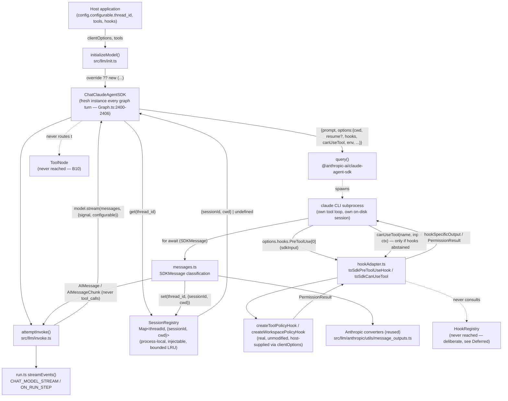
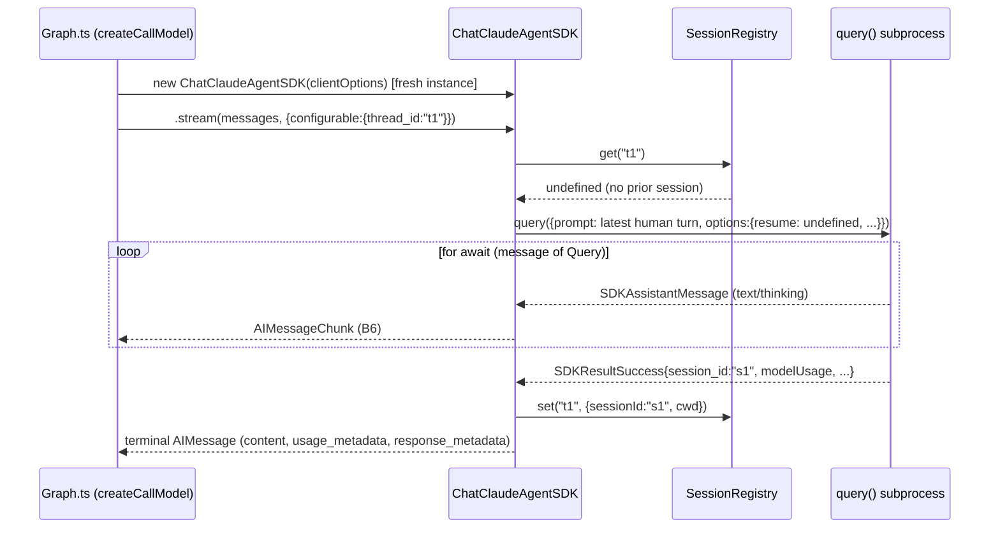
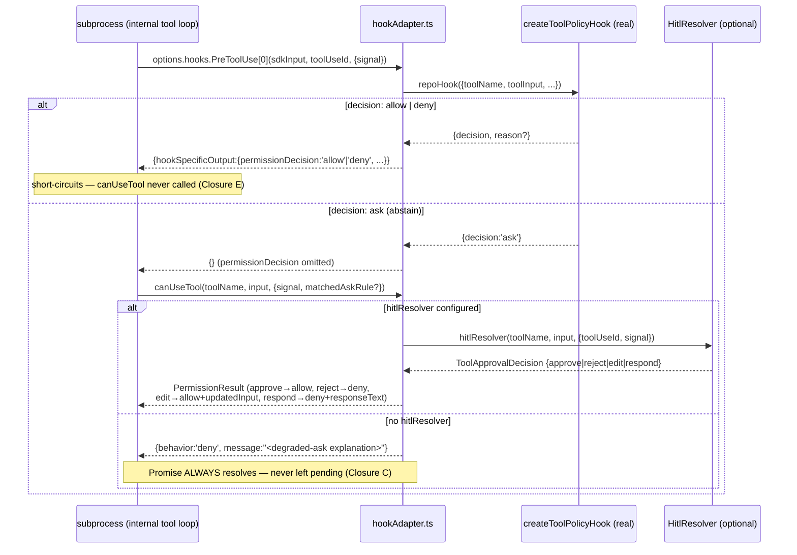
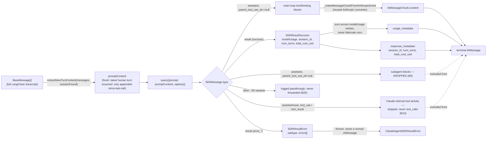

# `Providers.CLAUDE_AGENT_SDK` — TDD Implementation Plan (synthesis)

> Three sessions independently planned this exact feature within the same
> ~15-minute window and each wrote a full TDD plan
> (`2026-08-15-12-01-...`, `2026-08-15-12-02-...`, and an earlier draft of
> this file). This document merges them: the ground-truth SDK type
> extraction and the `ask`/`respond` architectural analysis from the
> `12-14` draft, the reused-Anthropic-converters insight and the
> `env`-replaces-not-merges gotcha from `12-01`, and the session-continuity
> risk (the single most important finding, present in neither of the other
> two) from `12-02`. All three are retained at their original paths as the
> historical record; this is the canonical plan going forward.

## Overview

Add the Claude Agent SDK (`@anthropic-ai/claude-agent-sdk`) as a
`Providers` enum member: a `ChatClaudeAgentSDK` that occupies the "main
agent model" slot (registered statically, like `CustomAnthropic` — the SDK
is a **direct** dependency, not an optional BAML-style port), where **one
provider call is one bounded `claude` CLI subprocess turn**, not one raw
model completion. Two properties make this unlike every existing provider
in the registry:

1. **The subprocess drives its own internal tool loop.** `tool_calls` are
   never emitted to the host graph; `toolsCondition` always routes to
   `END` for this provider.
2. **The subprocess is stateful across calls** (an on-disk session,
   resumed by id), while every model instance in this graph is
   reconstructed fresh on every turn (`Graph.ts`'s `createCallModel`,
   confirmed by direct read: its returned node function calls
   `initializeModel(...)` on every invocation, `:2400-2406`). Bridging that
   mismatch — not tool binding, not packaging — is this plan's central risk.

Three prior decisions from the research doc are inputs, not open questions:
direct SDK dependency, Claude Code owns its own tool loop, registered as a
`Providers` enum member. Twenty-seven behaviors (B0–B26). Five are BLOCKING
closure tests (Closure E is folded into B20/B21, not a new B-number).

## A note on sourcing

An early `WebFetch` of the SDK's TypeScript reference page and a second,
independent `WebFetch` of the _same_ page returned materially different and
partially contradictory type shapes (different `SDKMessage` variant names, a
fabricated `stop_reason` enum on the result message that doesn't exist).
`WebFetch` explicitly processes pages through a small, fast summarizing
model and warns results may be lossy — it is not a reliable source for exact
field names. Every type-level claim in this plan instead comes from running
`npm pack @anthropic-ai/claude-agent-sdk@latest`, extracting the real
tarball, and reading `sdk.d.ts`/`sdk-tools.d.ts` directly (verified at
version **0.3.233**). Re-verify against
`node_modules/@anthropic-ai/claude-agent-sdk/sdk.d.ts` once the dependency
is actually installed, since the version may have moved by then.

## Current State Analysis

`src/llm/providers.ts:22-36` is a static `Partial<ChatModelConstructorMap>`
object literal; every entry except `BAML` lives here directly (BAML
registers via `registerChatModel()` as an import side-effect specifically
because it is an _optional_ dependency this package must not statically
import). The direct-dependency decision means this provider carries no such
constraint — a normal static entry, like `CustomAnthropic`. No new npm
subpath export, no `config/package-entries.mjs` entry, no
`config/circular-deps.test.mjs` count change — none of BAML's packaging
machinery applies here.

### Key discoveries

- **`ChatBAML` is the only existing provider that extends `BaseChatModel`
  directly** (`src/llm/baml/ChatBAML.ts`); every other provider subclasses
  an upstream LangChain integration (`CustomAnthropic extends
ChatAnthropicMessages`, `src/llm/anthropic/index.ts:452`). With no
  upstream LangChain integration for the Claude Agent SDK, `ChatBAML` is
  this plan's structural template for class shape, not `CustomAnthropic`.
- **`ChatModelConstructorMap` is a mapped type over `Providers`**
  (`src/types/llm.ts:205-207`) — adding the enum member without matching
  `ProviderOptionsMap`/`ChatModelMap` entries is a compile error (B0).
- **`manualToolStreamProviders`** (`src/llm/providers.ts:38-41`, currently
  `{ANTHROPIC, BEDROCK}`) needs no entry for this provider — that set
  exists for providers whose streaming path needs manually-synthesized
  `tool_call_chunks`, and this provider never emits `tool_calls` at all
  (B10). Confirmed by omission, not by silence.
- **A fresh model instance is constructed on every graph turn, not once per
  conversation — confirmed by direct read, not inferred.**
  `createCallModel(agentId)` (`src/graphs/Graph.ts:2264`) returns an async
  node function; inside that function, `initializeModel({...})` is called
  on every invocation (`:2400-2406`, unless `this.overrideModel` is set).
  Every other provider is stateless per call, so this has never mattered
  before. It matters here: there is **no stable JS object** to hold a
  Claude Agent SDK `session_id` across turns — continuity must be threaded
  through something that outlives the instance. See "Session Continuity"
  below.
- **`config.configurable.thread_id` is this codebase's established stable
  per-conversation key** — confirmed present at exactly four other sites
  (`src/graphs/Graph.ts:1803,3501,4132,4341`) for checkpointing/session
  purposes, independent of the per-turn message array. This is the anchor
  this provider uses to recover session continuity.
- **`SDKAssistantMessage.message` is a real Anthropic `BetaMessage`**
  (`sdk.d.ts:3021-3070`, field `message: BetaMessage`) — the exact shape
  `@anthropic-ai/sdk`'s own Messages API returns, which
  `src/llm/anthropic/utils/message_outputs.ts` already converts to
  LangChain content (`getAnthropicUsageMetadata`, `_makeMessageChunkFromAnthropicEvent`,
  `anthropicResponseToChatMessages`). **This is the load-bearing reuse
  target for streaming translation** — adaptation of existing, tested code,
  not a new parser from scratch. The Red step for that behavior proves
  structural compatibility against the real installed types rather than
  assuming it; a version-skew content-block type is the realistic failure
  mode, not a wholesale mismatch.
- **`Options.env` REPLACES the subprocess environment entirely — it does
  not merge with `process.env`** (`sdk.d.ts:1461-1479`, explicit in the
  JSDoc). Any multi-tenant isolation option that sets `env` must spread
  `process.env` itself first, or the subprocess silently loses
  `PATH`/`HOME`/credentials — a real failure mode, not hypothetical.
- **`SDKResultMessage = SDKResultSuccess | SDKResultError`**, discriminated
  by `subtype` (`sdk.d.ts:4529-4600`) — `'success'` vs. four `error_*`
  variants. `stop_reason` is `string | null` and coexists with `subtype`; it
  is not the routing field and not a fixed enum, contradicting one of the
  two conflicting `WebFetch` summaries. `usage` is main-loop-only;
  `modelUsage` (per-model, includes subagents/sidechains) is documented in
  the SDK's own JSDoc as "the correct field for token/cost accounting" —
  `usage_metadata` must be derived from `modelUsage`, matching
  `AGENTS.md:146`'s "usage/cost is accurate per provider" invariant.
- **`SDKMessage` is a ~39-member union** (`sdk.d.ts:4273`), not the ~5-6
  members either scraped-doc summary implied. A provider cannot
  exhaustively switch on every member; this plan handles a named subset
  (`system`, `assistant`, `user`, `result`) plus an explicit unknown-type
  passthrough.
- **`canUseTool`'s return type has exactly two branches, `allow`/`deny` —
  no `ask` branch exists anywhere in the SDK's type system**
  (`PermissionResult`, `sdk.d.ts:2193-2205`). Its own JSDoc states
  permission prompts have **no park deadline** — "ask" is implemented by
  never resolving the Promise, not by a return value. A separate
  `matchedAskRule` field on `canUseTool`'s context object
  (`sdk.d.ts:254-265`) is set when an SDK-side `permissions.ask` rule
  (independent of this repo's hooks) forced the prompt — a host doing its
  own auto-approval logic should treat asks carrying this field as
  rule-forced, i.e. as expressing genuine human-prompt intent.
  `PreToolUseHookSpecificOutput.permissionDecision` is separately typed
  `HookPermissionDecision = 'allow' | 'deny' | 'ask' | 'defer'`
  (`sdk.d.ts:843`) — a _hook_ can return `'ask'`, but no comment anywhere in
  the shipped `.d.ts` states what happens procedurally afterward (types
  don't encode control flow). **Design decision**: this repo's `PreToolUse`
  adapter never emits `'ask'`/`'defer'` — it only ever resolves
  `'allow'`/`'deny'`, or abstains (omits `permissionDecision` entirely) when
  this repo's own policy says `'ask'`, letting the SDK's own documented
  evaluation order (hooks → deny rules → ask rules → permission mode →
  allow rules → `canUseTool`) fall through to `canUseTool` — the one
  extension point unambiguously confirmed to be the actual pause point.
  This sidesteps the hook-level `'ask'` ambiguity by construction.
- **Hook composability is a deliberate single-hook seam, not a
  `HookRegistry` integration — verified against the actual mechanism, not
  assumed.** `executeHooks` (`src/hooks/executeHooks.ts:476-478`) — the
  only place `deny > ask > allow` folding across _multiple_ hooks happens —
  requires a live `HookRegistry` instance as a non-optional parameter, plus
  per-call `runId`/`threadId`/`sessionId` context; its fold logic
  (`applyToolDecision` et al.) is module-private, not exported, so it
  cannot be reused standalone. `HookRegistry` access has never been given
  to a provider class before (`grep -rn "HookRegistry" src/llm/` returns
  zero non-test hits) — every existing holder (`ToolNode`,
  `SubagentExecutor`) receives it as an execution-layer constructor field
  sourced from `Run`/`Graph`, never through `clientOptions`, which
  `Graph.ts:2405` forwards to `initializeModel` completely unmodified (no
  assignment onto it anywhere in `Graph.ts`). Wiring a `HookRegistry`
  through to this provider would therefore mean either a `Graph.ts` change
  (this plan touches none) or a host-duplicated reference with no clean
  way to obtain per-call `runId`/`threadId` — a real architectural
  addition, not a Phase 0 wiring detail. **This phase instead mirrors
  `ChatBAML`'s own precedent** (`functions: BamlFunctionSet`, a
  host-supplied port through `clientOptions`, `ChatBAML.ts:43-56`):
  `clientOptions.preToolUseHook`/`postToolUseHook` each accept ONE
  already-resolved `HookCallback<'PreToolUse'|'PostToolUse'>`. A host
  wanting the same `deny > ask > allow` composition `ToolNode` gets across
  multiple hooks (e.g. `createToolPolicyHook` + `createWorkspacePolicyHook`)
  is responsible for composing them itself before passing the result in —
  documented explicitly in "What We're NOT Doing" and B26, not left
  ambiguous.
- **This repo's `ask`/`respond` HITL outcomes cannot reuse `ToolNode`'s
  graph-interrupt/checkpoint-resume mechanism as-is — confirmed
  structurally, not just suspected.** `ToolNode` raises this repo's
  `interrupt()` around a **graph-level** pending tool call: a control-flow
  signal that unwinds the entire call stack and checkpoints graph state so
  a _different_ invocation — possibly a different process, possibly days
  later — can resume it via `Run.resume(...)`. `canUseTool`'s Promise, by
  contrast, is awaited from **inside one live `query()` call's in-memory
  async-generator chain**; nothing in the SDK's types supports serializing
  a pending `canUseTool` call, and resolving it later requires the exact
  same process and the exact same live subprocess connection. Calling this
  repo's actual `interrupt()` primitive from inside a `canUseTool` callback
  would attempt to unwind past the very `query()` iteration that's awaiting
  the callback's own resolution — these two pause mechanisms do not
  compose. What **is** consistent with `canUseTool`'s "no park deadline"
  contract is a same-process, in-memory pending-request extension point
  (a `hitlResolver`) that something can plug into later; this plan ships
  the seam and its safe default (deny with an explanation when nothing is
  plugged in) but does not build a live human-response bridge — seat B23/B24.
- **`respond`** (this repo's HITL outcome that substitutes a canned tool
  result without executing) **has no SDK analog**: `PermissionResult` is
  binary allow/deny at every layer, with no "skip execution, inject a
  substitute result" branch. `respond` must degrade to `deny` with the
  human's response text as the message — a deliberate, honest capability
  loss, not a bug.
- **Zod v4 is a real but low-risk dependency shift, verified against the
  actual dependency graph, not assumed.** The SDK peer-depends on
  `zod: "^4.0.0"`; this repo has `zod@3.25.67` installed only
  _transitively_ today (no `package.json` entry). Every dependency that
  touches zod — `@langchain/core`, `@langchain/anthropic`,
  `@langchain/openai`, `@langchain/langgraph`, `@anthropic-ai/sdk`,
  `openai`, `@mistralai/mistralai`, `zod-to-json-schema` — already declares
  `zod ^3.25.x || ^4.x`. The one holdout, `@anthropic-ai/sandbox-runtime`
  (`zod ^3.24.1`, no v4 range), is already optional/lazily-loaded
  (`package.json:271,274,283`) and shares no module boundary with this
  provider's own zod usage; npm nests its own v3 copy for it, a normal
  resolution outcome, not a conflict. `@modelcontextprotocol/sdk` is a
  genuinely new dependency, absent even transitively today.
  **This dependency-graph check covers only third-party ranges, not this
  repo's own zod usage — a separate, real risk.** `zod` is imported
  directly by 10+ files under `src/` despite having no `package.json`
  entry (`src/types/run.ts:6` and others) — a phantom dependency that
  currently resolves whatever a transitive install happens to produce
  (`3.25.67` today). A bump to the resolved top-level `zod@4.x` changes
  what those files actually get at runtime, and zod v3→v4 has real
  breaking changes (error formatting, `.parse()` semantics, schema
  introspection) that no third-party range check can catch. B0's
  verification gate must exercise this repo's own direct zod call sites,
  not just confirm every dependency's declared range accepts v4.
- **No property-testing framework, by ratified decision** — `bd show
AF-d9m` (closed 2026-08-09, confirmed): "Ratified by user: no fast-check
  dependency... use table-driven property tests enumerating the stated
  domains." Every "Property" in this plan is table-driven, not generative.
- **`Options.toolAliases`** (`sdk.d.ts:1422-1447`) lets a host redirect a
  built-in tool name (e.g. `Bash`) to an MCP tool name at the
  name-resolution layer without changing what the model sees — a genuine,
  previously-undiscovered mechanism for enforcing this repo's own
  workspace/sandbox policy on Claude's built-in tools without duplicating
  them. Materially more promising than exposing this repo's own tools via
  `createSdkMcpServer` (already rejected). Listed under Deferred — it needs
  its own design pass, not a phase-0 addition.
- **`resolveWorkspacePathSafe` is a per-file-path check, not a session
  `cwd` resolver** (`src/tools/local/LocalExecutionEngine.ts:1319`) — it
  symlink-resolves and validates one candidate path against the workspace
  roots. The correct reuse target for a session's working directory is
  `getLocalCwd(config)` (`:227`), the same source of truth the local coding
  engine and sandbox use; `getWorkspaceRoots(config)`'s non-root entries map
  to the SDK's `additionalDirectories` option.
- **Test style**: Jest + ts-jest, `*.test.ts`, `@/` aliases,
  `@jest/globals` explicit imports, fakes-are-real-implementations over
  mocks (`AGENTS.md:112-118`). `src/llm/__tests__/providers.registry.test.ts`
  (269 lines, already extended once for BAML) is the live template this
  provider's registry behaviors extend directly, not a new file —
  `BUILT_IN_PROVIDERS = Object.values(Providers).filter(p => p !==
Providers.BAML)` grows to 13 automatically once the enum member exists;
  no BAML-style "stays inert until imported" test applies to a static
  entry.
- **Live/credentialed tests** that spawn a real `claude` CLI subprocess
  belong in `*.live.test.ts`, gated by an env var + `describe.skip` by
  default, matching the 9-file precedent
  (`src/specs/agent-handoffs.live.test.ts:20-24`, `package.json:210`'s
  `test:live:handoffs` script) — never a substitute for the BLOCKING
  closure tests below, which must pass by default against a fake.
- **Langfuse is non-negotiable for a provider** (`AGENTS.md:122-157`).

## Session Continuity — the load-bearing architectural risk

The one design point that makes this integration genuinely unlike every
other provider in the registry, and unlike BAML's port pattern too.

**The mismatch.** LangChain's `BaseChatModel` contract hands a provider the
**full** running `BaseMessage[]` transcript on every call — every existing
provider is stateless and re-derives everything from that array each time.
The Claude Agent SDK is the opposite: `query()` spawns a **stateful**
subprocess with its own on-disk session; a second turn in the same
conversation should call `query()` with `resume: <session_id>` and **only
the new** user-turn content — replaying the full history as a fresh prompt
would both lose the subprocess's own turn/cache continuity and make the
model re-answer from scratch every turn.

**Why the JS instance can't hold `session_id`.** As established above,
`createCallModel` constructs a brand-new `ChatClaudeAgentSDK` every turn.
There is no persistent object to stash `session_id` as instance state.

**The resolution.** `config.configurable.thread_id` is the key into a
small, injectable, process-local session registry
(`src/llm/claudeAgentSdk/sessionRegistry.ts`,
`Map<threadId, {sessionId, cwd}>`). On each call: look up `thread_id` → if
found, pass `resume: sessionId` and extract only the messages appended
since the last call as the prompt; if not found, start fresh with the
latest human-turn content and record the resulting `session_id` from the
terminal `SDKResultMessage` under that key — on **both** success and error
terminal messages, since an errored turn's session may still be resumable.

**Explicit limitation, not silently dropped**: this registry is
**process-local**. A host running multiple stateless server processes
behind a load balancer will not get continuity for a thread whose turns
land on different processes unless that host also wires `sessionStore`
(already a thin pass-through) and persists `session_id` externally itself —
documented in host docs (B26), not solved by this plan, the same posture
BAML's port pattern took toward the real bridge package.

**The registry's stored `cwd` is read back, not just written.** On a
resumed call, if `getLocalCwd(config)`'s freshly-resolved value differs
from the session's recorded `cwd`, `ClaudeAgentSDKSessionResumeError` is
thrown rather than silently resuming a subprocess session against a
different working directory than the one it was created in — the SDK's
own on-disk session state is tied to its original `cwd`, so a mismatch is
a real correctness hazard, not a cosmetic one. See B15.

## System & Interface Map

Diagrams and per-seam grammar for the chain summarized as ASCII art in
"Workflow Closure" below. Every node/seam name here matches that section's
Production Operation Chain and Closures A-E exactly — this is that same
chain rendered as pictures plus a formal contract per crossing, not a
parallel description.

### Component diagram



### Sequence: fresh turn, no prior session (B5, B11)



### Sequence: resumed turn, same thread (B12, Closure B; B15's cwd guard)

```mermaid
sequenceDiagram
    participant Graph as Graph.ts (createCallModel)
    participant CCA2 as ChatClaudeAgentSDK (2nd, fresh instance)
    participant SR as SessionRegistry
    participant SDK as query() subprocess
    Note over Graph,CCA2: Same thread_id="t1" — a DIFFERENT instance;<br/>Graph.ts reconstructs fresh every turn (confirmed Graph.ts:2400-2406)
    Graph->>CCA2: new ChatClaudeAgentSDK(clientOptions)
    Graph->>CCA2: .stream(messages, {configurable:{thread_id:"t1"}})
    CCA2->>SR: get("t1")
    SR-->>CCA2: {sessionId:"s1", cwd:"/repo"}
    alt getLocalCwd(config) !== recorded cwd
        CCA2--xGraph: throw ClaudeAgentSDKSessionResumeError (B15)
    else cwd matches
        CCA2->>SDK: query({prompt: only new turn content, options:{resume:"s1", ...}})
        SDK-->>CCA2: SDKResultSuccess{session_id:"s1", ...}
        CCA2->>SR: set("t1", {sessionId:"s1", cwd})
        CCA2-->>Graph: terminal AIMessage
    end
```

### Sequence: tool permission bridging (Closures C and E)



### Data flow: message classification pipeline (B6-B10, B25)



### Interface & Contract Grammar, per seam

Each block is the formal shape crossing that seam — cross-reference to the
behavior(s) that test it. `?` = optional, `|` = alternation, `[]` = array.

**Seam 1 — `initializeModel` → `ChatClaudeAgentSDK` construction (B0-B2)**

```
ClaudeAgentSDKClientOptions ::= BaseChatModelParams &
  { cwd? : AbsolutePath
  , workspace? : LocalWorkspaceConfig
  , queryFn? : QueryFn                    (* test seam, defaults to real `query` *)
  , sessionRegistry? : SessionRegistry    (* test seam, defaults to module singleton *)
  , sessionRegistryBound? : number        (* default 500 *)
  , preToolUseHook? : HookCallback<'PreToolUse'>
  , postToolUseHook? : HookCallback<'PostToolUse'>
  , hitlResolver? : HitlResolver
  , multiTenant? : boolean
  , sessionStore? : SessionStore          (* thin pass-through *)
  , resume? : SessionId                   (* explicit override, precedence over registry *)
  , maxTurns? : number
  }
construct(ClaudeAgentSDKClientOptions) -> ChatClaudeAgentSDK
  PRECONDITION:  none
  POSTCONDITION: instance has no session_id / no subprocess yet (lazy — B5)
```

**Seam 2 — `attemptInvoke` → `ChatClaudeAgentSDK.stream()` invocation (B5, B18)**

```
stream(messages: BaseMessage[], config: RunnableConfig) -> AsyncIterable<AIMessageChunk>
  config.configurable.thread_id? : ThreadId
  config.signal? : AbortSignal
  PRECONDITION:  config.signal not already aborted (else: zero query() calls)
  POSTCONDITION: exactly one query() call per stream(), or a thrown
                 ClaudeAgentSDK*Error before any query() call (B4, B15)
```

**Seam 3 — `ChatClaudeAgentSDK` ↔ `SessionRegistry` (B11-B14, Closure B)**

```
SessionEntry     ::= { sessionId : SessionId, cwd : AbsolutePath }
get(threadId : ThreadId) -> SessionEntry | undefined
set(threadId : ThreadId, entry : SessionEntry) -> void
INVARIANT: get() never mutates; a different threadId never returns another
           thread's entry (B13); size bounded by sessionRegistryBound,
           LRU-evicted past the bound (B14, degrades to fresh-start)
CONTRACT:  set() called on BOTH SDKResultSuccess and SDKResultError
           terminal messages (an errored turn's session may be resumable)
```

**Seam 4 — `ChatClaudeAgentSDK` → `query()` subprocess spawn (B15-B19)**

```
query(args) -> Query
  args.prompt        : string                     (* fresh or resumed content, per Seam 3 *)
  args.options.cwd            : AbsolutePath       (* = getLocalCwd(config), B15 *)
  args.options.resume?        : SessionId          (* from Seam 3, or clientOptions.resume override *)
  args.options.additionalDirectories? : AbsolutePath[]  (* = getWorkspaceRoots(config).slice(1) *)
  args.options.hooks?.PreToolUse?  : [SdkHookCallback]  (* Seam 6, iff clientOptions.preToolUseHook set *)
  args.options.hooks?.PostToolUse? : [SdkHookCallback]
  args.options.canUseTool     : SdkCanUseTool       (* Seam 7, always set *)
  args.options.abortController : AbortController    (* forwarded from config.signal *)
  args.options.env?           : Record<string,string>  (* REPLACES process.env — B16 must spread it first *)
  args.options.settingSources? : []                 (* iff multiTenant *)
  args.options.sessionStore?  : SessionStore         (* thin pass-through *)
  args.options.maxTurns?      : number
Query extends AsyncGenerator<SDKMessage, void>
```

**Seam 5 — `Query` async stream → message classification (Closure A, B6-B9, B25)**

```
SDKMessage ::= SDKSystemMessage
             | SDKAssistantMessage { message: BetaMessage, parent_tool_use_id: string | null }
             | SDKUserMessage      { message: BetaMessageParam, parent_tool_use_id: string | null }
             | SDKResultMessage
             | SDKMirrorErrorMessage        (* sourcing unconfirmed — see B17 *)
             | <~34 other unhandled variants>
classify(SDKMessage) -> MainLoopText | SubagentText(dropped) | ToolActivity(stripped) | Terminal | Unknown(logged)
INVARIANT: ToolActivity never becomes AIMessageChunk.tool_calls / .tool_call_chunks (B10, the
           single most important behavior in this plan)
```

**Seam 6 — subprocess ↔ `options.hooks.PreToolUse` (B20, Closure E)**

```
SdkHookCallback(sdkInput: PreToolUseHookInput, toolUseId: string, ctx: {signal}) ->
  Promise<{ hookSpecificOutput?: { hookEventName: 'PreToolUse'
                                  , permissionDecision?: 'allow' | 'deny'
                                  , permissionDecisionReason?: string
                                  , updatedInput?: Record<string,unknown> } }>
toSdkPreToolUseHook(repoHook: HookCallback<'PreToolUse'>) -> SdkHookCallback
  repoHook output ::= { decision?: 'allow'|'deny'|'ask', reason?, updatedInput?, allowedDecisions? }
  MAPPING: 'allow'/'deny' -> permissionDecision set (short-circuits, Seam 7 never reached)
           'ask'          -> permissionDecision OMITTED (abstain, falls through to Seam 7)
CONTRACT: field names translate both directions (camelCase <-> snake_case);
          deny+updatedInput drops updatedInput (nonsensical combination)
```

**Seam 7 — subprocess ↔ `canUseTool` fallback / HITL (B21-B22, Closure C)**

```
SdkCanUseTool(toolName: string, input: Record<string,unknown>,
              ctx: {signal, matchedAskRule?: boolean}) -> Promise<PermissionResult>
PermissionResult ::= { behavior: 'allow', updatedInput?, updatedPermissions? }
                    | { behavior: 'deny', message: string, interrupt?: unknown }  (* interrupt? unconfirmed, see B21 *)
toSdkCanUseTool(hitlResolver?: HitlResolver) -> SdkCanUseTool
  MAPPING (repo ToolApprovalDecision -> PermissionResult):
    approve            -> {behavior:'allow'}
    reject(reason?)     -> {behavior:'deny', message: reason}
    edit(updatedInput)  -> {behavior:'allow', updatedInput}
    respond(responseText) -> {behavior:'deny', message: responseText}   (* lossy by construction, B22 *)
    no hitlResolver     -> {behavior:'deny', message: <degraded-ask text>}
LIVENESS: the returned Promise always resolves — never left pending (Closure C)
```

**Seam 8 — message classification → terminal `AIMessage` (B5-B9, B24)**

```
assemble(MainLoopText[], SDKResultMessage) -> AIMessage | throws ClaudeAgentSDK*Error
  AIMessage.content          : string                       (* concatenated main-loop text/thinking *)
  AIMessage.tool_calls       : ABSENT (never present, not an empty array — B5)
  AIMessage.usage_metadata?  : { input_tokens, output_tokens, ... }  (* summed from modelUsage; omitted
                                                                         entirely if unavailable — B7 *)
  AIMessage.response_metadata : { session_id, num_turns, total_cost_usd }
  SDKResultError -> ClaudeAgentSDKResultError{subtype, errors}  (thrown, never a normal AIMessage — B8)
```

**Seam 9 — `attemptInvoke` → `run.ts` host-visible dispatch (B23)**

```
streamEvents(AIMessageChunk | AIMessage) -> GraphEvents.CHAT_MODEL_STREAM | ON_RUN_STEP
INVARIANT: unchanged from every other provider — this provider supplies no new event shape,
           only correctly-populated existing fields (usage/cost accuracy per AGENTS.md:146)
```

## Desired End State

`initializeModel({ provider: Providers.CLAUDE_AGENT_SDK, clientOptions })`
returns a `ChatClaudeAgentSDK` instance. `attemptInvoke`'s normal
`.stream()`/`.invoke()` path drives one bounded `query()` session per call:
`cwd` resolved via `getLocalCwd`, a second call in the same
`thread_id` resumes the first call's session, permission decisions bridged
to this repo's own hook system, and the terminal result surfaced as an
`AIMessage`/`AIMessageChunk` carrying text content, usage metadata (from
`modelUsage`), and session/cost `response_metadata` — **never**
`tool_calls`. A Langfuse `generation` observation is produced with correct
attribution.

### Observable behaviors

- Given client options with no tools bound, when invoked, then a final
  `AIMessage` with the session's text result and `usage_metadata`, never
  `tool_calls`.
- Given two `attemptInvoke` calls sharing one `thread_id`, each against a
  freshly-constructed model instance, when the second call is made, then
  the SDK receives `resume: <first call's session_id>`.
- Given a `PreToolUse` policy configured to deny a tool, when the (faked)
  subprocess attempts that tool, then `canUseTool` resolves `{ behavior:
'deny' }` with the policy's reason.
- Given a policy that would resolve `'ask'` and no `hitlResolver` is
  configured, when a Claude-internal tool call reaches it, then the call is
  denied with an explanatory message and the invocation completes — it
  never hangs.
- Given `bindTools([...])` is called, when invoked, then it throws a typed
  error naming the limitation.

## What We're NOT Doing

- No mid-session, resumable human-in-the-loop approval reusing `ToolNode`'s
  graph-interrupt/checkpoint-resume mechanism — structurally incompatible
  with `canUseTool`'s live-Promise model (see Key Discoveries). The
  `hitlResolver` extension point (B23) is the seam a same-process bridge
  would plug into; building that bridge is deferred.
- No exposing this repo's local-coding-engine tools, programmatic tool
  calling, or subagent delegation via `createSdkMcpServer` — the local
  bundle duplicates Claude's own built-ins and would double the
  policy-enforcement surface for no new capability; the two additive tools
  are deferred to a follow-up phase.
- No `toolAliases`-based redirection of Claude's built-ins to this repo's
  own sandboxed tools — a real, newly-discovered opportunity, explicitly
  deferred, not a phase-0 addition.
- No `spawnClaudeCodeProcess` sandbox routing — the SDK spawns its own
  subprocess; this phase passes `cwd`/`env` options into it, not an
  interception of the spawn itself.
- No subprocess pool, scheduler, or multi-tenancy scaling logic — the SDK's
  own hosting guidance places this on the embedding host, not this library.
- No cross-process/cross-server session continuity — the registry is
  process-local, documented as a host responsibility.
- No `SessionStore` adapter implementation — a typed pass-through only.
- No `HookRegistry` integration for Claude-internal tool calls — `clientOptions.preToolUseHook`/`postToolUseHook`
  each accept exactly one already-resolved hook callback (mirroring
  `ChatBAML`'s host-supplied-port precedent), not the multi-hook
  `deny > ask > allow` composition `ToolNode` gets automatically from a
  live `HookRegistry`. A host running both `createToolPolicyHook` and
  `createWorkspacePolicyHook` (the documented, intended composition — see
  Key Discoveries) must compose them into one callback itself before
  passing it to this provider; see Deferred and B26.
- No attempt to handle all ~39 `SDKMessage` union members — a named subset
  plus an explicit unknown-type passthrough.
- No forwarding of intermediate Claude-internal `tool_use`/`tool_result`
  activity as host-visible progress events in this phase — only the
  model's own text/thinking commentary and the terminal result are
  surfaced. A `SubagentExecutor`-style `ON_*_UPDATE` progress channel is a
  plausible follow-up, not required for a working provider.
- No streaming-input mode, mid-session `setPermissionMode`/`setModel`, or
  any `Query` control method beyond `interrupt()`/`close()` for
  cancellation — single-shot prompt mode only.
- Not touching existing `llmProviders` entries or any other provider's
  behavior.

## Testing Strategy

- **Framework**: Jest + ts-jest, `*.test.ts`, `@/` aliases, `@jest/globals`
  explicit imports — matching `src/llm/baml/__tests__/ChatBAML.cancellation.test.ts`'s
  conventions.
- **Fakes are real implementations of the `query()` function's contract**,
  never a `jest.mock()` of the SDK package. `ChatClaudeAgentSDK`'s
  constructor accepts an internal `queryFn` override (defaulting to the
  real SDK's `query`), purely a test seam — hosts needing custom subprocess
  spawning already have the SDK's own public `spawnClaudeCodeProcess`
  option for that, passed straight through. The fake is scripted to
  actually _call_ `options.canUseTool(...)`/`options.hooks.PreToolUse[...]`
  with real SDK-shaped arguments when it "wants" to run a tool, and to
  branch its subsequent yielded messages on the real returned decision —
  proving the adapter is wired end-to-end, not merely type-compatible.
  Mirrors BAML's `fakeFunctionSet.ts` philosophy exactly.
- **Properties are table-driven, not generative** (`AF-d9m`, ratified) —
  domains enumerated explicitly per behavior, no `fast-check` dependency.
- **Live suite (opt-in, not default)**: `*.live.test.ts`, env-var-gated,
  `describe.skip` by default, for real-subprocess drift detection and the
  one genuinely unconfirmed question (does a hook-level `'ask'` reach
  `canUseTool`?) that this plan's design deliberately never depends on the
  answer to.
- **No `as never`** — if a fixture needs a cast, the public type is wrong.
- **Registry tests extend the existing file** — no parallel registry test
  file.

## Workflow Closure

Five BLOCKING closure tests.

### Production Operation Chain

```
initializeModel({provider: CLAUDE_AGENT_SDK, clientOptions})
  -> new ChatClaudeAgentSDK(clientOptions)                          [fresh instance, every turn]
    -> attemptInvoke -> model.stream(messages, {signal, configurable:{thread_id}})
      -> sessionRegistry.get(thread_id) -> {resume?, promptContent}
      -> query({prompt, options:{cwd, resume?, hooks, canUseTool, abortController, env, ...}})
        -> [whenever the fake subprocess "attempts" a tool, hooks fire before canUseTool]
           options.hooks.PreToolUse[0](sdkInput, ...) -> toSdkPreToolUseHook(clientOptions.preToolUseHook)
             -> createToolPolicyHook (real, unmodified, host-supplied via clientOptions)
               -> hookSpecificOutput.permissionDecision returned to the fake query()
                  ('allow'/'deny' short-circuits; abstained falls through to canUseTool)
        -> for await (message of Query)                            [async subprocess-stream boundary]
          -> classify: assistant(main-loop) -> AIMessageChunk content (reused Anthropic converters)
             assistant(subagent, parent_tool_use_id!=null) -> dropped from final answer
             tool_use/tool_result (Claude-internal) -> never tool_calls
             result(success) -> terminal AIMessage + usage_metadata(modelUsage) + sessionRegistry.set
             result(error_*) -> typed error thrown, session_id still recorded
        -> [whenever the fake subprocess "attempts" a tool]
           canUseTool(toolName, input, {...}) -> hookBridge.toPermissionResult()
             -> createToolPolicyHook/createWorkspacePolicyHook (real, unmodified)
               -> PermissionResult{allow|deny} returned to the fake query()
      -> run.ts's streamEvents() loop dispatches CHAT_MODEL_STREAM / ON_RUN_STEP
```

### Closure A: ✅ DONE — "a Claude Agent SDK turn's message stream becomes an observable, correctly-classified final answer" [BLOCKING]

Crosses the async subprocess-message-stream boundary and the
`attemptInvoke` → `run.ts` event-dispatch boundary.

- **SOURCE (seed only)**: the fake `Query`'s scripted `SDKMessage[]` script
- **TRIGGER**: `attemptInvoke({ model, messages, provider: CLAUDE_AGENT_SDK })`
- **DRIVERS**: the fake `Query`'s own `for await` iteration
- **OBSERVE**: the final `AIMessage.content`/`usage_metadata` as consumed by
  `run.ts`'s `streamEvents()` handler, never a raw call to the translation
  function in isolation
- **FORBIDDEN SPAN**: never hand-construct an `AIMessageChunk`, never call
  the classification function directly, never independently recompute
  `modelUsage`'s sum and compare against a value not produced by the
  provider's own code
- **RED-AT-SEAM**: script a `subagent`-parented `SDKAssistantMessage` with
  distinctive text and disable subagent filtering → that text leaks into
  the final answer → red
- **DRIVABILITY**: the fake `Query` is the injected seam; no clock needed
- **EXECUTION**: in-process; fails closed if the script never yields a
  terminal `result`

### Closure B: ✅ DONE — "a second turn in the same thread resumes the first turn's session" [BLOCKING]

Crosses the per-turn model-reconstruction boundary via a store outside the
instance — the exact shape a closure test exists to catch (a weaker test
could assert "the registry has an entry" without proving a second,
independently-constructed call actually reads it back).

- **SOURCE (seed only)**: the fake `query`'s scripted `SDKResultSuccess`
  responses (turn 1 returns `session_id: "s1"`)
- **TRIGGER**: two separate `attemptInvoke(...)` calls sharing
  `config.configurable.thread_id`, each against a freshly-constructed
  `ChatClaudeAgentSDK` via `initializeModel` (never reused) — boundary =
  `highest_new_connector`, since this is the seam the plan exists to prove
- **DRIVERS**: none — synchronous async/await chain
- **OBSERVE**: the second fake `query` call's received `options.resume`
- **FORBIDDEN SPAN**: never read/write the session registry's internal map
  directly in the test; never pre-seed a session id via a constructor
  param — continuity must flow only through two real
  `initializeModel`+`attemptInvoke` round trips
- **RED-AT-SEAM**: stop calling `sessionRegistry.set(...)` after turn 1 (or
  key the registry by something other than `thread_id`) → turn 2's fake
  receives `resume: undefined` → red
- **DRIVABILITY**: the session registry is the injected store seam
  (explicit instance in tests, module-singleton default in production)
- **EXECUTION**: in-process; fails closed if `resume` is ever `undefined`
  on the second call

### Closure C: ✅ DONE — "a real tool-policy decision reaches the SDK in the SDK's own shape, and an 'ask' never hangs" [BLOCKING]

Crosses the repo-hook-system ↔ SDK-hook-system translation boundary and
proves a liveness property, not just correctness.

- **SOURCE (seed only)**: a real, unmodified `createToolPolicyHook({deny:
['delete_*'], ask: ['edit_file']})` — imported and called exactly as a
  host would, never stubbed
- **TRIGGER**: the fake `Query` invokes `options.canUseTool('delete_file',
...)` and, separately, `options.canUseTool('edit_file', ...)`
- **DRIVERS**: the fake's own invocation of `canUseTool` is the real
  synchronous driver for the async permission-callback edge
- **OBSERVE**: for `delete_file`, the returned `PermissionResult` is
  `{behavior:'deny', message}` naming the policy reason; for `edit_file`
  (an `'ask'` policy outcome with no `hitlResolver` configured), the
  returned `PermissionResult` is _also_ `{behavior:'deny', message}` but
  with language distinguishing it as a degraded-ask outcome — **and both
  Promises resolve within the test's normal timeout**, never left pending
- **FORBIDDEN SPAN**: never call the adapter function directly with a
  hand-built input — must go through the real `canUseTool` invocation as
  the fake performs it; never hand-write the expected SDK output and
  compare against a reimplementation of the mapping logic
- **RED-AT-SEAM**: (a) remove the adapter's call into the real policy hook,
  hardcode `allow` → the scripted deny is never consulted → red; (b) change
  the adapter to `return new Promise(() => {})` for the no-`hitlResolver`
  ask case → the test times out → red
- **DRIVABILITY**: `createToolPolicyHook` is the injected seam; no clock
  needed (a completion proof, not a timing proof)
- **EXECUTION**: in-process, no infra

### Closure D: "bindTools throws before any SDK call is made" [BLOCKING — safety]

Not an async/registration-crossing closure by the framework's default
classification rule, named BLOCKING here because the failure mode (tools
silently ignored) is high-cost enough to warrant a closure-style proof that
no SDK call occurs.

- **SOURCE**: none
- **TRIGGER**: `initializeModel({ provider: CLAUDE_AGENT_SDK, clientOptions, tools: [oneTool] })`
- **DRIVERS**: none — synchronous
- **OBSERVE**: the thrown error's type; the fake `queryFn` constructor spy
  was never called
- **FORBIDDEN SPAN**: never call `bindTools` directly, bypassing
  `initializeModel`
- **RED-AT-SEAM**: make `bindTools` a silent no-op → `initializeModel`
  returns a model as if tools were bound → red (nothing observes the
  missing throw)
- **DRIVABILITY**: no clock needed
- **EXECUTION**: in-process, no infra

### Closure E: ✅ DONE — "a real PreToolUse hook decision reaches the SDK's `hooks.PreToolUse` channel and is consulted before `canUseTool`" [BLOCKING]

Crosses the same repo-hook-system ↔ SDK-hook-system translation boundary
as Closure C, but for the `hooks.PreToolUse` extension point rather than
`canUseTool` — proves the wiring `B20`'s adapter alone cannot: that
`clientOptions.preToolUseHook`, once set, actually lands inside
`Options.hooks.PreToolUse` on the real `query()` call, and that the SDK's
documented evaluation order (hooks before `canUseTool`) is real in this
provider's own wiring, not merely asserted in prose.

- **SOURCE (seed only)**: a real, unmodified `createToolPolicyHook({deny:
['delete_*']})` passed as `clientOptions.preToolUseHook` — imported and
  configured exactly as a host would, never stubbed
- **TRIGGER**: `attemptInvoke({model, messages, provider:
CLAUDE_AGENT_SDK})` where `model` was constructed with
  `clientOptions.preToolUseHook` set
- **DRIVERS**: the fake `Query`'s own invocation of
  `options.hooks.PreToolUse[0](sdkInput, toolUseId, {signal})` is the real
  synchronous driver for the async hook-callback edge
- **OBSERVE**: (a) `Options.hooks.PreToolUse` is a non-empty array on the
  `query()` call the fake received, present _because_
  `clientOptions.preToolUseHook` was set; (b) the returned
  `hookSpecificOutput.permissionDecision` matches the real policy hook's
  `'deny'` decision for `delete_file`; (c) for that same call, the fake's
  `options.canUseTool` is never subsequently invoked — proving the hook
  short-circuits before `canUseTool` is reached, per the SDK's documented
  evaluation order
- **FORBIDDEN SPAN**: never call `toSdkPreToolUseHook`'s returned function
  directly with a hand-built input (that is B20's Tier-2 unit test, not
  this closure) — must go through the real `options.hooks.PreToolUse[...]`
  invocation as the fake performs it; never hand-construct the expected
  SDK output and compare against a reimplementation of the mapping logic
- **RED-AT-SEAM**: remove the `Options.hooks` construction from
  `ChatClaudeAgentSDK`'s `query()` call (leave only `canUseTool` wired) →
  the fake's `options.hooks` is empty/undefined even though
  `clientOptions.preToolUseHook` was set → red
- **DRIVABILITY**: `createToolPolicyHook` is the injected seam (same as
  Closure C); no clock needed
- **EXECUTION**: in-process, no infra

---

## Behaviors

Full Red/Green/Refactor cycles are given for the load-bearing behaviors
(B0, B4, B10, B12, B20, B22); the rest carry complete Given/When/Then
specs, files touched, and success criteria at the same rigor.

### Phase 0 — Type closure & static registration

#### B0 — ✅ DONE — Public type closure lands with the enum; dependencies verified compatible

**Given** the typed surface and dependencies are added
**When** `npm install && npm ls zod` and `npx tsc --noEmit` run
**Then** install succeeds with a single top-level `zod@4.x` (except
`@anthropic-ai/sandbox-runtime`'s own isolated nested v3 copy), no
`ERESOLVE`, and typecheck passes with no `as never`

**Edge cases**: `zod` resolving to two copies is the _expected_, asserted
outcome, not a failure to investigate away.
**Property**: no property — fixed compile/install-time assertion.
**Dependency pin policy**: `@anthropic-ai/claude-agent-sdk` is pinned to
the exact tarball-verified version (`0.3.233`), not a caret range — this
plan's own type claims are only as good as the installed `.d.ts` they were
read from, and the "note on sourcing" above already documents one instance
of doc drift. A caret range could silently move the installed types out
from under this plan between write time and implementation time. Bump
deliberately, re-verifying `sdk.d.ts` citations, not automatically via
`npm update`.

**Files touched**: `package.json` (`@anthropic-ai/claude-agent-sdk`,
`zod@^4.0.0`, `@modelcontextprotocol/sdk@^1.29.0`), `package-lock.json`,
`src/common/enum.ts:101` (appended after the existing `BAML = 'baml',`
line), `src/types/llm.ts:153,186,202`,
`src/llm/claudeAgentSdk/types.ts` (new)

##### 🔴 Red

```ts
// src/llm/claudeAgentSdk/__tests__/types.compile.test.ts
const options: ClaudeAgentSDKClientOptions = { cwd: '/tmp/x' };
expect(options.cwd).toBe('/tmp/x');
```

Plus a non-Jest install check: `npm install && npm ls zod`.

##### 🟢 Green

Add `CLAUDE_AGENT_SDK = 'claudeAgentSdk'` to `Providers`, the
`ClaudeAgentSDKClientOptions` type (extends `BaseChatModelParams`), both map
entries, and the three `package.json` dependency lines.

##### 🔵 Refactor

`ClaudeAgentSDKClientOptions` extends `BaseChatModelParams` rather than
restating shared fields, matching every sibling `*ClientOptions` type.

**Success criteria**: `npm install` clean · `npm ls zod` shows the expected
resolution · `npx tsc --noEmit` clean · `npx eslint src/` clean

---

#### B1 — ✅ DONE — Resolvable as a normal static entry, no side-effect import

**Given** the enum member and static registry entry exist
**When** `getChatModelClass(Providers.CLAUDE_AGENT_SDK)` is called from a
root-barrel import alone
**Then** returns `ChatClaudeAgentSDK` — no `registerChatModel` side-effect
import required, the deliberate opposite of BAML's registration shape

**Property**: no property — a single fixed resolution assertion.

**Files**: `src/llm/providers.ts` (new object-literal entry), extends
`src/llm/__tests__/providers.registry.test.ts` (`BUILT_IN_PROVIDERS.length`
→ 13)

---

#### B2 — ✅ DONE — A registered class flows through `initializeModel`

Instance of `ChatClaudeAgentSDK`, constructed with `clientOptions`;
`override ?? new (...)` short-circuit preserved verbatim
(`src/llm/init.ts:29-31`) — explicitly **not** refactored; `bindTools`
called only for a non-empty `tools` array, unchanged (`src/llm/init.ts:58-62`).

**Property**: no property — a single fixed construction assertion.

**Files**: `src/llm/claudeAgentSdk/ChatClaudeAgentSDK.ts`

---

#### B3 — ✅ DONE — All thirteen built-ins undisturbed

`BUILT_IN_PROVIDERS = Object.values(Providers).filter(p => p !==
Providers.BAML)` now asserts length **13** (was 12; BAML remains excluded
by name, the new provider needs no exclusion since it's a normal static
entry). One named, type-checked fixture. The existing file's stale
`describe`/`it` title strings (`'B3 — all twelve built-ins undisturbed'`,
`'enumerates twelve built-in providers from the enum'` —
`providers.registry.test.ts:149-150`) are updated to "thirteen" in the
same change, not left to drift from the assertion they describe.

**Property**: no property — a fixed count assertion, not a domain to
enumerate.

**Files**: `src/llm/__tests__/providers.registry.test.ts`

---

#### B4 — ✅ DONE — `bindTools` throws a typed, named error [safety — Closure D]

**Given** a `ChatClaudeAgentSDK` instance
**When** `bindTools([tool])` is called (directly, or via `initializeModel`
with a non-empty `tools` array)
**Then** throws `ClaudeAgentSDKToolsUnsupportedError`, naming that Claude
Code owns its own tool loop and that LangChain-bound tools have no effect —
**before** any SDK call is made

Mirrors the _error-shape_ pattern `ChatBAML.withStructuredOutput()` uses
(`ChatBAML.ts:77-88`) — a `never`-returning method, a dedicated named
`Error` subclass, a message naming the workaround — not `ChatBAML`'s own
`bindTools()`, which is fully implemented (`ChatBAML.ts:67-75`) because
BAML delegates tool _execution_ to this repo's `ToolNode`. This provider
diverges from that on its own architectural grounds, not by analogy:
Claude Code owns its tool loop entirely (B10), so a bound tool has no
execution path to reach at all — binding one and having it silently do
nothing would be silent data loss, a worse failure mode than a loud error
a host must actively route around (e.g. via `toolAliases` or
`createSdkMcpServer` in a future phase). The error message names that
workaround so a developer isn't stuck guessing.

**Property (table-driven)**: `{empty array, one tool, three tools}` —
throws iff `tools.length > 0`.
**Edge cases**: empty array must NOT throw (`initializeModel` never calls
`bindTools` for `[]`); `withStructuredOutput` is gated the same way, same
error class.
**Files touched**: `src/llm/claudeAgentSdk/ChatClaudeAgentSDK.ts`,
`src/llm/claudeAgentSdk/errors.ts`

##### 🔴 Red

```ts
const model = new ChatClaudeAgentSDK({ cwd: '/tmp' });
expect(() => model.bindTools([fakeTool])).toThrow(
  ClaudeAgentSDKToolsUnsupportedError
);
```

##### 🟢 Green

```ts
override bindTools(): never {
  throw new ClaudeAgentSDKToolsUnsupportedError();
}
```

##### 🔵 Refactor

Error message names the workaround (`toolAliases` / a future
`createSdkMcpServer` exposure) rather than leaving a developer to guess.

**Success criteria**: unit test passes · Closure D passes (no fake `query`
constructor call observed)

---

### Phase 1 — One turn, no `tool_calls` ever

#### B5 — ✅ DONE — An unbound turn returns a final answer from the terminal success result

**Given** a fake `Query` scripted with one terminal `SDKResultSuccess`
(`result: "hello"`)
**When** `invoke([new HumanMessage('hi')])`
**Then** an `AIMessage` with `content === "hello"` and **no** `tool_calls`
key present at all (not an empty array — absent)

Since B4 gates all tool binding, this is the **only** invocation shape this
provider has in this phase, not "the no-tools-bound case among several."

**Property**: no property on this behavior specifically — its input
variety is covered by B6 (content diversity), B7 (usage domain), B9
(subagent interleaving), B10 (tool_use diversity); this behavior fixes the
single baseline scenario those build on.

**Files**: `src/llm/claudeAgentSdk/ChatClaudeAgentSDK.ts`,
`src/llm/claudeAgentSdk/messages.ts`,
`src/llm/claudeAgentSdk/__tests__/fakeQuery.ts` (new — the reusable fake,
mirrors BAML's `fakeFunctionSet.ts`)

---

#### B6 — ✅ DONE — Streaming text/thinking content reuses the existing Anthropic converters [part of Closure A]

**Given** a fake `Query` yielding `SDKAssistantMessage`s whose
`message: BetaMessage` carries real text/thinking content blocks, followed
by a terminal `SDKResultSuccess`
**When** `.stream(...)`
**Then** each `AIMessageChunk`'s content matches what
`_makeMessageChunkFromAnthropicEvent`/`anthropicResponseToChatMessages`
(`src/llm/anthropic/utils/message_outputs.ts`) would produce for the same
content blocks via the standard Anthropic path, concatenating correctly

This is adaptation of existing, tested code, not new logic — the Red step's
first job is proving structural compatibility against the _real_ installed
types.

**Edge cases**: empty stream (no assistant messages before the result)
resolves to an `AIMessageChunk` with empty content, never `undefined` —
**this provider's own responsibility, not `attemptInvoke`'s**. `finalChunk`
in `invoke.ts` starts `undefined` (`:859`) and is cast, uncast, on return
(`:1039`), so a provider that yields nothing hands the graph
`{messages: [undefined]}` unless the provider itself guards against it.
`ChatClaudeAgentSDK`'s `_streamResponseChunks` must carry the same
explicit `!yielded` fallback (`yield new ChatGenerationChunk({text: '',
message: new AIMessageChunk({content: ''})})`) BAML implements at
`ChatBAML.ts:266-271` — mirror that guard directly, not by inference from
`attemptInvoke`. An `SDKAssistantMessageError` on a partial message
surfaces via `response_metadata.error`, never silently dropped; an
`aborted: true` message surfaces its partial content rather than
throwing.
**Property (table-driven)**: for `{0, 1, 3, 8}` content blocks of mixed
text/thinking type, concatenating every streamed chunk's content equals the
non-streaming `_generate` path's content for the same scripted session —
four explicit rows.
**Files touched**: `src/llm/claudeAgentSdk/messages.ts`,
`src/llm/claudeAgentSdk/__tests__/messages.test.ts`

---

#### B7 — ✅ DONE — `usage_metadata` is derived from `modelUsage`, never `usage` [part of Closure A]

**Given** a terminal `SDKResultSuccess` with both `usage` (main-loop-only)
and `modelUsage` (per-model, includes subagents) populated with different
totals
**When** the terminal `AIMessage` is constructed
**Then** `usage_metadata.input_tokens`/`output_tokens` sum from every
`modelUsage` entry, never from the sibling `usage` field's values when they
differ; `response_metadata` carries `session_id`, `num_turns`,
`total_cost_usd`

**Given** `modelUsage` is absent or empty for a turn that never ran a model
call (e.g. an early `error_max_budget_usd`)
**Then** no fabricated-zero `usage_metadata` is emitted — `usage.ts` must
enforce this itself. `chunkAdapters.ts:15-35` is the stream smoother's
piece-deduplication logic, not this convention; the real precedent is
`src/llm/baml/callMeta.ts:47-60` (`usage_metadata` key omitted entirely
when there's nothing honest to report, never set to zero or `undefined`).
This matters concretely: `src/llm/anthropic/utils/message_outputs.ts:103-107`
— part of the converter code B6 reuses — _does_ fabricate
`input_tokens: 0` on its `message_delta` path when cumulative usage is
unset. `usage.ts` must not inherit that behavior; add a fixture asserting
this provider's own usage derivation omits the key rather than
reproducing `message_outputs.ts`'s zero-fill.

**Property (table-driven)**: `{modelUsage present with >0 tokens across 2
model keys, modelUsage present but empty object, modelUsage absent}` — three
explicit rows, asserting present-and-summed, absent, and absent
respectively.
**Files touched**: `src/llm/claudeAgentSdk/usage.ts`

---

#### B8 — ✅ DONE — Each terminal error subtype becomes a distinct typed error [part of Closure A]

**Given** a terminal `SDKResultError` with `subtype: 'error_max_turns'`
(or `error_during_execution` / `error_max_budget_usd` /
`error_max_structured_output_retries`)
**When** the turn completes
**Then** `ClaudeAgentSDKResultError` is thrown, carrying `subtype` and
`errors: string[]` verbatim, catchable by `attemptInvoke`'s existing error
handling — never returned as a normal `AIMessage`, never a generic `Error`
with a string-matched message

**Property (table-driven)**: for `subtype ∈ {error_max_turns,
error_during_execution, error_max_budget_usd,
error_max_structured_output_retries}` — four explicit rows, each asserting
`ClaudeAgentSDKResultError` is thrown with `subtype` and `errors` carried
verbatim from the scripted `SDKResultError`, and that `attemptInvoke`'s
existing error handling (`invoke.ts:1247`'s `catch`) actually receives it
rather than a generic `Error`.

**Files touched**: `src/llm/claudeAgentSdk/errors.ts`,
`src/llm/claudeAgentSdk/messages.ts`

---

#### B9 — ✅ DONE — Subagent-originated messages never leak into the terminal answer [part of Closure A]

**Given** a fake `Query` interleaving main-loop (`parent_tool_use_id:
null`) and subagent (`parent_tool_use_id: '<id>'`) `SDKAssistantMessage`s
with distinct, identifiable text
**When** the turn completes
**Then** the terminal `AIMessage.content` contains only main-loop text —
subagent text is dropped, not surfaced (per "What We're NOT Doing")

**Property (table-driven)**: `{all main-loop, all subagent, 3 messages
alternating main-loop/subagent}` — three explicit interleavings, asserting
the final answer's text is exactly the main-loop-only concatenation each
time.
**Files touched**: `src/llm/claudeAgentSdk/messages.ts`

---

#### B10 — ✅ DONE — `tool_calls` are never emitted, on any chunk, ever [BLOCKING — Closure A, the core architectural behavior]

**Given** a fake `Query` streaming `SDKAssistantMessage`s containing
`tool_use` content blocks (the subprocess genuinely called a built-in tool
internally) and matching `SDKUserMessage`s carrying results
**When** the full stream is consumed via `attemptInvoke` → `toolsCondition`
**Then** **no** emitted `AIMessageChunk` (before or after `concat()`) ever
carries a non-empty `tool_calls` or `tool_call_chunks` field — this
provider's edge to `ToolNode`/`toolsCondition` is structurally absent, so
`toolsCondition` always routes to `END`

This is the single most important behavior in this plan: it is what makes
`ChatClaudeAgentSDK` compatible with the existing graph machinery at all.
Getting it wrong — accidentally emitting `tool_calls` for Claude's internal
`tool_use` blocks — would route them into `ToolNode`, which cannot execute
them (they were never meant to be host-executed) and would corrupt the
graph.

Intermediate `tool_use`/`tool_result` pairs are not forwarded as
host-visible progress in this phase (see What We're NOT Doing) — only
text/thinking commentary (B6) and the terminal result (B5/B7/B8) surface.

**Property (table-driven)**: `{no tool_use, one tool_use, three
interleaved tool_use/tool_result pairs across main-loop and subagent
messages}` — three explicit rows, asserting `tool_calls.length === 0` and
`tool_call_chunks.length === 0` on the final composed chunk each time.
**Files touched**: `src/llm/claudeAgentSdk/messages.ts`

##### 🔴 Red

```ts
// src/llm/claudeAgentSdk/__tests__/messages.test.ts
const queryFn = fakeQuery([
  assistantMessage({
    content: [{ type: 'tool_use', id: 'tu1', name: 'Bash', input: {} }],
  }),
  userMessage({
    content: [{ type: 'tool_result', tool_use_id: 'tu1', content: 'ok' }],
  }),
  resultSuccess({ result: 'done' }),
]);
const model = new ChatClaudeAgentSDK({ cwd: '/tmp', queryFn });
const chunks: AIMessageChunk[] = [];
for await (const chunk of await model.stream([new HumanMessage('run ls')])) {
  chunks.push(chunk);
}
const final = chunks.reduce((a, b) => a.concat(b));
expect(final.tool_calls ?? []).toHaveLength(0);
expect(final.tool_call_chunks ?? []).toHaveLength(0);
```

##### 🟢 Green

Translation in `messages.ts` maps `tool_use`/`tool_result` content blocks
to response-metadata/observability fields only — never into
`AIMessageChunk.tool_calls` or `.tool_call_chunks`, on any chunk, before or
after `concat()`.

##### 🔵 Refactor

The tool_use/tool_result-stripping step is its own pure function
(`stripInternalToolActivity(blocks)`), reused by every message-
classification branch so no future content-block type accidentally
reintroduces a `tool_calls` leak.

**Success criteria**: unit test passes · Closure A passes with the same
assertion driven through `attemptInvoke`/`toolsCondition`, never
`END`-short-circuited by a false-positive `tool_calls` emission.

---

### Phase 2 — Session continuity

#### B11 — ✅ DONE — A first turn with no prior session starts fresh and records the new session id [part of Closure B]

**Given** an empty session registry for `thread_id: "t1"`
**When** `stream(messages, {configurable:{thread_id:'t1'}})` completes with
a terminal `SDKResultSuccess{session_id:'s1'}`
**Then** `sessionRegistry.get('t1')` subsequently returns
`{sessionId:'s1'}`, and the fake `query`'s received `options.resume` on
this first call was `undefined`

**Files**: `src/llm/claudeAgentSdk/sessionRegistry.ts`,
`src/llm/claudeAgentSdk/ChatClaudeAgentSDK.ts`

---

#### B12 — ✅ DONE — A second turn in the same thread resumes the recorded session [BLOCKING CLOSURE — Closure B]

Full spec in Workflow Closure above.

##### 🔴 Red

```ts
// src/llm/claudeAgentSdk/__tests__/sessionContinuity.closure.test.ts
const registry = new SessionRegistry();
const calls: Array<{ resume?: string }> = [];
const queryFn = fakeQuery(
  [
    { resume: undefined, result: resultSuccess({ session_id: 's1' }) },
    { resume: 's1', result: resultSuccess({ session_id: 's1' }) },
  ],
  calls
);
const config = { configurable: { thread_id: 't1' } };

await attemptInvoke({
  model: initializeModel({
    provider: Providers.CLAUDE_AGENT_SDK,
    clientOptions: { queryFn, sessionRegistry: registry },
  }),
  messages: [new HumanMessage('turn 1')],
  config,
});
await attemptInvoke({
  model: initializeModel({
    provider: Providers.CLAUDE_AGENT_SDK,
    clientOptions: { queryFn, sessionRegistry: registry },
  }), // fresh instance
  messages: [
    new HumanMessage('turn 1'),
    new AIMessage('reply 1'),
    new HumanMessage('turn 2'),
  ],
  config, // same thread_id
});

expect(calls[1].resume).toBe('s1');
```

##### 🟢 Green

`ChatClaudeAgentSDK` reads `config.configurable?.thread_id` in
`_generate`/`_streamResponseChunks`, looks it up in the injected (or
module-singleton) `sessionRegistry`, passes `resume` when found, records
`session_id` from the terminal message on every call (success and error).

##### 🔵 Refactor

"Content appended since the last call" is its own pure function
(`extractNewTurnContent(messages, sessionFound)`), not inlined — keeping
the fresh-vs-resumed prompt-construction paths independently testable.

**Success criteria**: closure test passes via the real production call
path · deleting `sessionRegistry.set(...)` makes it fail for the documented
reason

---

#### B13 — ✅ DONE — A different thread never resumes another thread's session [part of Closure B]

**Given** sessions recorded for `thread_id: "t1"` and `"t2"`
**When** a call with `thread_id: "t2"` is made
**Then** its `query` call never receives `t1`'s `session_id` as `resume`

**Property (table-driven)**: `{same thread twice, two different threads,
missing thread_id}` — three rows; the missing-`thread_id` row asserts no
throw and simply never resumes.
**Files**: `src/llm/claudeAgentSdk/sessionRegistry.ts`

---

#### B14 — ✅ DONE — The session registry is bounded, by design

**Given** more entries are recorded than the registry's bound (a small LRU,
default 500 threads, configurable via a constructor option)
**When** the bound is exceeded
**Then** the oldest-unused entry is evicted, not an unbounded memory leak —
eviction degrades to B11's fresh-start path, not an error

**Property (table-driven)**: for `entryCount ∈ {bound-1, bound, bound+1,
bound+50}` against a small test bound (e.g. 3) — four explicit rows,
asserting membership is exactly the most-recently-used `entryCount` (or
all of them under the bound) and that eviction never throws.

**Observability**: eviction is silent by design (degrades to B11's
fresh-start path), but — matching B25's "never silently dropped without a
trace" standard — the evicted thread's next call emits the same
debug-level log/metric B25 uses for unknown message types, so a host can
distinguish "this thread never had a session" from "this thread's session
was evicted mid-conversation."

**Type surface**: the bound is
`ClaudeAgentSDKClientOptions.sessionRegistryBound?: number` (default
`500`), threaded through `sessionRegistry.ts`'s constructor — named
explicitly here so B0's `types.ts` files-touched list includes it.

**Files touched**: `src/llm/claudeAgentSdk/sessionRegistry.ts`

---

### Phase 3 — Workspace, multi-tenancy, cancellation, pass-through

#### B15 — ✅ DONE — `cwd` and `additionalDirectories` reuse the local coding engine's workspace resolution

**Given** `clientOptions.workspace` matching `LocalExecutionConfig`'s shape
**When** a `query()` call is constructed
**Then** `Options.cwd` equals `getLocalCwd(config)`
(`src/tools/local/LocalExecutionEngine.ts:227`) and
`Options.additionalDirectories` maps from `getWorkspaceRoots(config)`'s
non-root entries — reused directly, not reimplemented

**Explicit non-claim**: this does not route Claude Code's own built-in tool
executions through `resolveWorkspacePathSafe`/`getWriteRoots`/`getReadRoots`
— those run entirely inside the subprocess, opaque to this library.
Setting `cwd`/`additionalDirectories` only tells the SDK where its own
tools may operate.

**Given** a thread resumes (`sessionRegistry` has a recorded `cwd` for
`thread_id`) and the current call's `getLocalCwd(config)` resolves to a
_different_ absolute path
**Then** `ClaudeAgentSDKSessionResumeError` is thrown before `query()` is
called, naming both the recorded and the newly-resolved `cwd` — a stale or
reconfigured workspace root must not silently resume a subprocess session
created under a different directory.

**Files**: `src/llm/claudeAgentSdk/ChatClaudeAgentSDK.ts`

---

#### B16 — ✅ DONE — Multi-tenant isolation options apply when configured, and `env` is spread correctly

**Given** `clientOptions.multiTenant: true`
**When** `query()` is called
**Then** `Options.settingSources` is `[]`, `Options.env` **spreads
`process.env` first** and then sets `CLAUDE_CONFIG_DIR` (per-tenant) and
`CLAUDE_CODE_DISABLE_AUTO_MEMORY: '1'` — omitting the spread would silently
drop `PATH`/`HOME`/credentials from the subprocess, since `Options.env`
replaces rather than merges (confirmed in the real `.d.ts`'s JSDoc)

**Edge cases**: `multiTenant` unset/false — none of these forced, `env`
left undefined so the subprocess inherits `process.env` per the SDK's own
default.
**Files touched**: `src/llm/claudeAgentSdk/ChatClaudeAgentSDK.ts`

---

#### B17 — ✅ DONE — `sessionStore`, an explicit `resume` override, and `maxTurns` are thin pass-throughs

**Given** `clientOptions.sessionStore`/`resume`/`maxTurns` are set
**When** `query()` is called
**Then** forwarded verbatim — no adapter, no validation beyond the type
system. An explicit `resume` in `clientOptions` takes precedence over the
session registry's own lookup (explicit host intent wins over this
provider's convenience cache).

**Given** the fake `Query` emits an `SDKMirrorErrorMessage`
**Then** the turn continues to completion and a warning-level side-channel
event is dispatched — the run never fails because of a session-store
mirror failure, matching the SDK's own documented non-fatal-by-design
semantics.

**Sourcing note**: unlike every other named `SDKMessage`/`SDKResult*`
variant in this plan, `SDKMirrorErrorMessage` does not appear in the "Key
discoveries" section's tarball-verified type list — re-confirm its exact
name and shape against the installed `sdk.d.ts` before this Green step,
per this plan's own sourcing standard (see "A note on sourcing").

**Classification**: the pass-through assertions (`sessionStore`/`resume`/
`maxTurns`) are LEAF — static `Options` construction, no async/
registration edge. The `SDKMirrorErrorMessage` non-fatal-continuation
assertion is BLOCKING-eligible by the mechanical rule (crosses the async
subprocess-stream boundary) but is covered as Tier-2 support under Closure
A's umbrella (same fake-`Query`-driven mechanism), not a fifth standalone
closure.

**Files**: `src/llm/claudeAgentSdk/types.ts`,
`src/llm/claudeAgentSdk/ChatClaudeAgentSDK.ts`

---

#### B18 — ✅ DONE — Abort propagates; no follow-on call starts after abort

Pre-abort → no `query()` call. Mid-request abort → `Options.abortController`
fires (forwarded from `config.signal`, mirroring
`options.signal?.throwIfAborted()` in BAML) and the fake `Query`'s
iteration stops with no follow-on call.

**Files**: `src/llm/claudeAgentSdk/ChatClaudeAgentSDK.ts`

---

#### B19 — ✅ DONE — Nothing from the local-coding-engine bundle is exposed via `createSdkMcpServer`

**Given** a default `ChatClaudeAgentSDK` configuration
**When** `Options.mcpServers` is constructed
**Then** it is empty/absent — verified by absence, proving the deferral is
real, not accidental.

**Files touched**: `src/llm/claudeAgentSdk/ChatClaudeAgentSDK.ts` (negative assertion)

---

### Phase 4 — Hook / permission bridging

#### B20 — ✅ DONE — `PreToolUse` allow/deny decisions translate to the SDK's granular decision channel

**Given** this repo's `PreToolUseHookOutput` (`decision: 'allow' | 'deny'`,
`src/hooks/types.ts:370-397`)
**When** translated to the SDK's shape
**Then** `decision: 'allow'` → `{hookSpecificOutput:{hookEventName:'PreToolUse',
permissionDecision:'allow', updatedInput}}`; `decision: 'deny'` →
`{hookSpecificOutput:{..., permissionDecision:'deny',
permissionDecisionReason: reason}}` — written into the **granular**
`hookSpecificOutput.permissionDecision` field, never a coarse top-level
field that doesn't exist in the real SDK shape

**And**: `PostToolUseHookOutput.updatedOutput` maps to the SDK's
`PostToolUseHookSpecificOutput.updatedToolOutput` (confirmed real field
name; `updatedMCPToolOutput` is MCP-tool-only and superseded by
`updatedToolOutput`, not used).

The adapter also translates field naming, not just decision values: this
repo uses `toolName`/`toolInput`/`toolUseId` (camelCase); the real SDK uses
`tool_name`/`tool_input`/`tool_use_id` (snake_case, verified `.d.ts`). It
synthesizes this repo's `runId`/`threadId`/`stepId`/`turn`/`executingAgentId`
bookkeeping fields from the provider's own call-site state, since the SDK's
hook input carries none of them.

**Wiring**: `Options.hooks.PreToolUse` is constructed as
`clientOptions.preToolUseHook ? [toSdkPreToolUseHook(clientOptions.preToolUseHook)]
: undefined` inside `ChatClaudeAgentSDK`'s `query()` call — a single,
already-resolved hook, not a `HookRegistry` lookup (see Key Discoveries'
"Hook composability" note and "What We're NOT Doing"). `Options.hooks.PostToolUse`
mirrors the same shape for `clientOptions.postToolUseHook`. This wiring,
and the SDK's hooks-before-`canUseTool` precedence, is proven end-to-end
by Closure E — B20's own Red/Green/Refactor below stays scoped to the
field-shape translation itself (a Tier-2 unit proof), not the wiring.

**Property (table-driven)**: for `{allow, allow+updatedInput, deny,
deny+updatedInput}`, assert the exact translated shape each time — the
`deny+updatedInput` row asserts `updatedInput` is **dropped**, since
sending both is a nonsensical combination.

##### 🔴 Red

```ts
const policyHook = createToolPolicyHook({ deny: ['delete_*'] }); // REAL, unmodified
const sdkHook = toSdkPreToolUseHook(policyHook);
const out = await sdkHook(
  {
    hook_event_name: 'PreToolUse',
    tool_name: 'delete_file',
    tool_input: {},
    tool_use_id: 'x',
    session_id: 's',
    transcript_path: '/x',
    cwd: '/x',
  },
  'x',
  { signal: new AbortController().signal }
);
expect(out.hookSpecificOutput?.permissionDecision).toBe('deny');
```

##### 🟢 Green

`toSdkPreToolUseHook(repoHook)` wraps the repo `HookCallback<'PreToolUse'>`,
translates field names both directions, calls the real hook, writes the
result into `hookSpecificOutput.permissionDecision`.

##### 🔵 Refactor

The field-name translation is one small pure function, reused by B21's
`PostToolUse` path — not duplicated.

**Success criteria**: passes calling the real `createToolPolicyHook`, not a
stub · Closure E passes, proving this translation is actually reachable
from a real `query()` call, not only from a direct unit call

**Files touched**: `src/llm/claudeAgentSdk/hookAdapter.ts`,
`src/llm/claudeAgentSdk/ChatClaudeAgentSDK.ts` (the `Options.hooks` wiring),
`src/llm/claudeAgentSdk/__tests__/hookAdapter.test.ts`,
`src/llm/claudeAgentSdk/__tests__/hookWiring.closure.test.ts` (new — Closure E)

---

#### B21 — ✅ DONE — `canUseTool` bridges allow/deny; an `'ask'` outcome degrades safely when no `hitlResolver` is wired [BLOCKING — Closure C]

**Given** this repo's policy resolves `'allow'`/`'deny'` for a tool
**When** `Options.canUseTool(toolName, input, {...})` is invoked by the
(faked) subprocess
**Then** it resolves the matching `PermissionResult`

**Given** this repo's policy would resolve `'ask'`, and no `hitlResolver`
is configured on this provider's client options
**When** `canUseTool` is invoked
**Then** it resolves `{behavior:'deny', message}`, where the message
explicitly identifies this as a degraded-ask outcome (distinct wording from
a plain policy deny) — **and the Promise always resolves**, it is never
left pending, which is what prevents the real production deadlock risk
`canUseTool`'s own "no park deadline" JSDoc warns about

**Given** a `hitlResolver` _is_ configured (an extension seam this phase
ships but does not implement a live human-response bridge for)
**When** `'ask'` is reached
**Then** the resolver's decision (`approve`/`reject`/`edit`) maps
`approve`→allow, `reject`→deny+reason, `edit`→allow+updatedInput,
matching this repo's `ToolApprovalDecision` vocabulary
(`src/types/hitl.ts`) at the type level, without claiming any particular
transport gets a human's answer into that resolver — that transport is out
of scope (see "What We're NOT Doing" and Deferred)

Full closure spec above (Closure C).

**Edge cases**: `matchedAskRule` present in the `canUseTool` context (an
SDK-side ask rule independent of this repo's own policy) — the adapter
still applies this repo's own decision, since `matchedAskRule` only
indicates _why_ the SDK reached `canUseTool`, not what this repo should
decide. A `PermissionResult.deny` branch's `interrupt?` field is named in
this plan's own earlier (pre-tarball) research pass but is not confirmed
in the tarball-verified "Key Discoveries" citation of `PermissionResult`
(`sdk.d.ts:2193-2205`) — re-read that exact range before Green; if the
field exists, this adapter must state explicitly whether it sets it (and
to what) or leaves it `undefined`, rather than leaving its disposition
silent.

**Type surface** (new, `src/llm/claudeAgentSdk/types.ts`):

```ts
export type HitlResolver = (
  toolName: string,
  input: Record<string, unknown>,
  context: { toolUseId: string; matchedAskRule?: boolean; signal: AbortSignal }
) => Promise<ToolApprovalDecision>;
```

Async, single-call, mirrors `canUseTool`'s own signature shape so the
adapter's wiring is a direct pass-through. A rejected/thrown `hitlResolver`
Promise is caught by the adapter and treated identically to the
no-`hitlResolver`-configured path (degraded deny), so a resolver bug can
never leave `canUseTool`'s Promise pending — the same liveness guarantee
Closure C proves for the no-resolver case extends to a broken resolver.

**Files touched**: `src/llm/claudeAgentSdk/hookAdapter.ts`,
`src/llm/claudeAgentSdk/types.ts`,
`src/llm/claudeAgentSdk/__tests__/hookAdapter.canUseTool.closure.test.ts`

**Success criteria**: closure test green · both the deny and the
degraded-ask-deny paths complete within the test's default timeout, proving
liveness, not just correctness

---

#### B22 — ✅ DONE — `respond` degrades honestly to a denial, never a fabricated success

**Given** a `hitlResolver` resolves with `respond` (`responseText: "no
relevant results"`)
**When** `toSdkCanUseTool` returns its `PermissionResult`
**Then** it is `{behavior:'deny', message: "no relevant results"}` — never
a synthesized `allow` — because the real `PermissionResult` union has no
branch for "skip execution, inject a canned successful result"

**Property (table-driven)**: `{approve, reject, edit, respond}` — four
rows, asserting the exact `PermissionResult` for each; `respond` is the one
lossy row, documented in B26.

##### 🔴 Red

```ts
const resolver: HitlResolver = async () => ({
  type: 'respond',
  responseText: 'no relevant results',
});
const result = await toSdkCanUseTool(resolver)(
  'web_search',
  {},
  { signal: new AbortController().signal }
);
expect(result).toEqual({ behavior: 'deny', message: 'no relevant results' });
```

##### 🟢 Green

`toSdkCanUseTool`'s `respond` branch never synthesizes `{behavior:'allow'}`
— `PermissionResult` has no branch for "skip execution, inject a
substitute result," so `respond` maps to `{behavior:'deny', message:
responseText}` unconditionally.

##### 🔵 Refactor

The four-branch mapping (`approve`/`reject`/`edit`/`respond`) is a single
exhaustive `switch` over `ToolApprovalDecision['type']`, so a future fifth
decision type is a compile error here, not a silent fallthrough.

**Success criteria**: passes for all four `ToolApprovalDecision` variants
· never emits `allow` for `respond`

**Files touched**: `src/llm/claudeAgentSdk/hookAdapter.ts`

---

### Phase 5 — Langfuse & cross-cutting

#### B23 — ✅ DONE — Langfuse generation observation is accurately shaped

**Given** a completed turn with `modelUsage`/`total_cost_usd`/`session_id`
**When** the run is traced
**Then** a `generation` observation exists with correct model attribution
and usage/cost from `modelUsage` — the existing usage-metadata attachment
from B7 is what Langfuse's existing callback machinery already consumes
generically; no new Langfuse-specific code path.

**Success criteria**: `npx jest langfuse deterministic-trace-id` (existing
suite, `AGENTS.md:155`) passes unmodified with this provider selected

---

#### B24 — ✅ DONE — Public errors are actionable

Stable, typed, exported from `src/llm/claudeAgentSdk/errors.ts`:
`ClaudeAgentSDKToolsUnsupportedError` (B4),
`ClaudeAgentSDKResultError` (B8, carries `subtype`/`errors`),
`ClaudeAgentSDKSessionResumeError` (thrown only if the SDK itself rejects
an explicit `resume` — e.g. a stale session id — surfaced rather than
silently retried fresh, since silently starting a new session under the
same `thread_id` would be a surprising behavior change for a host expecting
continuity).

---

#### B25 — ✅ DONE — `SDKMessage` variants outside the named subset are a safe, logged passthrough

**Given** the fake `Query` yields a message type outside `{system,
assistant, user, result}` (any of the other ~35 union members)
**When** the stream is consumed
**Then** it is not forwarded as content, does not throw, and is counted in
a debug-level log/metric — never silently dropped without a trace, and
never causing an unhandled-type crash

**Files touched**: `src/llm/claudeAgentSdk/messages.ts`

---

#### B26 — ✅ DONE — Host documentation ships with the feature

`docs/providers/claude-agent-sdk.md`: no host action needed for the
dependency itself (direct dependency, unlike BAML); the zod v4 shift and
why it's safe (the evidence table above); the "no `tool_calls` ever"
behavior and its `toolsCondition`-always-`END` consequence; the
`bindTools` throw and what it means for a host; the `thread_id`-keyed
session-continuity contract and its **process-local limitation**
(cross-server hosts must wire `sessionStore` and persist `session_id`
externally); the multi-tenant isolation options and the `env`
replace-not-merge gotcha; the hook-bridging limitations — including that
`clientOptions.preToolUseHook`/`postToolUseHook` each accept exactly ONE
already-resolved hook, not this repo's full `HookRegistry`, so a host
running multiple `PreToolUse` hooks (e.g. `createToolPolicyHook` +
`createWorkspacePolicyHook`) must compose them into one callback itself
before wiring this provider — a silent capability gap relative to every
other provider's `ToolNode`-routed tool calls if undocumented; most
importantly, a prominent, explicit callout that **mid-session
human-in-the-loop tool approval and `respond` are not supported for
Claude-internal tool calls in this phase**, with the architectural reason
(no serialization hook for a pending `canUseTool` call, and this repo's own
`interrupt()` unwinds/checkpoints in a way that doesn't compose with a live
subprocess connection) — so a host doesn't file a bug against a documented
limitation.

**Files touched**: `docs/providers/claude-agent-sdk.md`

---

## Verification gates

```
npm install && npm audit          # lockfile changed, new direct deps
npm ls zod                        # single v4 resolution + sandbox-runtime's isolated v3 nest
npx tsc --noEmit
npx eslint src/
npx jest                          # full suite, no real subprocess required
npx jest claudeAgentSdk           # this provider's suite in isolation
npx jest langfuse deterministic-trace-id   # AGENTS.md:155
npm run build
npm run test:live:claude-agent-sdk   # new opt-in script, env-gated, not part of CI default
```

No packaged-boundary test — no separate npm subpath exists, same posture
as `CustomAnthropic`.

## Deferred — blocked, not dropped

| Item                                                                                                                                                                            | Blocked by                                                                                                                                                                                                                                                                                                  | Unblocks when                                                                                      |
| ------------------------------------------------------------------------------------------------------------------------------------------------------------------------------- | ----------------------------------------------------------------------------------------------------------------------------------------------------------------------------------------------------------------------------------------------------------------------------------------------------------- | -------------------------------------------------------------------------------------------------- |
| A live human-response transport plugged into the `hitlResolver` seam                                                                                                            | needs a bounded-process-lifetime, in-memory pending-request mechanism, architecturally separate from `ToolNode`'s interrupt/resume                                                                                                                                                                          | a follow-up design pass scopes and builds that mechanism                                           |
| Whether a hook-level `'ask'` behaves like an ask-rule                                                                                                                           | unconfirmed SDK procedural semantics — the real `.d.ts` declares the type but not the control flow                                                                                                                                                                                                          | a live behavioral check against a real subprocess (this plan's design never depends on the answer) |
| `toolAliases`-based redirection of Claude's built-ins to this repo's own sandboxed tools                                                                                        | genuine opportunity, changes the tool-execution trust boundary, needs its own design pass                                                                                                                                                                                                                   | follow-up design pass                                                                              |
| Exposing programmatic-tool-calling / subagent delegation via `createSdkMcpServer`                                                                                               | needs LangChain tool → Zod/MCP translation, plus a product decision on cross-provider delegation                                                                                                                                                                                                            | follow-up design pass                                                                              |
| Cross-server session continuity                                                                                                                                                 | host-owned `sessionStore` + external `session_id` persistence                                                                                                                                                                                                                                               | a specific host needs it                                                                           |
| Routing Claude-internal tool calls through this repo's full `HookRegistry` (multi-hook `deny > ask > allow` composition, matching `ToolNode`) instead of one client-option hook | no exported fold primitive (`executeHooks`'s precedence logic is module-private); giving a provider class `HookRegistry` access is a new architectural precedent — needs either a `Graph.ts` change or a host-duplicated reference plus a way to obtain per-call `runId`/`threadId`/`stepId`/`turn` context | a host needs more than one composed hook and hand-chaining in `clientOptions` proves insufficient  |
| Forwarding intermediate `tool_use`/`tool_result` as host-visible progress                                                                                                       | scope line for this phase                                                                                                                                                                                                                                                                                   | a `SubagentExecutor`-style progress channel is designed                                            |
| `spawnClaudeCodeProcess` sandbox routing                                                                                                                                        | out of this phase's scope                                                                                                                                                                                                                                                                                   | a future phase wants this repo's sandbox-runtime wrapping the `claude` subprocess itself           |

## Decisions needed

1. **Naming**: `Providers.CLAUDE_AGENT_SDK = 'claudeAgentSdk'`,
   `ChatClaudeAgentSDK`, `src/llm/claudeAgentSdk/` — all three prior drafts
   agreed on the enum value; class/directory naming picked for consistency
   with it. Confirm before B0's Green step.
2. **Session-registry bound (B14)**: proposed 500 threads / simple LRU, no
   measured basis — left as a constructor option with that default, not
   hardcoded, in case a host needs different scale characteristics.
3. **`bindTools` hard error (this plan's choice) vs. silent no-op**: chosen
   for the same reason BAML's `withStructuredOutput` gate was — an error a
   host must actively route around beats a silently non-functional tool
   binding. Revisit only if a concrete host need appears.
4. `bd` tracking — see session close for created/deduped issue ids; three
   prior sessions already created overlapping epics and phase issues for
   this feature (`AF-2np8`, `AF-5b30`, `AF-hpdl` and their children) that
   need consolidating to point at this synthesized plan, not three
   divergent ones.

## References

- Research: `thoughts/searchable/shared/research/2026-08-13-10-38-claude-code-sdk-agent-provider.md`
  (three architecture decisions + three follow-up resolutions)
- Prior parallel drafts, retained as historical record:
  `thoughts/searchable/shared/plans/2026-08-15-12-01-tdd-providers-claude-agent-sdk-phase0.md`,
  `thoughts/searchable/shared/plans/2026-08-15-12-02-tdd-providers-claude-agent-sdk-phase0.md`
- BAML precedent (structural template for closure tests, registry-isolation
  seam, table-driven-property convention): `thoughts/searchable/shared/plans/2026-08-09-15-57-tdd-providers-baml-phase0.md`
- Ground-truth SDK types (verbatim from the real installed
  `@anthropic-ai/claude-agent-sdk@0.3.233` tarball, not scraped docs):
  `sdk.d.ts:196-266,254-265,843,1348-2133,1422-1479,1461-1479,2171,2193-2340,2358-2379,3021-3070,4273,4529-4600,4690-4904,5075-5153,7834`
- Patterns: `src/llm/baml/ChatBAML.ts` (structural template) ·
  `src/llm/providers.ts:27-41` · `src/llm/init.ts` ·
  `src/llm/invoke.ts:~1230-1264` ·
  `src/graphs/Graph.ts:1803,2264,2400-2406,3501,4132,4341` (per-turn
  reconstruction + `thread_id` precedent) ·
  `src/llm/anthropic/utils/message_outputs.ts` (reuse target) ·
  `src/tools/local/LocalExecutionEngine.ts:227,240-260,1319` ·
  `src/hooks/createToolPolicyHook.ts` (full, 181 lines) ·
  `src/hooks/createWorkspacePolicyHook.ts:240-359` ·
  `src/hooks/HookRegistry.ts` · `src/types/hitl.ts:1-220` ·
  `src/llm/__tests__/providers.registry.test.ts` (269 lines, test template) ·
  `src/specs/agent-handoffs.live.test.ts:20-24` (live-test convention) ·
  `bd show AF-d9m` (property-testing ratification)
