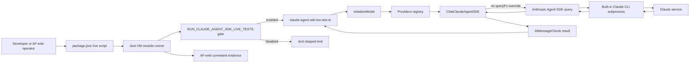
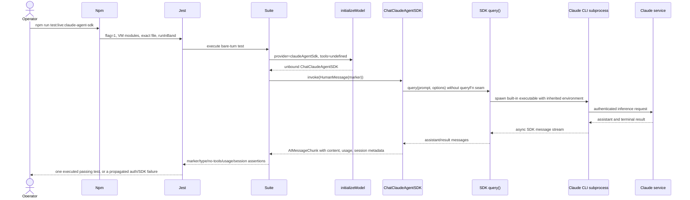
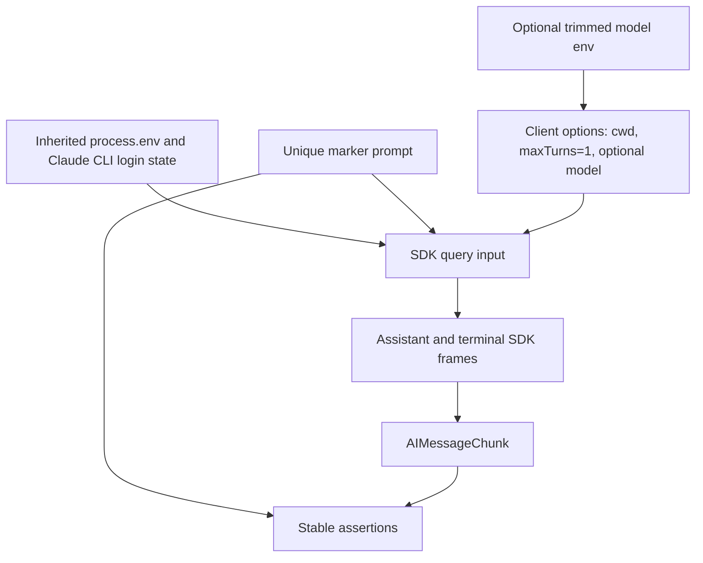

# System Map: AF-nr1p Claude Agent SDK Live Harness

## Scope and ownership

AF-nr1p owns the npm entrypoint and executable Jest specification. It does not change the provider implementation. AF-enki owns the first authenticated, billed execution and its evidence. AF-t37e independently changes result metadata and is not a dependency of this harness.

## Component map



## Disabled/default sequence

```mermaid
sequenceDiagram
  participant Jest
  participant Suite as Live suite module
  participant SDK as Claude Agent SDK

  Jest->>Suite: collect with run flag absent
  Suite->>Suite: liveEnabled = false
  Suite-->>Jest: describe.skip with one skipped test
  Note over Suite,SDK: initializeModel and query are never executed
  Jest-->>Jest: exit 0; 0 executed, 1 skipped
```

## Enabled/live sequence



## Data flow



## Interface grammar

```ebnf
LiveScript = RunGate, VmModules, Jest, ExactSuite, SerialExecution ;
RunGate = "RUN_CLAUDE_AGENT_SDK_LIVE_TESTS=1" ;
VmModules = "NODE_OPTIONS='--experimental-vm-modules'" ;
ExactSuite = "src/specs/claude-agent-sdk.live.test.ts" ;
SerialExecution = "--runInBand" ;

DisabledCollection = RunGate absent, "=>", ExecutedTests(0), SkippedTests(1) ;
ModelOverride = trim(env("CLAUDE_AGENT_SDK_LIVE_MODEL")) ;
ModelOption = ModelOverride nonblank, "=>", { model: ModelOverride }
            | ModelOverride blank, "=>", {} ;

BareClientOptions = {
  cwd: process.cwd(),
  maxTurns: 1,
  [model: ModelOverride]
} ;
BareModel = initializeModel({
  provider: Providers.CLAUDE_AGENT_SDK,
  clientOptions: BareClientOptions,
  tools: undefined
}) ;
RealQuerySelection = BareClientOptions excludes queryFn ;
LiveTurn = BareModel.invoke([HumanMessage(MarkerPrompt)]) ;

Success = AIMessageChunkTypeGuard
        & ContentContains(Marker)
        & ToolCalls(0)
        & ToolCallChunks(0)
        & PositiveInputTokens
        & PositiveOutputTokens
        & TotalTokensConsistent
        & NonEmptySessionId
        & NumTurnsAtLeast(1) ;

MissingAuthentication = RunGate present, "=>", PropagatedJestFailure ;
EvidenceHandoff = AF-nr1p committed harness, "=>", AF-enki authenticated execution ;
```

## Boundary invariants

- The default test path stops at Jest collection; it cannot cross the provider or subprocess boundary.
- The enabled path omits `queryFn`, so the adapter resolves the real installed SDK.
- No host tools, hooks, HITL resolver, multi-tenant environment, or graph orchestration are added.
- Authentication remains owned by the SDK/CLI inherited environment; the test neither discovers nor rewrites credentials.
- Timing and cost are observations, not correctness gates.
- Any authenticated SDK error propagates and fails Jest; the explicit live command never converts an error into a skip.
