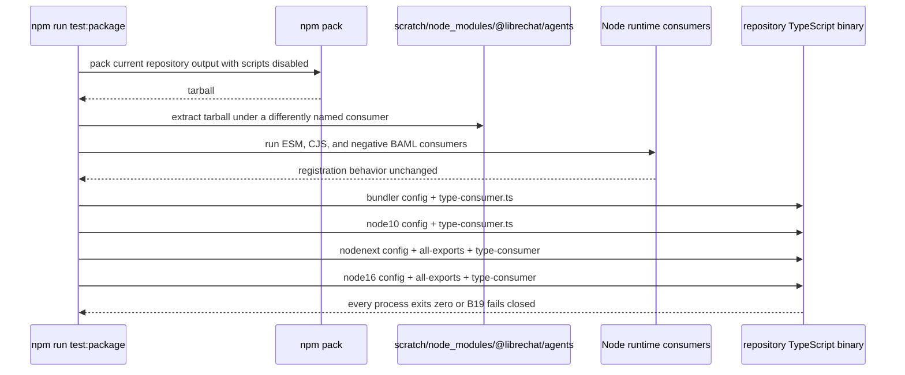
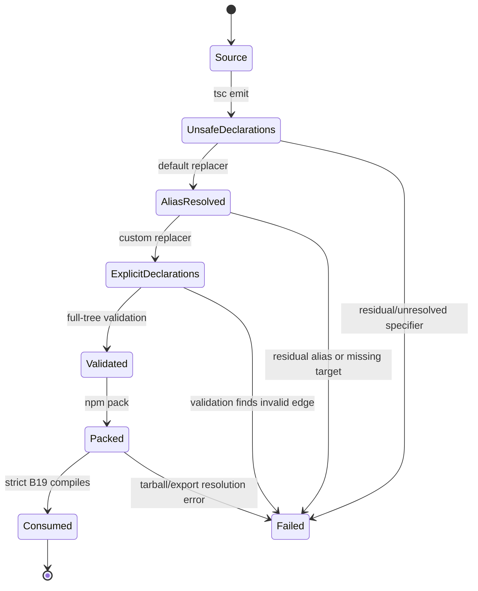

# System map: AF-sy8 NodeNext-compatible BAML declarations

## Boundary and ownership

AF-sy8 owns the named `./baml` acceptance surface. AF-7bv owns the one library-wide declaration rewrite mechanism and the 14-export package gate. The boundary is deliberate: AF-sy8 may expand the shared BAML consumer and verify or complete its NodeNext/Node16 config membership, but it must not add a second transformer or edit BAML runtime/source imports.


## Build sequence

```mermaid
sequenceDiagram
  participant N as npm run build
  participant R as tsdown
  participant T as tsc declaration emit
  participant A as tsc-alias default replacer
  participant C as custom declaration replacer
  participant D as dist/types

  N->>R: emit ESM/CJS runtime artifacts
  R-->>N: runtime paths already explicit
  N->>T: emit .d.ts under bundler resolution
  T->>D: write source-spelled aliases and relatives
  N->>A: run one tsc-alias invocation
  A->>A: resolve @/ using tsconfig paths
  A->>C: pass full matched statement { orig, file, config }
  C->>C: isolate quoted path; preserve surrounding syntax and quote style
  alt declaration file target exists
    C-->>D: replace path with relative .js
  else declaration directory index exists
    C-->>D: replace path with relative /index.js
  else bare or supported explicit specifier
    C-->>D: preserve statement
  else residual alias or unresolved relative
    C--xN: throw with file, specifier, attempted targets
  end
  Note over C,D: tsc-alias writes files individually; this is deterministic, not transactional
```

## Packed-consumer sequence



## Declaration-specifier grammar

The custom replacer receives the complete matched statement, not a raw specifier.

```ebnf
statement          = prefix, quote, specifier, quote, suffix ;
quote              = "'" | '"' ;
specifier          = bare | builtin | explicit | source_alias | relative ;
bare               = package_name, { package_segment } ;
builtin            = "node:", module_name ;
explicit           = relative_prefix, path, supported_runtime_suffix ;
source_alias       = "@/", source_path ;
relative           = relative_prefix, path ;
relative_prefix    = "./" | "../", { "../" } ;
supported_runtime_suffix = ".js" | ".mjs" | ".cjs" | ".json" | ".node" ;
declaration_target = file_target | index_target ;
file_target        = emitted_path, ".d.ts" ;
index_target       = emitted_path, "/index.d.ts" ;
```

Transformation contract:

| Input path after default alias pass | Declaration target | Output path |
| --- | --- | --- |
| bare package or `node:` builtin | not first-party | unchanged |
| already supported explicit path | already publishable | unchanged |
| extensionless relative | sibling `name.d.ts` | `name.js` |
| extensionless relative | sibling `name/index.d.ts` | `name/index.js` |
| `@/...` | residual alias | throw |
| extensionless relative | no declaration target | throw |

The returned string is `statement` with only its quoted `specifier` replaced. The prefix, suffix, import/export form, whitespace, comments, and quote character remain unchanged.

## State and failure model



Failure after a per-file write may leave a partial ignored `dist/` tree. That state is never publishable because `npm run build` exits non-zero; the next build re-emits declarations before rewriting them.

## Public `./baml` contract

`src/llm/baml/index.ts:12-14` exposes this unchanged manifest.

| Kind | Exported names | Fixture witness |
| --- | --- | --- |
| Runtime class | `ChatBAML` | value import and reference; never instantiate |
| Runtime constant | `BAML_PORT_VERSION` | value import; port fixture uses it |
| Runtime errors | `BamlNotRegisteredError`, `BamlPortVersionError`, `BamlToolNotBoundError`, `BamlTurnError`, `BamlUnsupportedError` | value imports and reference array |
| Port/tool types | `BamlPortVersion`, `BamlDeclaredTool`, `BamlSelectedTool`, `BamlFailureCode`, `BamlToolFailure`, `BamlFunctionSet`, `BamlClientOptions` | type-only manifest tuple plus existing no-cast adapter |
| Transcript/input types | `BamlCallMeta`, `BamlTranscriptRole`, `BamlTranscriptToolCall`, `BamlTranscriptEntry`, `BamlPromptInput` | type-only manifest tuple |
| Outcome types | `BamlAnswerOutcome`, `BamlTextChunk`, `BamlToolCallsOutcome`, `BamlFailureOutcome`, `BamlTurnResult`, `BamlTurnChunk` | type-only manifest tuple |

## Consumer matrix

| Mode | Fixture(s) | Resolution seam | Required result |
| --- | --- | --- | --- |
| ESM runtime | `esm-consumer.mjs` | `exports.import` | BAML registers and resolves |
| CJS runtime | `cjs-consumer.cjs` | `exports.require` | same registry behavior |
| Negative runtime | `negative-consumer.mjs` | root entry only | BAML remains unregistered |
| Bundler types | `type-consumer.ts` | `exports.types` | complete BAML manifest compiles |
| Node10 types | `type-consumer.ts` | `typesVersions` | complete BAML manifest compiles |
| NodeNext types | `all-exports-consumer.mts`, `type-consumer.ts` | `exports.types`, strict ESM declaration traversal | 14/14 subpaths and BAML manifest compile; `skipLibCheck: false` |
| Node16 types | `all-exports-consumer.mts`, `type-consumer.ts` | Node16 ESM declaration traversal | same result; `skipLibCheck: false` |

## Cross-layer contracts

| Seam | Producer obligation | Consumer obligation | Observable |
| --- | --- | --- | --- |
| Source -> declaration emit | Preserve public TypeScript surface | Emit declaration graph | `dist/types/llm/baml/index.d.ts` exists |
| Default -> custom replacer | Return full statement with source aliases resolved | Load exact enabled/file config, preserve full syntax, append declaration-aware runtime extension, and fail if the loader is skipped | real tsc-alias integration test plus fatal postcondition |
| Rewriter -> package | No residual `@/`; no extensionless/unresolved first-party edge | Ship exactly built `dist` | full-tree validation plus tarball contents |
| `exports.types` -> TypeScript | Route `./baml` to its declaration entry | Traverse ESM declaration graph strictly | packed NodeNext/Node16 exit status |
| BAML barrel -> host | Export seven values and eighteen types | Reference all names without private mappings or casts | shared `type-consumer.ts` |

## Invariants and forbidden shortcuts

- One library-wide transformer; no BAML-only pass.
- No `src/llm/baml/**` import rewrite and no BAML runtime behavior change.
- No source aliases or direct repository `dist/types` path mappings in consumer configs.
- No `skipLibCheck: true` in NodeNext or Node16.
- No namespace-only all-exports fixture as a substitute for the named BAML fixture.
- No claim of transactional writes or ESLint coverage for globally ignored config/test files.
- The nine already-clean `./langchain/*` leaf facades remain untouched.
- A directory-local literal scan is diagnostic; the packed strict compile is the closure proof.

## Red and Green at the seam

| State | Root | `./langchain` | `./baml` | `./openai` | `./responses` | Nine leaf exports |
| --- | ---: | ---: | ---: | ---: | ---: | ---: |
| Recorded pre-fix NodeNext | fail: 46 `TS2834` | fail: 8 `TS2834` | fail: 3 `TS2834` | fail: alias `TS2307` | fail: alias `TS2307` | pass: 9/9 |
| Required post-fix NodeNext/Node16 | pass | pass | pass + complete named manifest | pass | pass | pass: 9/9 unchanged |

## Implementation handoff

AF-sy8 implementation begins only after AF-7bv reports its commit and changed-file list. Then:

1. Inspect and run the real transformer integration suite; reject the prerequisite if loader shape, ordering, or full-statement preservation is unproved.
2. Expand `test/package/consumers/type-consumer.ts` to the complete manifest.
3. Verify or modify both strict configs to compile `all-exports-consumer.mts` and `type-consumer.ts`.
4. Build, inspect BAML's three barrel paths, and run the full packed B19 matrix.
5. Report the 14/14 export matrix and close AF-sy8 only after AF-7bv is complete.
