# TDD plan: AF-t37e Claude Agent SDK result metadata

## Goal

Preserve the selected main-loop model's `contextWindow`, `maxOutputTokens`,
and `canonicalModel` when `SDKResultMessage.modelUsage` becomes LangChain
message metadata, while retaining aggregate token accounting across every
model entry and every existing response metadata key.

## Scope

In scope:

- extend the Claude Agent SDK result translation in
  `src/llm/claudeAgentSdk/usage.ts`;
- remember the actual main-loop assistant model in
  `ChatClaudeAgentSDK._streamResponseChunks` and pass it to the translator;
- preserve the provider-specific usage projection across LangChain's lossy
  `AIMessageChunk.concat` boundary with a provider-local chunk type;
- prove the terminal message exposes the fields on both `usage_metadata` and
  `response_metadata`;
- prove ambiguous multi-model results never publish a guessed context window;
- keep existing token aggregation, empty-usage omission, session continuity,
  tool filtering, and stream concatenation behavior unchanged.

Out of scope:

- editing `/home/maceo/Dev/silmari-chat`;
- adding fields to the sibling API's `UsageMetadata` or token-usage event;
- changing the UI's static token-limit resolution chain;
- changing SDK versions, package dependencies, provider selection, or
  Langfuse trace shaping.

The close note must explicitly record the downstream follow-up in
`silmari-chat/packages/api/src/agents/usage.ts` and
`silmari-chat/client/src/hooks/Chat/useTokenLimits.ts`.

## Current behavior

`usageMetadataFromResult` sums input/output tokens from all `modelUsage`
entries and discards their identity and limit fields. Separately,
`responseMetadataFromResult` publishes only `session_id`, `num_turns`, and
`total_cost_usd`. `ChatClaudeAgentSDK` calls both after the SDK terminal result
arrives, without retaining any preceding assistant model identity.

This loses data the installed SDK already supplies. It also makes a naive
`Object.values(modelUsage)[0]` fix unsafe because the record can include
subagents and sidechains and the SDK declares no primary-entry ordering.

There is a second loss point after construction. LangChain's
`AIMessageChunk.concat` delegates to `mergeUsageMetadata`, which reconstructs
only standard token-count/detail fields
(`node_modules/@langchain/core/dist/messages/ai.js:219-238`,
`metadata.js:26-33`). A content chunk concatenated with a terminal chunk drops
custom usage fields, while open-ended `response_metadata` survives. The fix
must therefore cover both metadata construction and concat preservation.

## Locked decisions

### Selected-model policy

The translation accepts `preferredModel?: string`, obtained from the latest
main-loop `SDKAssistantMessage.message.model` observed during the current
query. Selection uses this precedence:

1. exact `modelUsage` record-key match;
2. a unique `ModelUsage.canonicalModel` match;
3. the only entry when the record has exactly one entry;
4. no selection when multiple entries remain ambiguous.

Raw object order, maximum tokens, and maximum cost are never selectors. An
ambiguous result still emits correctly aggregated token counts and legacy
response fields, but omits `model` from response metadata and omits
`canonical_model`, `context_window`, and `max_output_tokens` from both
metadata surfaces.

Raw-key and canonical comparisons run only when `preferredModel != null`.
Two canonical matches are ambiguous. An exact raw-key match wins even if more
than one entry shares its canonical id.

### Metadata projection

When an entry is selected, attach this projection to terminal
`response_metadata`:

```ts
{
  model: entry.canonicalModel ?? rawModel,
  ...(entry.canonicalModel == null
    ? {}
    : { canonical_model: entry.canonicalModel }),
  context_window: entry.contextWindow,
  max_output_tokens: entry.maxOutputTokens,
}
```

Attach `canonical_model`, `context_window`, and `max_output_tokens` to
`usage_metadata`, but do not introduce `usage_metadata.model`. The sibling
billing layer treats `usage.model` as an active pricing override, so adding it
would change billing behavior. Response metadata owns result introspection;
usage metadata owns the current transport into `ModelEndHandler.collectedUsage`.

Use explicit provider interfaces:
`ClaudeAgentSDKUsageMetadata extends UsageMetadata`,
`ClaudeAgentSDKResponseMetadata extends ResponseMetadata`, a selected-model
projection, and a combined return type. Do not return
`Record<string, unknown>` from the Claude-specific helper or add duplicated
SDK field types.
Zero is preserved because SDK fields are required numbers and zero can be an
honest crash/startup sentinel.

Token counts remain aggregate across every main-loop, subagent, sidechain, and
internal `modelUsage` entry. The selected context/model fields describe only
the main-loop entry. Downstream wiring must not treat aggregate multi-model
input as that selected model's exclusive context consumption.

### One-pass production translation

Introduce one production helper that iterates `Object.entries(modelUsage)`
once to aggregate tokens and locate candidates. It returns both
`usageMetadata` and `responseMetadata`, ensuring the two objects cannot select
different models. The loop records token totals, entry count, sole candidate,
exact candidate, canonical candidate, and canonical-match count. A separate
flat resolver uses ordered early returns: exact, exactly-one canonical,
singleton, undefined. Accumulator mutation stays in the loop body, never in a
condition or control expression.

Retain `usageMetadataFromResult(result, preferredModel?)` and
`responseMetadataFromResult(result, preferredModel?)` as exported typed
wrappers because the bead's acceptance criterion names the response helper.
Production must call the combined helper once, never both wrappers.

The helper must not mutate `SDKResultMessage`, `ModelUsage`, or message chunks.

### Concat-survival contract

Add a small provider-local `ClaudeAgentSDKMessageChunk` subclass in
`messages.ts`. OOP is justified here only because LangChain exposes concat as a
virtual method. Every assistant and terminal Claude chunk uses the subclass so
the left operand owns the override. The override calls the base concat, then
constructs and returns a new Claude chunk containing standard merged token
counts plus the latest Claude model projection, without summing limits and
without mutating either operand or their metadata/`lc_kwargs` objects.

Generic `invoke.ts`, `events.ts`, and Langfuse code remain unchanged. The
provider-specific chunk is still an `AIMessageChunk`, and the existing event
handler pushes the preserved usage object without reconstruction.

### Preferred-model lifecycle

`preferredModel` is a generator-local variable initialized for each
`_streamResponseChunks` call, never a class or session field. It is assigned by
a standalone statement immediately after main-loop classification and before
content stripping, callbacks, or yields. Subagent messages never update it.
The existing flat branch/early-`continue` order remains intact.

## Behavior inventory

| ID  | Classification    | Behavior                                                                                                                       | Proof                                                            |
| --- | ----------------- | ------------------------------------------------------------------------------------------------------------------------------ | ---------------------------------------------------------------- |
| B1  | leaf              | One entry emits aggregate token counts and the split selected projection on both metadata objects                              | direct helper + stream unit tests                                |
| B2  | leaf              | Main-loop assistant model selects its exact record from a multi-model result independent of record order                       | table-driven stream unit test                                    |
| B3  | leaf              | A unique canonical-model match selects the corresponding raw record                                                            | pure helper or stream unit test                                  |
| B4  | leaf              | Multiple unmatched entries keep aggregate tokens but omit every singular model/limit field                                     | stream unit test                                                 |
| B5  | leaf              | Empty `modelUsage` still omits `usage_metadata` and preserves legacy response fields                                           | existing B7 table plus regression assertion                      |
| B6  | leaf              | Legacy `session_id`, `num_turns`, `total_cost_usd`, and aggregate token totals are unchanged                                   | existing tests                                                   |
| B7  | blocking closure  | Real `initializeModel -> attemptInvoke -> ChatClaudeAgentSDK` path carries model limits and identity to the final message      | `turnTranslation.closure.test.ts`                                |
| B8  | leaf              | Subagent assistant messages never become the preferred model                                                                   | mandatory stream test with differing subagent/main-loop models   |
| B9  | blocking boundary | Nonempty assistant content concatenated with terminal metadata preserves the usage projection without duplicating token totals | raw-stream, `invoke`, `attemptInvoke`, and collection assertions |
| B10 | blocking boundary | One model instance serving interleaved streams keeps preferred-model state isolated per invocation                             | concurrent stream unit test                                      |

The scope contains no retry, timer, registration, or persistent-store behavior,
so no eventual/polling closure is required. B7 is blocking because it crosses
the provider/invocation module boundary and proves the final observable.

## Implementation phases

### Phase 1: failing tests

- [x] Extend the `assistantMessage` fixture with an optional `model` field so
      tests can identify main-loop and subagent model records explicitly without
      type assertions.
- [x] Define file-local raw/canonical main and subagent model constants to keep
      selector test branches typo-safe.
- [x] Add a direct test of `responseMetadataFromResult` proving the three new
      values exactly match its selected entry and legacy keys are unchanged.
- [x] Add a B7 unit row/test in
      `src/llm/claudeAgentSdk/__tests__/ChatClaudeAgentSDK.stream.test.ts` for a
      single model entry with canonical id and nonzero limits. Assert exact fields
      on both terminal metadata objects plus every legacy field.
- [x] Add a multi-entry test where the main-loop model is not the first record
      entry. Assert its limits are chosen while token counts still sum all entries.
- [x] Add a unique canonical-match case and an unmatched multi-entry case. The
      latter must assert the response's four singular fields and the usage
      projection's three singular fields are absent.
- [x] Add selector cases for duplicate canonical matches, multiple entries
      without a preferred model/canonical ids, exact-key precedence over duplicate
      canonical values, zero-valued selected limits, and frozen inputs.
- [x] Add mandatory ordering cases: main-loop A then subagent B selects A; text
      main-loop A then tool-only main-loop B selects B before stripping.
- [x] Add a concat regression with nonempty content before the terminal chunk.
      Assert the raw terminal chunk, reduced stream, `model.invoke`, and final
      `attemptInvoke` message retain the projection and token totals are not
      duplicated.
- [x] Add an interleaved-concurrency test using one model instance and two
      differently modeled `fakeQueryFromGenerator` streams. Each invocation must
      retain its own limits.
- [x] Add assistant-then-result-error and assistant-then-missing-result cases to
      prove capture never synthesizes a success or changes existing errors.
- [x] Extend Closure A in
      `src/llm/claudeAgentSdk/__tests__/turnTranslation.closure.test.ts` with
      `canonicalModel` and final-message assertions for both metadata paths.
- [x] In Closure A, separately assert the last raw streamed chunk and the final
      concatenated message. Feed the final message through `ModelEndHandler`'s
      collection contract and assert its retained usage projection.
- [x] Run only the two affected suites and capture the expected Red failures
      caused by missing fields.

### Phase 2: minimal production change

- [x] Define explicit Claude Agent SDK usage/response/result metadata
      interfaces in `usage.ts`, extending LangChain `UsageMetadata` and
      `ResponseMetadata` and reusing SDK `ModelUsage`/`SDKResultMessage`.
- [x] Implement the one-pass aggregate-and-select helper with the locked
      precedence and optional projection.
- [x] In `_streamResponseChunks`, retain the latest main-loop assistant
      `message.message.model` before content stripping. Subagent messages must not
      update it.
- [x] Replace the two independent terminal helper calls with one combined
      helper call using the remembered model.
- [x] Add `ClaudeAgentSDKMessageChunk` and a pure usage-projection preservation
      helper. Use the subclass for every main-loop and terminal chunk.
- [x] Run the affected unit and closure suites to Green.

### Phase 3: refactor and regression

- [x] Check the selector for flat control flow, no side effects in
      conditions/control expressions, no mutable input, and one collection pass.
- [x] Confirm the compatibility wrappers delegate to the combined helper and
      production invokes neither wrapper.
- [x] Confirm response and usage projections are produced from one selected
      value and cannot diverge.
- [x] Confirm concat creates a new chunk and mutates neither operand.
- [x] Remove the closure test's `Record<string, unknown>` cast; use typed
      metadata or `toMatchObject`. Introduce no `any`, double assertions, or broad
      unknown records.
- [x] Consolidate same-module imports, keep type imports standalone, and sort
      all touched import groups per AGENTS.md.
- [x] Run all Claude Agent SDK tests.
- [x] Run `npx tsc --noEmit` and `npx eslint src/`.
- [x] Run the Langfuse/deterministic trace suites because provider usage
      metadata participates in generation observations.
- [x] Run `npm run build`.

### Phase 4: completion

- [x] Update this plan's checkboxes and status with actual verification output.
- [x] Update and close AF-t37e with file:line evidence, test results, and the
      sibling-repository follow-up.
- [x] Commit the scoped repository changes locally without pushing or merging.

## Red/green/refactor detail

### Red

The strongest failure should be Closure A: its existing result already carries
`contextWindow` and `maxOutputTokens`, so adding only `canonicalModel` and
metadata assertions proves the current translation loses SDK data across the
real invocation path. Unit failures separately pin selector ambiguity and
ordering behavior.

### Green

Keep selection internal to the Claude provider. `ChatClaudeAgentSDK` supplies
the preferred model and receives ready-to-attach metadata objects; it should
not understand `ModelUsage` details beyond passing the model name. No generic
LangChain, event, invoke, or Langfuse module needs a change.

### Refactor

Prefer one named projection helper for the selected entry and one
aggregate/select loop. Use early returns for empty usage. Avoid spreading
optional fields as `undefined`; omit them. Do not add inline comments that
narrate straightforward mechanics.

The concat adapter must contain no selection logic: it only restores an
already-selected projection after LangChain merges standard token counters.
The terminal/right projection wins when present; otherwise the existing/left
projection survives. Limits and model strings are never arithmetically merged.

## File inventory

Expected production edits:

- `src/llm/claudeAgentSdk/usage.ts`
- `src/llm/claudeAgentSdk/ChatClaudeAgentSDK.ts`
- `src/llm/claudeAgentSdk/messages.ts`

Expected test edits:

- `src/llm/claudeAgentSdk/__tests__/fixtures.ts`
- `src/llm/claudeAgentSdk/__tests__/ChatClaudeAgentSDK.stream.test.ts`
- `src/llm/claudeAgentSdk/__tests__/turnTranslation.closure.test.ts`

Process artifacts:

- this plan and its review;
- the linked research document and staged closure adapter;
- Beads state for AF-t37e.

No package or dependency files should change.

## System map

### Component and data-flow map

```mermaid
flowchart LR
  SDK[Claude SDK Query stream] -->|SDKAssistantMessage| STREAM[ChatClaudeAgentSDK stream]
  SDK -->|SDKResultSuccess.modelUsage| STREAM
  STREAM -->|preferred main-loop model| META[resultMetadataFromResult]
  META -->|aggregate tokens + selected projection| TERM[Claude terminal message chunk]
  STREAM -->|Claude content chunks| CONCAT[ClaudeAgentSDKMessageChunk.concat]
  TERM --> CONCAT
  CONCAT -->|preserved AIMessageChunk| INVOKE[model.invoke / attemptInvoke]
  INVOKE -->|usage_metadata| MODELEND[ModelEndHandler.collectedUsage]
  INVOKE -->|response_metadata| AGG[response metadata aggregator]
  MODELEND -. follow-up, out of scope .-> API[silmari-chat usage pipeline]
  API -. follow-up, out of scope .-> UI[useTokenLimits]
```



Ownership stays local: the Claude adapter selects and preserves its extension;
generic invocation and event components consume a normal `AIMessageChunk`
without provider conditionals.

### Turn sequence

```mermaid
sequenceDiagram
  participant Q as SDK Query
  participant C as ChatClaudeAgentSDK
  participant U as usage.ts translator
  participant M as Claude chunk concat
  participant I as attemptInvoke
  participant E as ModelEndHandler

  Q->>C: assistant(model=A, main-loop)
  C->>C: preferredModel = A
  C-->>I: Claude content chunk
  Q->>C: assistant(model=B, subagent)
  Note over C: preferredModel remains A
  Q->>C: result(modelUsage={A,B})
  C->>U: resultMetadataFromResult(result, A)
  U-->>C: aggregate tokens + A projection
  C-->>I: Claude terminal chunk
  I->>M: content.concat(terminal)
  M-->>I: new Claude chunk; counters merged, A limits preserved once
  I-->>E: model-end output usage_metadata
  E->>E: push preserved usage object
```

### Selection grammar

```text
PreferredModel ::= SDKAssistantMessage.message.model from latest main-loop message

ExactCandidate ::= entry where PreferredModel != null
                   and rawRecordKey == PreferredModel

CanonicalCandidate ::= entry where PreferredModel != null
                       and entry.canonicalModel == PreferredModel

SelectedEntry ::= ExactCandidate
                | CanonicalCandidate when canonicalMatchCount == 1
                | SoleEntry when entryCount == 1
                | None

UsageProjection ::= aggregate(inputTokens, outputTokens across all entries)
                    + selected(canonical_model?, context_window, max_output_tokens)

ResponseProjection ::= legacy(session_id, num_turns, total_cost_usd)
                       + selected(model, canonical_model?, context_window,
                                  max_output_tokens)
```

Precedence is ordered, not set-based: exact always wins. `None` yields legacy
response metadata and aggregate tokens only.

### Interface contracts

| Boundary                    | Input                               | Output                          | Invariants                                                                            |
| --------------------------- | ----------------------------------- | ------------------------------- | ------------------------------------------------------------------------------------- |
| SDK stream → provider       | ordered `SDKMessage`s               | generator-local preferred model | only main-loop assistants update; capture precedes stripping                          |
| result → translator         | `SDKResultMessage`, preferred model | combined typed metadata         | one `modelUsage` pass; no input mutation; no guessed multi-entry limits               |
| translator → terminal chunk | combined metadata                   | `ClaudeAgentSDKMessageChunk`    | response has `model`; usage intentionally has no `model`                              |
| Claude concat               | left/right AI chunks                | new Claude AI chunk             | standard counters sum; selected limits do not sum; right projection wins when present |
| final message → model end   | `usage_metadata`                    | collected usage reference       | no reconstruction or provider conditional                                             |
| response aggregator         | `response_metadata`                 | collected response metadata     | open-ended fields survive standard LangChain merge                                    |

### State and concurrency map

```text
_streamResponseChunks invocation #1: preferredModel_1 ── result_1 ── metadata_1
_streamResponseChunks invocation #2: preferredModel_2 ── result_2 ── metadata_2
                                      no shared class/session field
```

Each invocation owns its capture variable and query iterator. Interleaving
does not create an edge between the two state lines.

### Failure map

| Terminal condition                       | Output                                                               |
| ---------------------------------------- | -------------------------------------------------------------------- |
| success with selected entry              | terminal chunk with both projections                                 |
| success with ambiguous entries           | terminal chunk with aggregate tokens and legacy response fields only |
| success with empty `modelUsage`          | no `usage_metadata`; legacy response fields remain                   |
| SDK result error after assistant capture | existing `ClaudeAgentSDKResultError`; no metadata success chunk      |
| iterator ends after assistant capture    | existing missing-terminal error; no metadata success chunk           |

### Verification seams

- Direct helper seam pins AF-t37e's named function contract.
- Raw terminal stream seam distinguishes construction from aggregation.
- Reduced stream and `invoke` seams prove the provider's virtual concat path.
- `attemptInvoke` Closure A proves the cross-module final observable.
- Model-end collection assertion proves the usage-event handoff used by the
  sibling repository's future wiring.

## Acceptance-criterion traceability

| Criterion                                                          | Proof                                                                 |
| ------------------------------------------------------------------ | --------------------------------------------------------------------- |
| `responseMetadataFromResult` includes context/canonical/max output | direct helper test                                                    |
| values match the selected `ModelUsage` entry                       | exact assertions for all three fields                                 |
| legacy response keys remain                                        | existing response test retained and extended                          |
| aggregate usage remains                                            | existing two-record equality assertion retained                       |
| future usage-event transport is lossless                           | content + terminal concat, `attemptInvoke`, and collection assertions |
| ambiguous multi-model result never guesses                         | unmatched and duplicate-canonical cases                               |

## Verification commands

```sh
npx jest src/llm/claudeAgentSdk/__tests__/ChatClaudeAgentSDK.stream.test.ts src/llm/claudeAgentSdk/__tests__/turnTranslation.closure.test.ts --runInBand
npx jest claudeAgentSdk --runInBand
npx jest langfuse deterministic-trace-id --runInBand
npx tsc --noEmit
npx eslint src/
npm run build
```

## Implementation results

- Red: the two targeted suites failed because the helper accepted no preferred
  model and Closure A lacked the three projected usage fields.
- Green: targeted unit/closure suites pass, 2 suites and 35 tests.
- Provider regression: `npx jest claudeAgentSdk --runInBand` passes, 11 suites
  and 89 tests.
- Trace regression: `npx jest langfuse deterministic-trace-id --runInBand`
  passes, 11 suites and 165 tests.
- Static quality: `npx tsc --noEmit` and `npx eslint src/` pass with no output.
- Package verification: `npm run build` completes ESM, CJS, and declaration
  output successfully.

## Exit criteria

- selected main-loop context/model/output-limit fields survive on both
  metadata surfaces;
- custom usage fields survive nonempty assistant-chunk concatenation and the
  model-end collection boundary without altering `usage_metadata.model`;
- aggregate usage remains the sum of every model record;
- ambiguous multi-model results never guess a singular model;
- all existing Claude provider and tracing invariants pass;
- no sibling repository is modified;
- AF-t37e is closed with concrete evidence and a local commit exists.
