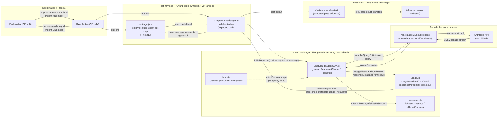
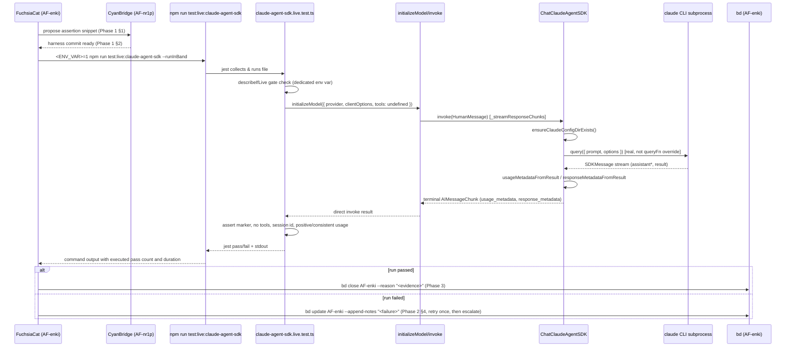
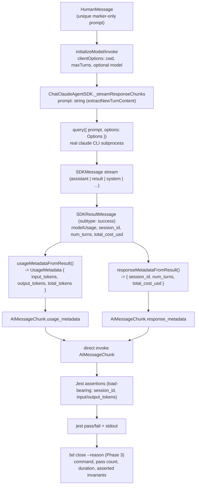

# System Map: AF-enki Live Inference Verification

Companion to `thoughts/searchable/shared/plans/2026-08-16-af-enki-live-inference-evidence.md` (plan) and its `-REVIEW.md`. Maps the concrete files, seams, and contracts the plan's three phases touch or depend on. Research source: `thoughts/searchable/shared/research/2026-08-16-12-20-claude-agent-sdk-live-inference-test.md`.

## System Diagram

## Sequence Diagram — one live run, end to end

## Data Flow — what crosses each seam

## Interface/Contract Grammar at Each Seam

### Seam 1 — FuchsiaCat ↔ CyanBridge (Agent Mail proposal)

- **Direction**: FuchsiaCat → CyanBridge (proposal), CyanBridge → FuchsiaCat (harness-ready signal).
- **Contract**: a Markdown message body containing the exact TypeScript snippet from the plan's Phase 1 §1. No enforced schema — human/agent-readable prose + code fence. Acceptance is asynchronous and explicit (a reply message), not implied by silence.
- **Precondition**: FuchsiaCat has not edited any path CyanBridge reserved (`package.json`, `src/specs/*claude-agent-sdk*`).
- **Postcondition**: CyanBridge's landed file either contains the proposed assertions verbatim, an adapted equivalent, or FuchsiaCat applies them herself once the base file exists — resolved via reply-thread before Phase 2 starts (plan's Phase 1 Manual Verification).

### Seam 2 — Live test file ↔ `package.json` script

- **Direction**: `package.json`'s `test:live:claude-agent-sdk` script → invokes jest against the live test file path.
- **Contract** (by precedent, `package.json:210`): `<RUN_ENV_VAR>=1 NODE_OPTIONS='--experimental-vm-modules' jest <file-path> --runInBand`. Exit code 0 = all contained `it(...)` blocks passed (or were `describe.skip`ped, which still exits 0 — a real pass is distinguished by grep'ing the jest summary for a `✓`, not by exit code alone, per Phase 2's Automated Verification).
- **Precondition**: the named env var is `'1'`. The suite has no credential-presence skip; invalid or missing SDK/CLI authentication propagates as a failed live command.

### Seam 3 — Live test file ↔ `initializeModel`/`ChatClaudeAgentSDK` (production contract, unmodified by this plan)

- **Direction**: test → `initializeModel({ provider: Providers.CLAUDE_AGENT_SDK, clientOptions, tools: undefined })` → `model.invoke([HumanMessage])`.
- **Contract**: `ClaudeAgentSDKClientOptions` (`types.ts:41-122`) — no `apiKey` field; `cwd`/`workspace`/`model` all optional; omitting `preToolUseHook`/`postToolUseHook`/`hitlResolver` yields the "no hooks" bare-turn mode; never call `.bindTools(...)` (throws unconditionally, `ChatClaudeAgentSDK.ts:427-432`).
- **Postcondition**: on success, direct invocation returns an `AIMessageChunk` carrying `response_metadata: { session_id, num_turns, total_cost_usd }` and (when `modelUsage` was non-empty) `usage_metadata: { input_tokens, output_tokens, total_tokens }`. On failure, `ChatClaudeAgentSDK` throws `ClaudeAgentSDKResultError` or a generic stream-ended-without-result `Error` (`ChatClaudeAgentSDK.ts:564-568,608-610`) — this plan's Phase 2 §4 failure path catches that at the Jest-exit-code level.

### Seam 4 — `ChatClaudeAgentSDK` ↔ real `claude` CLI subprocess (external process boundary)

- **Direction**: `query({ prompt: string, options: Options })` → real, dynamically-imported `@anthropic-ai/claude-agent-sdk` `query` (not the `queryFn` test seam — a live test must not set `clientOptions.queryFn`).
- **Contract**: subprocess inherits `process.env` unmodified (non-`multiTenant` path) — auth is whatever the `claude` CLI itself resolves (this sandbox: OAuth via `$HOME/.claude/.credentials.json`). `ensureClaudeConfigDirExists()` guarantees the config directory exists before every call regardless of auth mode.
- **Postcondition**: an `AsyncGenerator<SDKMessage>` yielding zero-or-more `assistant` messages followed by exactly one terminal `result` message (success or error subtype) — `ChatClaudeAgentSDK.ts:608-610` throws if the generator ends without one.

### Seam 5 — `SDKResultMessage` ↔ `usage.ts` (existing, unmodified production code)

- **Direction**: `usageMetadataFromResult(result)` / `responseMetadataFromResult(result)` (`usage.ts:19-50`), both pure functions of the terminal `SDKResultMessage`.
- **Contract**: `responseMetadataFromResult` always returns `{ session_id, num_turns, total_cost_usd }` (no undefined branch). `usageMetadataFromResult` returns `undefined` (not a zero-filled object) when `modelUsage` is empty — this plan's load-bearing assertions (`input_tokens ?? 0`, `output_tokens ?? 0`) tolerate that via nullish-coalescing rather than assuming the field is always present, matching the provider's own documented omit-don't-fabricate convention.
- **Out of scope for this plan**: AF-t37e (parallel, GoldStream) extends this contract with `context_window`/`canonical_model`/`max_output_tokens` — this plan's assertions deliberately don't depend on those fields existing.

### Seam 6 — captured evidence ↔ bd (AF-enki close reason)

- **Direction**: captured command output → `bd close AF-enki --reason "<prose>"` / `bd update AF-enki --append-notes "<prose>"` on failure.
- **Contract**: prose cites the exact command, exit code, executed-versus-skipped Jest counts, duration, asserted invariants, test file, and commit. Per-run session/token values remain inside the test process and are not exposed in normal output.

## Files Touched / Read (by phase)

| Phase | File                                                                                  | Mode                                     | Notes                                                                                              |
| ----- | ------------------------------------------------------------------------------------- | ---------------------------------------- | -------------------------------------------------------------------------------------------------- |
| 1     | `src/specs/claude-agent-sdk.live.test.ts` (expected path, not yet landed)             | proposed-not-applied                     | CyanBridge's reserved file; this plan only sends a code proposal via Agent Mail                    |
| 1     | `package.json` (~line 210)                                                            | read-only                                | verify the new script exists once landed; never edited by this plan                                |
| 2     | same live test file                                                                   | read-only                                | `grep` to confirm the actual gating env var name before running                                    |
| 2     | `src/llm/claudeAgentSdk/ChatClaudeAgentSDK.ts`, `usage.ts`, `messages.ts`, `types.ts` | read-only (already read during research) | not modified — production code this plan verifies, does not change                                 |
| 2     | command output                                                                        | read-only evidence                       | records exit code, executed pass count, and duration; per-run metadata is asserted but not printed |
| 3     | bd (AF-enki record)                                                                   | write                                    | `bd close`/`bd update --append-notes`                                                              |

## Open Seams Not Yet Resolved (tracked, not blocking this map)

- Seam 1's exact acceptance mechanism (verbatim adoption vs. adapted vs. handed back) is unresolved until CyanBridge replies — tracked in the plan's Phase 1 Manual Verification, not assumed here.
- Seam 2's exact env var name is unresolved until the file lands — Phase 2 §1 reads it directly rather than guessing.
