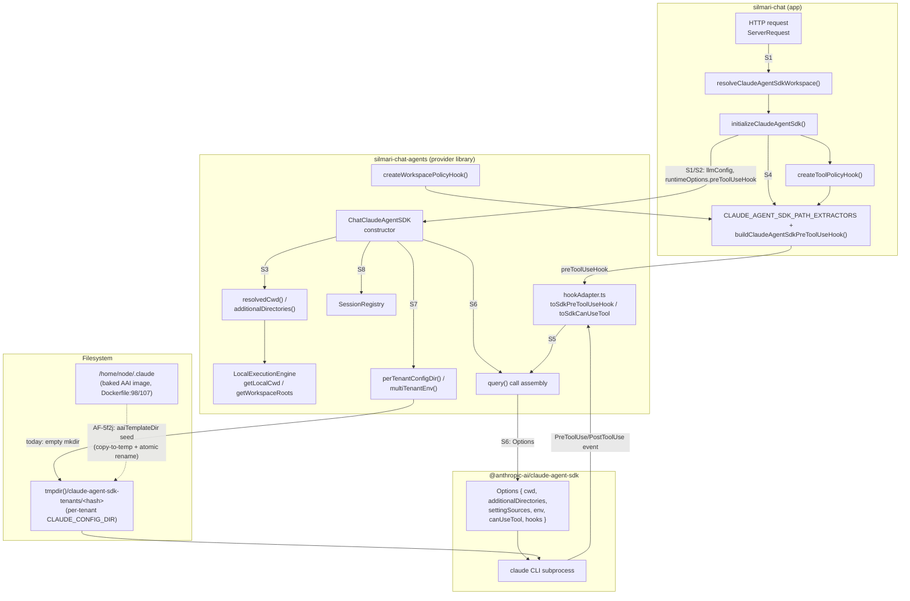
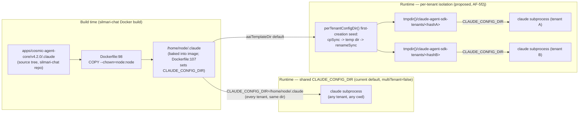

# Design: multi-tenant workspace/cwd scoping for the Claude Agent SDK endpoint

Answers the four open questions from `AF-j59p`. Companion to
`docs/providers/claude-agent-sdk.md` §5 (silmari-chat-agents) and
`thoughts/searchable/shared/handoffs/general/2026-08-15_23-01-48_wire-claude-agent-sdk-into-silmari-chat-and-fix-session-bug.md`.

**Amended post-review** (`2026-08-16-claude-agent-sdk-multitenant-workspace-design-REVIEW.md`):
Q1–Q3 were independently re-verified against the codebase and confirmed accurate — their
citations below are corrected but their decisions are unchanged. Q4's proposed fix
(`AF-5f2j`) is now fully specified — concurrency-safe seeding mechanism, the
`aaiTemplateDir` interface, copy semantics, and the `settingSources` value are all pinned
below, closing every gap the review raised. `AF-hro9`'s export name is decided. The
baked-AAI-image precondition Q4's fix depends on is confirmed shipped (see Q4). A
**System Map** section (system diagram, sequence diagrams, a data-flow diagram, and a
per-seam interface/contract grammar for all 8 seams this design crosses) was added below
the Q4 narrative, built from exact type signatures re-verified against the current
codebase.

## Q1 — Per-conversation `cwd`/workspace derivation

**Decision: keep the existing derivation. No change.**

`resolveClaudeAgentSdkWorkspace(req)` (`silmari-chat`,
`packages/api/src/endpoints/custom/initialize.ts:198`) resolves `cwd` to
`uploads/<req.user.id>` — the app's existing per-user, JWT-auth-derived,
path-traversal-guarded upload directory. This is stable per user (not
per-conversation): every conversation a given user starts resolves to the
same root. That's the right granularity here, not a per-thread temp dir —
it lets a user's uploaded files be visible to every conversation they
start, matching the product's existing upload model, while still hard-
isolating user A from user B.

`ChatClaudeAgentSDK.resolvedCwd()` (`src/llm/claudeAgentSdk/ChatClaudeAgentSDK.ts:293`)
reuses this repo's own `getLocalCwd`/`getWorkspaceRoots`
(`src/tools/local/LocalExecutionEngine.ts:227-260`) to turn
`{ cwd, workspace }` into a resolved root + additional-roots list. Nothing
here needs to change — `resolveClaudeAgentSdkWorkspace`'s output already
flows into `clientOptions.cwd` (`llmConfig: { cwd }` at
`initialize.ts:390`) and reaches `getLocalCwd` unmodified.

## Q2 — Does `LocalExecutionEngine`'s workspace-resolution convention apply?

**Yes — already reused for `cwd`/`additionalDirectories`. No change needed there.**

Confirmed by reading `ChatClaudeAgentSDK.ts:293-302`: `resolvedCwd()` and
`additionalDirectories()` both call straight into `getLocalCwd`/
`getWorkspaceRoots`. Claude Agent SDK's stateful subprocess-per-session
model doesn't need its own resolution logic for _this_ — `cwd` is resolved
once per call, same as every other tool that goes through
`LocalExecutionEngine`. The part that's genuinely provider-specific is the
_enforcement_ layer (Q3) and the _config-directory_ isolation (Q4), not the
root-resolution logic itself.

## Q3 — `createWorkspacePolicyHook` extension for Claude's built-in tools

**Decision: extend it. Implemented this session** (`silmari-chat`,
`packages/api/src/endpoints/custom/initialize.ts`).

### The gap this closes

Before this change, `initializeClaudeAgentSdk` wired only
`createToolPolicyHook` (a tool-_name_ allow/deny/ask policy) as
`preToolUseHook`. `cwd` is a subprocess _working directory default_, not a
sandbox — nothing stopped Claude's built-in `Read`/`Write`/`Edit` tools
from targeting an absolute path anywhere the OS user running the Node
process could reach. This is a real, live gap on a publicly-exposed
endpoint, not a theoretical one.

`createWorkspacePolicyHook`'s default `pathExtractors`
(`src/hooks/createWorkspacePolicyHook.ts:173-184`) are keyed to this repo's
own local-engine tool names (`read_file`, `write_file`, ... with a `path`
field) — wiring it in unmodified would silently no-op for every Claude
Agent SDK tool call, since `extractors[input.toolName] == null` short-
circuits straight to `allow` (`createWorkspacePolicyHook.ts:315-316`).

### What was built

`CLAUDE_AGENT_SDK_PATH_EXTRACTORS` (`initialize.ts`) maps Claude's own
built-in tool names/fields, confirmed against
`@anthropic-ai/claude-agent-sdk`'s `sdk-tools.d.ts`:

| Tool           | Input interface     | Field                           |
| -------------- | ------------------- | ------------------------------- |
| `Read`         | `FileReadInput`     | `file_path`                     |
| `Write`        | `FileWriteInput`    | `file_path`                     |
| `Edit`         | `FileEditInput`     | `file_path`                     |
| `NotebookEdit` | `NotebookEditInput` | `notebook_path`                 |
| `Grep`         | `GrepInput`         | `path` (optional — search root) |
| `Glob`         | `GlobInput`         | `path` (optional — search root) |

`buildClaudeAgentSdkPreToolUseHook(toolPolicyHook, cwd)` composes this with
the existing tool-policy hook, mirroring the two-hook composition example
in `docs/providers/claude-agent-sdk.md` §6 (this provider bridges exactly
one `preToolUseHook`, so composition is the host's job, not the SDK's).
`outsideRead`/`outsideWrite` are set to `'deny'` explicitly rather than
left at the hook's own `'ask'` default — this endpoint has no
`hitlResolver` wired (§7 of the same doc), so `'ask'` already degrades to a
deny today (the deny carries a message identifying it as a degraded-ask
outcome — §7's own wording — not a silent/unexplained one; there's simply
no human-approval escalation path for it to reach), but leaving that
implicit means the boundary would silently loosen if a `hitlResolver` is
added later for an unrelated reason (e.g. tool-approval UI). Explicit
`'deny'` keeps it a declared policy, not an accident of what's not
implemented yet.

Covered by `packages/api/src/endpoints/custom/claude-agent-sdk-workspace-hook.spec.ts`
(9 tests): extractor field-mapping, in/out-of-root Read/Write, tool-policy
deny short-circuiting the workspace check, and — explicitly — that `Bash`
is _not_ gated (next section).

**Verified gap (review):** the production wiring itself is real —
`buildClaudeAgentSdkPreToolUseHook` is called from `initializeClaudeAgentSdk`
(`initialize.ts:385`) and the resulting `preToolUseHook` is traced through
`setAgentRuntimeOptions` into `agents/run.ts`'s runtime-options merge — but
all 9 tests, plus the sibling `__tests__/initialize.claudeAgentSdk.test.ts`,
call `buildClaudeAgentSdkPreToolUseHook` directly with hand-built mocks and
never invoke `initializeClaudeAgentSdk` itself. No automated test currently
proves the composed hook survives that merge end-to-end; only code-reading
does. Tracked as a small addendum to the existing spec file — see
`AF-hro9`'s sibling follow-up note below (filed as `AF-j8s3`) rather than
implemented here, since it touches `silmari-chat` test files this session
didn't otherwise need to modify.

### The gap this does NOT close: `Bash`

`Bash` has no extractor. `createWorkspacePolicyHook`'s own
`compile_check` extractor (`extractCompileCheckPaths`,
`createWorkspacePolicyHook.ts:159-167`) parses command strings for path
tokens via a regex that has already needed three separate correctness
fixes (quoting — Codex P2 #31, `..`-traversal — P2 #35, the original
no-op — P1 #26; see that file's inline comments) and is not exported
publicly (`src/hooks/index.ts` exports the hook and its types, not the
extractor). Re-deriving an equivalent regex ad hoc in `silmari-chat`,
untested against that same history, would risk reintroducing exactly the
bugs it was hardened against.

**Recommended follow-up** (not done this session — filed as `AF-hro9`):
export `extractCompileCheckPaths` from `silmari-chat-agents`'s public hook
surface (`src/hooks/index.ts`) **under its existing name, unrenamed** — decided
by this review: the function's regex-hardened path-token extraction already
operates on arbitrary shell command strings, not specifically on
"compile check" semantics, so the existing name is accurate to its actual
behavior and renaming would only add churn with no downstream code
currently depending on either name. Then add a `Bash` entry to
`CLAUDE_AGENT_SDK_PATH_EXTRACTORS` (`silmari-chat`) that reuses it. Until
then, a Claude Agent SDK `Bash` call is gated only by
`createToolPolicyHook`'s tool-name policy — `cat /etc/passwd` today
succeeds if `Bash` is an allowed tool name, regardless of `cwd`.

## Q4 — `multiTenant: true` / `ChatClaudeAgentSDKSessionResumeError` interaction

**Requirement, stated plainly: the AAI framework (`apps/cosmic-agent-core`
— CLAUDE.md, skills, hooks, agents, commands) is core to this product, not
optional baseline content. Every client/tenant's `claude` subprocess MUST
have it available. This is non-negotiable and takes precedence over
config-directory isolation — isolation must be designed to preserve it,
never to drop it.**

**Decision: implement real per-tenant `CLAUDE_CONFIG_DIR` isolation
(`multiTenant: true`'s mechanism), but it MUST seed AAI into every
tenant's directory and MUST NOT set `settingSources: []`. As currently
implemented in this repo, `multiTenant: true` does neither — that's a bug
in the isolation mechanism, not a reason to avoid multi-tenancy. This
session did not ship the fix; it's the concrete next step, tracked below.**

### What `multiTenant: true` actually does today, and why it's broken for AAI

`multiTenant: true` sets `Options.settingSources: []` at the `query()` call
site (`ChatClaudeAgentSDK.ts:419-421`, `...(this.multiTenant !== true ? {} :
{ settingSources: [], env: multiTenantEnv(resolvedCwd) })`), where
`multiTenantEnv()` (`ChatClaudeAgentSDK.ts:216-226`) builds an `Options.env`
that overrides `CLAUDE_CONFIG_DIR` to a per-tenant directory
(`perTenantConfigDir`, `ChatClaudeAgentSDK.ts:164-169` —
`tmpdir()/claude-agent-sdk-tenants/<sha256(cwd)[:16]>`, freshly `mkdir`'d,
**empty**) and sets `CLAUDE_CODE_DISABLE_AUTO_MEMORY=1`.

Two separate, compounding problems, confirmed against the SDK's own
`sdk.d.ts`:

1. **The per-tenant directory is created empty.** Nothing copies AAI's
   `CLAUDE.md`/skills/hooks/agents/commands into it. A tenant landing on
   this path gets a bare `claude` CLI with none of AAI's framework loaded
   — the opposite of the requirement.
2. **`settingSources: []` actively blocks it even if the directory were
   seeded.** The SDK's own doc comment on `Options.settingSources`
   (`sdk.d.ts:1979-1988`) is explicit: _"Pass `[]` to disable filesystem
   settings (SDK isolation mode). **Must include `'project'` to load
   CLAUDE.md files.**"_ `multiTenant: true` hardcodes `[]` — so even a
   perfectly-seeded per-tenant directory would still fail to load
   `CLAUDE.md`, and very likely the project-scoped `.claude/settings.json`
   that AAI's skills/hooks/agents registration depends on. This means
   `multiTenant: true`, as written today, is not neutral toward AAI — it
   is actively hostile to it, on top of shipping it empty.

`silmari-chat` avoiding `multiTenant: true` today is why every tenant
currently _does_ get AAI (commit `b1c36081b`'s baked, shared
`CLAUDE_CONFIG_DIR=/home/node/.claude`, default `settingSources`). That's
the right behavior by accident of not touching this flag — not a reason to
treat the flag as permanently off-limits.

### The actual fix (tracked as `AF-j59p`'s remaining implementation work)

`multiTenantEnv()`/`perTenantConfigDir()` (`ChatClaudeAgentSDK.ts:164-226`,
`silmari-chat-agents`) need to change so that enabling per-tenant isolation
never means "tenant gets no AAI". **Fully specified below (amended
post-review — this closes every open design question the first pass of
this document left unresolved), so a TDD plan can be written directly from
this section without further design decisions:**

1. **Precondition — confirmed shipped.** The baked AAI source this fix
   copies from is `/home/node/.claude` in the deployed image, populated by
   `Dockerfile:98` (`COPY --chown=node:node apps/cosmic-agent-core/v4.2.0/.claude
/home/node/.claude`) with `CLAUDE_CONFIG_DIR=/home/node/.claude` set at
   `Dockerfile:107` (`silmari-chat`). Verified present on `main` via
   `git log -- Dockerfile apps/cosmic-agent-core`: `b1c36081b` (ship AAI
   infra into the image), `e1d42f524` (remaining cosmic-agent-core AAI
   package files), `31460c975` (grant write access to AAI writable roots +
   fix image permissions). This was an open question in the first pass of
   this document (a prior handoff noted this infra as uncommitted, session-
   local work) — it has since landed and is confirmed on `main`.

2. **New interface: `clientOptions.aaiTemplateDir?: string`.** Add to
   `ClaudeAgentSDKClientOptions` (`src/llm/claudeAgentSdk/types.ts`).
   - **Type:** `string | undefined` — an absolute path to a directory whose
     contents get copied into a tenant's `CLAUDE_CONFIG_DIR` on first
     creation.
   - **Default resolution order:** `clientOptions.aaiTemplateDir` if set,
     else `/home/node/.claude` if that path exists on disk (the deployed-
     image default confirmed in step 1), else **no seeding occurs and
     `perTenantConfigDir()` throws** rather than silently returning an
     empty directory — an unseeded tenant directory is exactly the bug this
     fix exists to close, so a misconfigured/missing template source must
     fail loudly (at first-request time, not silently at runtime when a
     tenant's `claude` subprocess mysteriously has no AAI), not degrade to
     today's silent-empty behavior. This makes local dev (no
     `/home/node/.claude`) an explicit, deliberate choice: either set
     `aaiTemplateDir` to a local fixture/checkout, or leave `multiTenant`
     off (the existing, already-safe default).
   - **Existence check happens once**, at the start of `perTenantConfigDir()`'s
     first-creation branch — not on every call — so the common case (tenant
     dir already seeded) pays no extra `existsSync` cost.

3. **Seed, don't create empty — concurrency-safe.** When
   `perTenantConfigDir()`'s directory does not yet exist for a given
   tenant hash:
   - `mkdtempSync` a sibling temp directory in the same parent
     (`tmpdir()/claude-agent-sdk-tenants/.tmp-<hash>-<random>`, so the
     rename in the next step is same-filesystem and therefore atomic).
   - Recursively copy `aaiTemplateDir`'s contents into that temp directory
     (`fs.cpSync(aaiTemplateDir, tmpDir, { recursive: true })` — Node's
     default `dereference: false` is intentional here: a symlink inside
     the AAI template package is copied as a symlink, not followed and
     inlined, so the copy stays cheap and doesn't accidentally duplicate
     large shared assets a symlink might point at). File permissions are
     whatever `cpSync` preserves from the source tree by default (no
     explicit `chmod` pass) — the deployed image already sets appropriate
     permissions on `/home/node/.claude` (`Dockerfile:106`,
     `chmod o+w` on directories), and the copy inherits that.
   - `renameSync(tmpDir, finalDir)` — atomic on POSIX filesystems (same
     parent directory, same filesystem). **This is what makes the whole
     operation concurrency-safe**: if two concurrent first-requests for the
     same new tenant hash both reach this branch, each builds its _own_
     temp directory and races only on the final `renameSync`; the loser's
     `rename` either succeeds silently over an already-identical directory
     (safe — both copies came from the same immutable template) or, on
     platforms/filesystems where `rename` onto an existing non-empty
     directory errors instead of replacing it, the loser catches that
     specific error and simply proceeds (the winner's directory is already
     correctly seeded — nothing further to do). Either outcome leaves
     exactly one fully-seeded directory, never a partially-copied one,
     because `renameSync` only ever exposes the _complete_ temp directory
     at the final path — a half-finished copy is never observable at
     `finalDir`. No new lock/mutex primitive is needed; this reuses the
     filesystem's own atomicity guarantee rather than inventing a new one
     (there is no existing per-tenant-keyed locking primitive elsewhere in
     this codebase to reuse instead — the only "compute once" pattern
     present, `loadRealQuery()`/`loadSandboxRuntime()`'s promise
     memoization, is single-flight per-process for one global resource,
     not per-tenant-keyed, so it doesn't fit this shape).
   - Idempotent by construction: subsequent calls for the same tenant hash
     see `finalDir` already exists (`existsSync`) and skip straight past
     seeding — a tenant's own session/state files written into that
     directory on later calls are never touched by this path.

4. **Stop hardcoding `settingSources: []` — decided.** `multiTenantEnv()`
   sets `settingSources: ['user', 'project', 'local']` explicitly (not
   omitted) — chosen over dropping the field entirely so the intent is
   visible in the code and stable regardless of what the SDK's own CLI
   default happens to be in a future SDK version, rather than depending on
   "omitted means default."

Until this lands, `multiTenant: true` remains unsafe to enable — not
because tenant isolation is undesirable, but because the mechanism as
written would silently take AAI away from every tenant that uses it. This
is a real gap in the provider, filed as `AF-5f2j` (`silmari-chat-agents`,
P1) — design notes on that bead have been updated to match this section
verbatim; a TDD plan (Given/When/Then, including a concurrency-race
Property test covering item 3 above) should be written from it before
implementation.

### Why the current (non-multiTenant, shared `CLAUDE_CONFIG_DIR`) setup is safe in the meantime

The security-critical boundary for this endpoint, per the user's own
stated requirement ("Claude has direct access to the user folder only,
controlled by auth"), is **filesystem access** — which `cwd` scoping (Q1)
plus the new workspace-policy-hook wiring (Q3) already enforce. A shared
`CLAUDE_CONFIG_DIR` does not weaken that: the `claude` CLI namespaces
session transcripts under `<config-dir>/projects/<encoded-cwd>/` by
project path internally, so two tenants with distinct `cwd`s (guaranteed —
`uploads/<userId>` is unique per user) don't collide on session storage
even sharing one `CLAUDE_CONFIG_DIR`. `SessionRegistry` (the in-memory
`thread_id → {sessionId, cwd}` map that actually drives resume) is
process-local and keyed by LibreChat's own globally-unique `thread_id`, not
by anything `CLAUDE_CONFIG_DIR`-derived — so it isn't affected by this
decision either way. This is why shipping AAI shared-and-working today
(current state) is strictly better than shipping per-tenant isolation that
silently drops AAI (`multiTenant: true` today) — not an argument against
building real per-tenant isolation once it preserves AAI per the fix above.

What a shared `CLAUDE_CONFIG_DIR` _does_ still leave open: any tool call
that can write outside `cwd` (e.g. an unguarded future `Bash` write to
`/home/node/.claude/settings.json`) could affect every tenant's subprocess
going forward. This is exactly why closing the `Bash` gap from Q3 matters —
it's the actual live attack surface today, independent of the
`multiTenant` fix above.

### `ChatClaudeAgentSDKSessionResumeError`'s role here

This error (`src/llm/claudeAgentSdk/errors.ts`, thrown at
`ChatClaudeAgentSDK.ts:390`) fires when a thread's recorded session `cwd`
differs from the newly-resolved `cwd` on a later call in the same thread.
Under the current derivation (Q1 — `cwd` is a pure function of
`req.user.id`, stable for the lifetime of that user account), this can
only fire if: (a) the uploads-root convention itself is reconfigured at
the deployment level (env var change, path migration), or (b) a future
scoping scheme makes `cwd` conversation-scoped instead of user-scoped
(e.g. a per-thread temp workspace). It is **not** reachable via
`SessionRegistry` eviction (LRU eviction on a bounded registry drops the
entry entirely — `get()` returns `undefined`, which takes the fresh-start
branch, not the mismatch branch) and is **not** affected by the
`multiTenant`/`CLAUDE_CONFIG_DIR` decision above. Under this design, the
error is intentionally near-dormant — a defense-in-depth guard against a
_different_, not-yet-built scoping scheme, not a path this deployment is
expected to exercise. Worth stating explicitly so a future reader doesn't
mistake its silence for "untested."

## System Map — Diagrams and Interface Grammar

This section maps every seam this design touches — where control or data
crosses from one component/module/repo into another — as a system diagram,
sequence diagrams, a data-flow diagram, and a per-seam interface/contract
grammar. Seam labels (`S1`–`S8`) are cross-referenced between the diagrams
and the grammar below them. All type signatures are quoted verbatim from
the current codebase (file:line given per seam), not paraphrased.

### System diagram



### Sequence diagram — request → tool-call gating (S1, S2, S3, S4, S5, S6, S8)

```mermaid
sequenceDiagram
  participant U as HTTP request
  participant R as resolveClaudeAgentSdkWorkspace (S1)
  participant I as initializeClaudeAgentSdk (S1/S4)
  participant C as ChatClaudeAgentSDK (S2)
  participant L as LocalExecutionEngine (S3)
  participant SR as SessionRegistry (S8)
  participant A as hookAdapter (S5)
  participant Q as query() call (S6)
  participant P as claude subprocess

  U->>R: req.user.id
  R->>R: path-traversal guard (resolve + relative + containment)
  R-->>I: cwd = uploads/&lt;userId&gt;
  I-->>C: llmConfig: ClaudeAgentSDKClientOptions,<br/>runtimeOptions.preToolUseHook
  C->>L: getLocalCwd/getWorkspaceRoots({cwd, workspace})
  L-->>C: resolvedCwd, additionalDirectories
  C->>SR: get(threadId)
  alt entry found, cwd matches resolvedCwd
    SR-->>C: SessionEntry {sessionId, cwd}
    Note over C: resumeId = sessionEntry.sessionId
  else entry found, cwd !== resolvedCwd
    SR-->>C: SessionEntry {sessionId, cwd: old}
    C--xC: throw ClaudeAgentSDKSessionResumeError(recordedCwd, resolvedCwd)
  else no entry (fresh thread, or evicted)
    SR-->>C: undefined
    Note over C: fresh-start branch, no resume option
  end
  C->>A: toSdkPreToolUseHook(preToolUseHook, {runId, threadId})
  C->>Q: queryFn({prompt, options: {cwd, additionalDirectories,<br/>canUseTool, hooks, ...}})
  Q->>P: spawn / resume claude subprocess
  P->>A: PreToolUse event (tool_name, tool_input snake_case)
  A->>A: toRepoPreToolUseInput (snake_case -> camelCase)
  A->>I: composed preToolUseHook(input, signal)
  Note over I: toolPolicyHook(input) -- decision==='deny' short-circuits;<br/>else workspacePolicyHook(input) evaluates path extractors
  I-->>A: PreToolUseHookOutput {decision: allow|deny|ask}
  A-->>P: hookSpecificOutput.permissionDecision (allow/deny;<br/>omitted on ask -> falls through to canUseTool)
  P-->>Q: tool result / terminal SDKResultMessage
  Q-->>C: streamed messages
  C->>SR: set(threadId, {sessionId, cwd: resolvedCwd})
```

### Sequence diagram — multiTenant seeding concurrency race (S7, proposed `AF-5f2j`)

```mermaid
sequenceDiagram
  participant Req1 as Request A (new tenant hash)
  participant Req2 as Request B (concurrent, same hash)
  participant PTC as perTenantConfigDir()
  participant FS as Filesystem

  par Request A
    Req1->>PTC: perTenantConfigDir(resolvedCwd)
    PTC->>FS: existsSync(finalDir)? No
    PTC->>FS: mkdtempSync(sibling tmpDirA)
    PTC->>FS: cpSync(aaiTemplateDir, tmpDirA, {recursive:true})
    PTC->>FS: renameSync(tmpDirA, finalDir)
    FS-->>PTC: wins the race — finalDir now fully seeded
  and Request B
    Req2->>PTC: perTenantConfigDir(resolvedCwd)
    PTC->>FS: existsSync(finalDir)? No (race window, before A's rename)
    PTC->>FS: mkdtempSync(sibling tmpDirB)
    PTC->>FS: cpSync(aaiTemplateDir, tmpDirB, {recursive:true})
    PTC->>FS: renameSync(tmpDirB, finalDir)
    FS-->>PTC: loses the race — succeeds as harmless no-op over an<br/>identical dir, or errors and is caught; nothing further to do
  end
  Note over FS: finalDir is always either absent or fully-seeded —<br/>renameSync only ever exposes the *complete* temp dir at the<br/>final path, so a half-finished copy is never observable there.
```

### Data-flow diagram — AAI propagation, build time vs. runtime (S7)



### Interface & contract grammar, per seam

Notation: `::=` defines a type; `->` is a function arrow; `?` marks an
optional field; file:line cites where the signature is declared. Pre/post-
conditions and error contracts are stated where the seam enforces them.

---

**S1 — HTTP request boundary** (`silmari-chat`: request → `initializeClaudeAgentSdk`)

```
resolveClaudeAgentSdkWorkspace(req: ServerRequest) -> string
  packages/api/src/endpoints/custom/initialize.ts:198

  ServerRequest ::= Request<unknown, unknown, RequestBody> & {
    user?: IUser, config?: AppConfig, conversationCreatedAt?: string,
    resolvedConversation?: Partial<TConversation> | null, authStrategy?: string
  }                                            packages/api/src/types/http.ts:23-32
  -- reads only req.user?.id; every other ServerRequest field is untouched by this seam

  Precondition:  req.user.id is a non-empty string
  Postcondition: result = resolve(UPLOADS_ROOT, userId); result is contained
                 within UPLOADS_ROOT (rel check: !rel.startsWith('..'), !isAbsolute(rel),
                 !rel.includes('..' + sep))                initialize.ts:205-208
  Errors (both plain Error, no subclass):
    "Providers.CLAUDE_AGENT_SDK requires an authenticated request: no
     req.user.id to scope its workspace to."                      when userId missing/empty
    "Resolved Claude Agent SDK workspace escapes uploads root for
     user ${userId}."                                             when containment check fails

isClaudeAgentSdkEndpoint(endpoint?: {provider?: unknown} | null) -> boolean
  packages/data-provider/src/config.ts:1912
  ::= endpoint?.provider === Providers.CLAUDE_AGENT_SDK

initializeClaudeAgentSdk({endpoint, req, endpointConfig, appConfig})
  -> Promise<ClaudeAgentSdkInitializeResult>          initialize.ts:365-375

  ClaudeAgentSdkInitializeResult ::= InitializeResultCommon & {
    provider: Providers.CLAUDE_AGENT_SDK,
    llmConfig: ClaudeAgentSDKClientOptions,             -- crosses into S2
    runtimeOptions: { preToolUseHook: HookCallback<'PreToolUse'> }  -- crosses into S4/S5
  }                                    packages/api/src/types/endpoints.ts:102-114
  Postcondition (initialize.ts:387-399):
    llmConfig = { cwd, workspace: { root: cwd, additionalRoots } }
    runtimeOptions = { preToolUseHook }  -- the S4-composed hook, not the bare tool-policy hook
```

---

**S2 — `ClientOptions` boundary** (`ClaudeAgentSdkInitializeResult.llmConfig` → `ChatClaudeAgentSDK` constructor)

```
ClaudeAgentSDKClientOptions ::= BaseChatModelParams & {
  cwd?: string
  model?: string
  queryFn?: QueryFn                    -- test seam; QueryFn ::= (params:{prompt,options?:Options}) -> Query
  sessionRegistry?: SessionRegistry    -- test seam, S8
  sessionRegistryBound?: number
  workspace?: LocalWorkspaceConfig     -- crosses into S3
  multiTenant?: boolean                -- gates S7
  sessionStore?: SessionStore
  resume?: string                      -- explicit override, takes precedence over S8's own lookup
  maxTurns?: number
  preToolUseHook?: HookCallback<'PreToolUse'>   -- crosses into S5
  postToolUseHook?: HookCallback<'PostToolUse'> -- crosses into S5
  hitlResolver?: HitlResolver          -- crosses into S5 (toSdkCanUseTool)
}                                      src/llm/claudeAgentSdk/types.ts:41-105

constructor(fields: ClaudeAgentSDKClientOptions)   ChatClaudeAgentSDK.ts:274-290
  Postcondition: every field above is copied 1:1 into readonly instance state
  (this.cwd, this.model, this.workspace, this.multiTenant, this.sessionStore,
  this.resumeOverride=fields.resume, this.maxTurns, this.preToolUseHook,
  this.postToolUseHook, this.hitlResolver, this.queryFnOverride=fields.queryFn,
  this.sessionRegistry = fields.sessionRegistry ?? getModuleSessionRegistry(fields.sessionRegistryBound));
  BaseChatModelParams fields pass through super(fields) untouched.

  -- AF-5f2j proposed addition (not yet in code): aaiTemplateDir?: string
     (see S7 grammar below for its full contract)
```

---

**S3 — Workspace-resolution boundary** (`ChatClaudeAgentSDK` → `LocalExecutionEngine`)

```
resolvedCwd(): string                              ChatClaudeAgentSDK.ts:293-295
  ::= getLocalCwd({ cwd: this.cwd, workspace: this.workspace })

additionalDirectories(): string[]                   ChatClaudeAgentSDK.ts:297-302
  ::= getWorkspaceRoots({ cwd: this.cwd, workspace: this.workspace }).slice(1)

getLocalCwd(config?: LocalExecutionConfig) -> string
  LocalExecutionEngine.ts:227-229
  ::= resolve(config?.workspace?.root ?? config?.cwd ?? process.cwd())
  Precedence: workspace.root > cwd > process.cwd() (bare fallback; unreachable via S1/S2
  in production since initializeClaudeAgentSdk always supplies cwd explicitly)

getWorkspaceRoots(config?: LocalExecutionConfig) -> string[]
  LocalExecutionEngine.ts:240-260
  ::= [root, ...dedup(resolve(root, extra) for extra in config?.workspace?.additionalRoots ?? [])]

LocalWorkspaceConfig ::= {
  root: string,                       -- required
  additionalRoots?: readonly string[],
  allowReadOutside?: boolean, allowWriteOutside?: boolean
}                                      src/types/tools.ts:758-771
```

---

**S4 — Hook-composition boundary** (`createToolPolicyHook` + `createWorkspacePolicyHook` → `buildClaudeAgentSdkPreToolUseHook`, `silmari-chat`)

```
PreToolUseHookInput ::= BaseHookInput & {
  hook_event_name: 'PreToolUse', toolName: string,
  toolInput: Record<string, unknown>, toolUseId: string,
  stepId?: string, turn?: number
}                                      src/hooks/types.ts:79-92 (BaseHookInput: 52-57)

PreToolUseHookOutput ::= BaseHookOutput & {
  decision?: ToolDecision,             -- ToolDecision ::= 'allow' | 'deny' | 'ask'
  reason?: string, updatedInput?: Record<string, unknown>,
  allowedDecisions?: ReadonlyArray<'approve'|'reject'|'edit'|'respond'>
}                                      src/hooks/types.ts:370-397 (ToolDecision: :36)

HookCallback<E extends HookEvent> ::= (input: HookInputByEvent[E], signal: AbortSignal)
  -> HookOutputByEvent[E] | Promise<HookOutputByEvent[E]>     src/hooks/types.ts:489-492

createToolPolicyHook(config: ToolPolicyConfig) -> HookCallback<'PreToolUse'>
  createToolPolicyHook.ts:129-131
  ToolPolicyConfig ::= { mode?: 'default'|'dontAsk'|'bypass', allow?: readonly string[],
                          deny?: readonly string[], ask?: readonly string[], reason?: string }
                                        createToolPolicyHook.ts:28-57

createWorkspacePolicyHook(config: WorkspacePolicyConfig) -> HookCallback<'PreToolUse'>
  createWorkspacePolicyHook.ts:271-273
  WorkspacePolicyConfig ::= { root: string, additionalRoots?: readonly string[],
    outsideRead?: OutsideAccessPolicy, outsideWrite?: OutsideAccessPolicy,
    reason?: string, pathExtractors?: Record<string, PathExtractor> }
                                        createWorkspacePolicyHook.ts:72-91
  OutsideAccessPolicy ::= 'ask' | 'allow' | 'deny'             (:70)
  PathExtractor ::= (toolInput: Record<string, unknown>) -> readonly string[]
                                        createWorkspacePolicyHook.ts:93-95
  Invariant: extractors[toolName] == null -> decision:'allow' (silent no-op) --
             this is why S4's whole job exists: without CLAUDE_AGENT_SDK_PATH_EXTRACTORS,
             every Claude-native tool name is unmapped and silently passes through.
             createWorkspacePolicyHook.ts:315-316

CLAUDE_AGENT_SDK_PATH_EXTRACTORS ::= Record<string, (input: Record<string, unknown>) -> readonly string[]>
  initialize.ts:267-278 — Read/Write/Edit -> file_path, NotebookEdit -> notebook_path,
  Grep/Glob -> path (optional). No Bash entry (tracked AF-hro9).

buildClaudeAgentSdkPreToolUseHook(
  toolPolicyHook: HookCallback<'PreToolUse'>,
  workspaceRoot: string,
  additionalWritableRoots: readonly string[] = []
) -> HookCallback<'PreToolUse'>                    initialize.ts:302-306
  ::= async (input, signal) => {
        const r = await toolPolicyHook(input, signal);
        if (r.decision === 'deny') return r;        -- deny short-circuits, workspace check never runs
        return workspacePolicyHook(input, signal);
      }                                             initialize.ts:314-320
```

---

**S5 — Hook-adapter boundary** (repo `HookCallback` shape → SDK's own hook/`canUseTool` shape, `silmari-chat-agents`)

```
toSdkPreToolUseHook(repoHook: HookCallback<'PreToolUse'>, context: {runId: string, threadId?: string})
  -> SdkHookCallback                                 hookAdapter.ts:67-70
  Maps SDK's PreToolUseHookInput (snake_case: tool_name, tool_input, tool_use_id) into
  repo's camelCase shape (toRepoPreToolUseInput, :26-37), invokes repoHook, then maps
  decision -> hookSpecificOutput.permissionDecision:
    'allow' -> 'allow' (:77-90)   'deny' -> 'deny' (:91-101)
    'ask' | undefined -> field OMITTED (:102-106) -- falls through to S6's canUseTool

toSdkPostToolUseHook(repoHook: HookCallback<'PostToolUse'>, context) -> SdkHookCallback
  hookAdapter.ts:115-118 — maps tool_response -> toolOutput (:39-51),
  updatedOutput -> hookSpecificOutput.updatedToolOutput (:125-132)

toSdkCanUseTool(hitlResolver?: HitlResolver) -> CanUseTool     hookAdapter.ts:155
  Calls hitlResolver(toolName, input, {toolUseId, matchedAskRule, signal});
  missing resolver, thrown call, or rejected promise all degrade to
  {behavior:'deny', message: NO_HITL_RESOLVER_MESSAGE(...)} -- never left pending.
  toolApprovalToPermissionResult (:176-193) maps repo 'approve'/'reject'/'edit'/'respond'
  -> SDK's PermissionResult {behavior:'allow'|'deny'} ('respond' degrades to 'deny' with
  the human's text as message -- the SDK union has no 'respond' behavior).
```

---

**S6 — SDK `query()` boundary** (`ChatClaudeAgentSDK` assembled options → SDK `Options` → subprocess)

```
Options (relevant fields)              node_modules/@anthropic-ai/claude-agent-sdk/sdk.d.ts:1348
  cwd?: string                                                          (:1415)
  additionalDirectories?: string[]                                     (:1358)
  settingSources?: SettingSource[]                                     (:1989)
    -- omitted = all sources (CLI default); [] = SDK isolation mode, MUST include
       'project' to load CLAUDE.md (sdk.d.ts:1979-1988, quoted in Q4 above)
  env?: { [envVar: string]: string | undefined }                       (:1477-1479)
    -- REPLACES subprocess env entirely, does not merge with process.env
  canUseTool?: CanUseTool                                              (:1406)
  hooks?: Partial<Record<HookEvent, HookCallbackMatcher[]>>            (:1547)
    HookCallbackMatcher ::= { matcher?: string, hooks: HookCallback[], timeout?: number }

Call assembly (ChatClaudeAgentSDK.ts:410-441):
  queryFn({ prompt, options: {
    cwd: resolvedCwd,                            -- S3's output
    ...model, ...resume, ...additionalDirectories,
    ...(multiTenant && { settingSources: [], env: multiTenantEnv(resolvedCwd) }),  -- S7
    ...sessionStore, ...maxTurns,
    abortController: forwardAbort(options.signal),
    canUseTool: toSdkCanUseTool(this.hitlResolver),                   -- S5
    ...(preToolUse == null && postToolUse == null ? {} : { hooks: {
      ...(preToolUse  && { PreToolUse:  [{ hooks: [preToolUse]  }] }),
      ...(postToolUse && { PostToolUse: [{ hooks: [postToolUse] }] }),
    }}),                                                               -- S5
  }})
```

---

**S7 — Config-dir / filesystem boundary** (`perTenantConfigDir`/`multiTenantEnv` → `node:fs`)

```
-- CURRENT (shipped):
perTenantConfigDir(resolvedCwd: string) -> string    ChatClaudeAgentSDK.ts:164-169
  ::= { digest = sha256(resolvedCwd).hex.slice(0,16);
        dir = join(tmpdir(), 'claude-agent-sdk-tenants', digest);
        mkdirSync(dir, {recursive:true});     -- creates EMPTY, no seed
        return dir }

multiTenantEnv(resolvedCwd: string) -> Record<string,string>   ChatClaudeAgentSDK.ts:216-226
  ::= { ...process.env (non-null values only),
        CLAUDE_CONFIG_DIR: perTenantConfigDir(resolvedCwd),
        CLAUDE_CODE_DISABLE_AUTO_MEMORY: '1' }

ensureClaudeConfigDirExists() -> void                 ChatClaudeAgentSDK.ts:197-200
  ::= mkdirSync(process.env.CLAUDE_CONFIG_DIR ?? resolveDefaultConfigDir(), {recursive:true})
  resolveDefaultConfigDir() -> string                  ChatClaudeAgentSDK.ts:202-208
    ::= join(homedir(), '.claude'); on homedir() throw -> join(tmpdir(), 'claude-agent-sdk-home-fallback')
  -- called unconditionally at ChatClaudeAgentSDK.ts:408, independent of multiTenant

-- PROPOSED (AF-5f2j, not yet implemented — full spec in Q4 "The actual fix" above):
clientOptions.aaiTemplateDir?: string                  -- new field on ClaudeAgentSDKClientOptions (S2)
  Default resolution: aaiTemplateDir ?? ('/home/node/.claude' if existsSync) ?? THROW
perTenantConfigDir(resolvedCwd, aaiTemplateDir) -> string
  ::= { finalDir = <as today>;
        if (!existsSync(finalDir)) {
          tmpDir = mkdtempSync(join(dirname(finalDir), '.tmp-'));   -- same parent, same filesystem
          cpSync(aaiTemplateDir, tmpDir, {recursive:true});          -- dereference:false (default)
          renameSync(tmpDir, finalDir);                              -- atomic on POSIX
        }
        return finalDir }
  Invariant (concurrency): finalDir is observable in exactly two states — absent, or
  fully-seeded. renameSync only ever exposes a complete tmpDir at finalDir, so no reader
  can observe a partially-copied directory regardless of request interleaving (see
  sequence diagram above).
  Error contract: aaiTemplateDir resolves to a path that doesn't exist on disk -> throw
  (fail loud at first-request time, never silently return an unseeded finalDir).
```

---

**S8 — Session-continuity boundary** (`SessionRegistry` ↔ `ChatClaudeAgentSDK`)

```
SessionEntry ::= { sessionId: string, cwd?: string }         sessionRegistry.ts:1-10ish

class SessionRegistry {
  get(threadId: string) -> SessionEntry | undefined           sessionRegistry.ts (get)
    ::= entries.get(threadId)   -- undefined on missing/evicted key
  set(threadId: string, entry: SessionEntry) -> void
    ::= entries.delete(threadId); entries.set(threadId, entry);  -- LRU touch (recency = insertion order)
        while (entries.size > bound) { evict entries.keys().next().value; onEvict(oldestKey) }
  bound: number = DEFAULT_SESSION_REGISTRY_BOUND (500)
}

Decision at call time (ChatClaudeAgentSDK.ts:381-395):
  sessionEntry = threadId == null ? undefined : sessionRegistry.get(threadId)
  if (sessionEntry != null && sessionEntry.cwd != null && sessionEntry.cwd !== resolvedCwd)
    throw ClaudeAgentSDKSessionResumeError(sessionEntry.cwd, resolvedCwd)   -- S8 error contract
  resumeId = this.resumeOverride ?? sessionEntry?.sessionId
  -- threadId == null, or sessionEntry == null (fresh/evicted) -> fresh-start branch, no resume

recordSession(sessionId: string) -> void                     ChatClaudeAgentSDK.ts:443-448
  ::= if (threadId != null) sessionRegistry.set(threadId, {sessionId, cwd: resolvedCwd})
  -- always records the CURRENT call's resolvedCwd, not the prior entry's

ClaudeAgentSDKSessionResumeError extends Error                errors.ts:52-68
  constructor(recordedCwd: string | undefined, resolvedCwd: string)
  readonly recordedCwd: string | undefined
  readonly resolvedCwd: string
  Fires only when: sessionEntry exists AND sessionEntry.cwd is non-null AND differs from
  resolvedCwd. Not reachable via eviction (evicted entries return undefined -> fresh-start
  branch, never this branch) and not affected by the multiTenant/CLAUDE_CONFIG_DIR
  decision (S7) — see Q4 narrative above for why this stays near-dormant under Q1's
  user-scoped cwd derivation.
```

## Summary of decisions

| Question                                    | Decision                                                                                                                                                                                                                                                                                                                                                                                                                                                                                                                                                                                                                                                                                                                                                                                                                                                                                                                                                              |
| ------------------------------------------- | --------------------------------------------------------------------------------------------------------------------------------------------------------------------------------------------------------------------------------------------------------------------------------------------------------------------------------------------------------------------------------------------------------------------------------------------------------------------------------------------------------------------------------------------------------------------------------------------------------------------------------------------------------------------------------------------------------------------------------------------------------------------------------------------------------------------------------------------------------------------------------------------------------------------------------------------------------------------- |
| Q1: cwd derivation                          | Keep `uploads/<req.user.id>`, user-scoped not thread-scoped. No change.                                                                                                                                                                                                                                                                                                                                                                                                                                                                                                                                                                                                                                                                                                                                                                                                                                                                                               |
| Q2: reuse `LocalExecutionEngine` resolution | Already reused via `getLocalCwd`/`getWorkspaceRoots`. No change.                                                                                                                                                                                                                                                                                                                                                                                                                                                                                                                                                                                                                                                                                                                                                                                                                                                                                                      |
| Q3: `createWorkspacePolicyHook` extension   | **Implemented.** Claude-native `pathExtractors` + hook composition, `outsideRead`/`outsideWrite: 'deny'`. `Bash` left ungated — tracked as `AF-hro9` (export name decided: `extractCompileCheckPaths`, unrenamed). Production wiring confirmed end-to-end by code-reading; automated test through the real entrypoint still missing — tracked as `AF-j8s3`.                                                                                                                                                                                                                                                                                                                                                                                                                                                                                                                                                                                                           |
| Q4: `multiTenant`/`settingSources`          | **AAI is mandatory for every tenant — not optional.** `multiTenant: true` as currently implemented is unsafe to enable: it ships each tenant an empty config dir AND hardcodes `settingSources: []`, which per the SDK's own docs blocks `CLAUDE.md` from loading even if seeded. Fix tracked as `AF-5f2j` (P1) and now **fully specified**: seed AAI into each per-tenant dir via an atomic copy-to-temp-then-`renameSync` (concurrency-safe, no new lock primitive needed), a new `clientOptions.aaiTemplateDir` field with a confirmed default (`/home/node/.claude`, verified shipped on `main`) and fail-loud behavior on a missing template source, and `settingSources: ['user', 'project', 'local']` set explicitly (not omitted). Until that lands, the current shared-`CLAUDE_CONFIG_DIR` setup (which already gives every tenant working AAI) stays as-is — not because isolation is unwanted, but because it's the only path today that doesn't drop AAI. |

## Follow-ups filed

- `AF-5f2j` (P1) — fix `multiTenant: true` to seed AAI into each
  per-tenant `CLAUDE_CONFIG_DIR` and stop hardcoding
  `settingSources: []`, so per-tenant isolation and mandatory AAI
  availability stop being mutually exclusive. **Fully specified** by the
  "actual fix" section above (Q4) — concurrency-safe seed mechanism,
  `aaiTemplateDir` interface, copy semantics, and the pinned
  `settingSources` value are all decided; ready for `create_tdd_plan`.
- `AF-hro9` — export `extractCompileCheckPaths`, unrenamed, from
  `createWorkspacePolicyHook`'s module (`src/hooks/index.ts`) and wire it
  into `CLAUDE_AGENT_SDK_PATH_EXTRACTORS.Bash` in `silmari-chat`. Naming
  decided by this review; ready for `create_tdd_plan`.
- `AF-j8s3` — add one integration-level test that calls
  `initializeClaudeAgentSdk` (or the full `initializeCustom` dispatch) with
  a fixture request and asserts the resulting `runtimeOptions.preToolUseHook`
  actually denies an out-of-workspace `Read` — closing the gap where the
  Q3 hook composition's production wiring is currently confirmed only by
  code-reading, not by an automated test. Small addendum to the existing
  `claude-agent-sdk-workspace-hook.spec.ts`; lives in `silmari-chat`.
