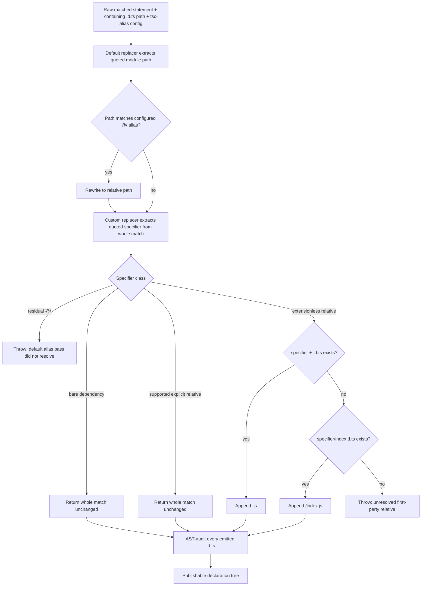
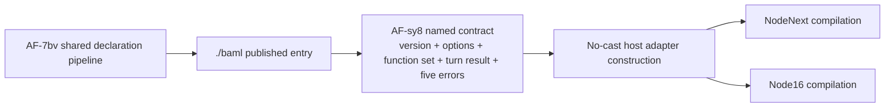

# AF-7bv NodeNext declaration pipeline system map

## System promise

After `npm run build`, every declaration in `dist/types` uses publishable module
specifiers, and a consumer installed from the real packed tarball can compile all
14 public exports under both `moduleResolution: "nodenext"` and
`moduleResolution: "node16"`.

This promise spans two issues:

- **AF-7bv** owns the shared declaration rewrite, full-tree audit, and all-export
  package boundary.
- **AF-sy8** is the named BAML-dependent subset. It becomes feasible through the
  AF-7bv pipeline, but its named types, values, and errors remain independently
  proven by `type-consumer.ts`.

The runtime `.mjs`/`.cjs` pipeline is an unchanged positive control. The change
is confined to the declaration-producing branch and its published-consumer gate.

## Current and target boundaries

| Boundary | Current state | Target contract |
|---|---|---|
| Source selection | `tsconfig.build.json` includes `src/**/*` and excludes tests/scripts/specs | Unchanged |
| Runtime producer | `tsdown` owns the 14 runtime entries, aliases, fixed `.mjs`/`.cjs` extensions, and unbundled output | Unchanged |
| Declaration producer | `tsc -p tsconfig.build.json` emits raw `.d.ts` under bundler resolution | Still the sole declaration emitter |
| Alias normalization | No declaration post-process; `@/` survives in emitted files | `tsc-alias` default replacer converts source aliases to first-party relatives |
| Relative normalization | Extensionless declaration specifiers survive | Declaration-aware custom replacer emits `.js` or `/index.js` |
| Output validation | No complete-tree declaration audit | Fatal AST audit checks the entire `dist/types` tree |
| Published boundary | B19 packs/extracts the package, then runs runtime plus bundler/node10 BAML consumers | Add NodeNext/Node16 checks for all 14 exports and the named BAML contract |

Evidence: `package.json:127-133`, `tsdown.config.mjs:4-35`,
`tsconfig.build.json:1-21`, and `test/package/run.mjs:66-177`.

## Component/system diagram

```mermaid
flowchart LR
  subgraph Source[Repository source and configuration]
    TS[src/**/*.ts]
    Entries[config/package-entries.mjs\n14 runtime entries]
    BuildCfg[tsconfig.build.json\nbundler resolution + declarationOnly]
    ExportMap[package.json exports + typesVersions]
  end

  subgraph Runtime[Runtime branch — unchanged]
    Tsdown[tsdown\nalias + fixed extension + unbundle]
    ESM[dist/esm/**/*.mjs]
    CJS[dist/cjs/**/*.cjs]
  end

  subgraph Declarations[Declaration branch — AF-7bv]
    TSC[tsc declaration emit]
    Raw[dist/types/**/*.d.ts\nraw source specifiers]
    Loader[tsc-alias loader]
    Default[default replacer\n@/x -> relative x]
    Custom[declaration-import replacer\nrelative -> .js or /index.js]
    Audit[fatal full-tree AST audit]
    Clean[dist/types/**/*.d.ts\npublishable specifiers]
  end

  subgraph Package[Published-package closure]
    Pack[npm pack --ignore-scripts]
    Extract[isolated scratch extraction]
    Installed[@librechat/agents installed tree]
    RuntimeConsumers[ESM + CJS + negative runtime consumers]
    LegacyTypes[bundler + node10\nnamed BAML consumer]
    NodeTypes[NodeNext + Node16\nall 14 + named BAML]
  end

  TS --> Tsdown
  Entries --> Tsdown
  Tsdown --> ESM
  Tsdown --> CJS

  TS --> TSC
  BuildCfg --> TSC
  TSC --> Raw
  Raw --> Loader
  Loader --> Default
  Default --> Custom
  Custom --> Audit
  Audit --> Clean

  ESM --> Pack
  CJS --> Pack
  Clean --> Pack
  ExportMap --> Pack
  Pack --> Extract --> Installed
  Installed --> RuntimeConsumers
  Installed --> LegacyTypes
  Installed --> NodeTypes

  classDef changed fill:#fff2cc,stroke:#a66d00,stroke-width:2px;
  classDef unchanged fill:#e8f5e9,stroke:#2e7d32;
  classDef boundary fill:#e3f2fd,stroke:#1565c0;
  class Loader,Default,Custom,Audit,Clean,NodeTypes changed;
  class Tsdown,ESM,CJS,RuntimeConsumers,LegacyTypes unchanged;
  class Pack,Extract,Installed,ExportMap boundary;
```

### Component ownership and seams

| Component | Owns | Input contract | Output contract |
|---|---|---|---|
| `tsdown` | Runtime transformation | `packageEntries`, source aliases | Fixed-extension `.mjs`/`.cjs`; no declarations |
| `tsc` | Declaration syntax and type shapes | Source tree plus bundler-path mapping | Raw `.d.ts`; specifiers may still be source-oriented |
| `tsc-alias` default replacer | `paths` alias mapping | Matched statement plus containing output file/config | Same matched statement with `@/` rewritten to a relative path |
| Custom declaration replacer | Node ESM relative-specifier shape | Default replacer's complete matched-string output | Same match with only its quoted specifier changed |
| Declaration audit | Complete-tree postconditions | Replacer module and every emitted `.d.ts` | Exit 0 only when loader and all specifier invariants hold |
| `package.json` export map | Public entry routing | Consumer subpath and resolution condition | Runtime or declaration entry in the extracted package |
| B19 harness | Published closure | Already-built real tarball contents | Aggregated runtime/type exit status |
| NodeNext/Node16 consumers | Final observable | Installed package plus both fixture files | Successful `tsc` exit with `skipLibCheck: false` |

## Build, package, and consumer sequence

All connectors in this sequence are synchronous; there is no queue, worker, or
eventual-consistency driver.

```mermaid
sequenceDiagram
  autonumber
  actor Developer
  participant NPM as npm scripts
  participant TD as tsdown
  participant TSC as tsc
  participant TAL as tsc-alias loader
  participant DR as default replacer
  participant CR as custom declaration replacer
  participant AU as declaration output audit
  participant B19 as test/package/run.mjs
  participant TAR as npm pack / tar
  participant NODE as runtime consumers
  participant TYPES as TypeScript consumers

  Developer->>NPM: npm run build (repository-root CWD)
  NPM->>TD: tsdown
  TD-->>NPM: dist/esm + dist/cjs
  NPM->>TSC: tsc -p tsconfig.build.json
  TSC-->>NPM: raw dist/types/**/*.d.ts
  NPM->>TAL: tsc-alias -p tsconfig.build.json
  TAL->>TAL: merge default/base-url entries before custom entries
  loop each matched import/export/module string in each emitted file
    TAL->>DR: { orig, file, config }
    DR-->>TAL: whole match; @/ rewritten to relative when resolvable
    TAL->>CR: { orig: defaultResult, file, config }
    CR-->>TAL: whole match; relative target made explicit or throw
  end
  TAL-->>NPM: rewritten dist/types
  NPM->>AU: node config/declaration-output-audit.cjs dist/types
  AU->>AU: require custom module and verify .default function
  AU->>AU: parse every .d.ts and validate every module specifier
  AU-->>NPM: exit 0 only if the complete tree is clean
  NPM-->>Developer: build success

  Developer->>NPM: npm run test:package
  NPM->>NPM: npm run test:declarations
  NPM->>B19: node test/package/run.mjs
  B19->>B19: require built ESM/CJS/BAML declaration artifacts
  B19->>TAR: npm pack --ignore-scripts
  TAR-->>B19: real tarball
  B19->>TAR: extract into isolated scratch package
  TAR-->>B19: installed @librechat/agents tree
  B19->>NODE: ESM, CJS, and negative runtime consumers
  NODE-->>B19: three exit statuses
  B19->>TYPES: bundler + node10 named-BAML checks
  TYPES-->>B19: two exit statuses
  B19->>TYPES: NodeNext + Node16, each with both fixture files
  TYPES-->>B19: all-exports + named-BAML exit statuses
  B19->>B19: aggregate failures; any nonzero is fatal
  B19-->>Developer: published-boundary result
```

Current B19's pack/extract/runtime/type sequence is implemented at
`test/package/run.mjs:66-177`. The two Node modes and the declaration test hook
are target connectors specified by the enhanced plan.

## Declaration-specifier data flow



### Matched-statement grammar

`tsc-alias` does not pass a bare path string to a replacer. It passes the whole
substring matched by its import-path grammar—for example `from './run'`,
`import('@/types')`, or `require('@/x')`. The custom replacer must preserve that
matched syntax and replace only the quoted path.

```ebnf
matched-reference = dynamic-import
                  | require-call
                  | side-effect-import
                  | from-clause
                  | module-declaration ;

dynamic-import     = "import", ws?, "(", comment?, quoted-specifier, ")" ;
require-call       = "require", ws?, "(", comment?, quoted-specifier, ")" ;
side-effect-import = "import", ws?, quoted-specifier ;
from-clause        = "from", ws?, quoted-specifier ;
module-declaration = "module", ws?, quoted-specifier ;

quoted-specifier   = quote, specifier, quote ;
quote              = "'" | '"' ;

specifier          = bare
                   | source-alias
                   | relative-explicit
                   | relative-extensionless ;

source-alias       = "@/", path-segments ;
relative-explicit  = relative-prefix, path-segments, supported-extension ;
relative-extensionless = relative-prefix, path-segments ;
relative-prefix    = "./" | "../", { "../" } ;
supported-extension = ".js" | ".mjs" | ".cjs" | ".json" | ".node" ;

bare               = package-name, [ "/", package-subpath ] ;
```

`@langchain/...` is a bare scoped package; only the exact `@/` prefix is the
repository's source alias.

### Rewrite grammar and examples

```text
bare package                         -> identity
supported explicit relative         -> identity; audit target existence
residual source alias @/...          -> fatal error
extensionless + sibling <x>.d.ts     -> <x>.js
extensionless + sibling <x>/index.d.ts -> <x>/index.js
extensionless + no declaration target -> fatal error
```

| Raw declaration example | Default output | Custom output |
|---|---|---|
| `export * from './run'` in `dist/types/index.d.ts` | unchanged | `export * from './run.js'` |
| `import type * as t from '@/types'` in `dist/types/openai/index.d.ts` | `import type * as t from '../types'` | `import type * as t from '../types/index.js'` |
| `import type { BamlClientOptions } from '@/llm/baml/types'` in BAML | relative `./types` from the containing declaration | `./types.js` |
| `export type { RunnableConfig } from '@langchain/core/runnables'` | unchanged | unchanged |
| `export * from './missing'` with no declaration target | unchanged | throws |

The custom replacer returns the complete matched string for every successful
case. It never returns only the specifier.

## `tsc-alias@1.8.10` interface contracts

The dependency is already declared at `package.json:310`; no dependency or
lockfile change belongs to this slice.

### 1. Configuration contract

`tsconfig.build.json` registers one custom key:

```json
{
  "tsc-alias": {
    "replacers": {
      "declaration-imports": {
        "enabled": true,
        "file": "./config/declaration-import-replacer.cjs"
      }
    }
  }
}
```

The custom key must remain distinct from `default` and `base-url`; this preserves
the loader's built-in-first ordering.

### 2. Replacer API contract

The installed type surface is:

```ts
interface AliasReplacerArguments {
  orig: string;
  file: string;
  config: IConfig;
}

type AliasReplacer = (args: AliasReplacerArguments) => string;
```

- `orig` is the complete regex match described above, not a bare specifier.
- `file` is the emitted declaration currently being processed; target probes are
  resolved relative to `dirname(file)`.
- `config` supplies the alias trie, path cache, and output interface.
- The return value replaces `orig` in the source, so unchanged cases return
  `orig` exactly.

Evidence: `node_modules/tsc-alias/dist/interfaces.d.ts:72-82` and
`node_modules/tsc-alias/dist/helpers/replacers.js:127-138`.

### 3. Default-before-custom ordering contract

The loader constructs `defaultReplacers`, spreads configured replacers after
them, iterates `Object.entries`, and pushes enabled functions in that order. It
then runs the complete file through each replacer sequentially. With the planned
distinct key, the custom replacer observes the default replacer's output.

```text
configured execution order = default -> [base-url when enabled] -> declaration-imports
file transformation         = replace(default) -> replace(base-url?) -> replace(custom)
```

The integration test must begin with an `@/` statement and assert one final
relative `.js` statement. That single result proves both alias resolution and
extension completion occurred in the intended order.

Evidence: `node_modules/tsc-alias/dist/helpers/replacers.js:33-70,127-138`.

### 4. CommonJS `.default` export contract

The loader uses `require(targetPath)` and reads only
`replacerModule.default`. The production module therefore exports:

```js
module.exports.default = declarationImportReplacer;
```

A plain `module.exports = declarationImportReplacer` does not satisfy the
installed loader contract.

Evidence: `node_modules/tsc-alias/dist/helpers/replacers.js:65-75`.

### 5. Repository-root CWD contract

For a relative configured `file`, the loader joins it to `process.cwd()`. The
build must invoke `tsc-alias` with the repository root as CWD; the path is not
resolved relative to `tsconfig.build.json`.

```text
process.cwd() = repository root
configured file = ./config/declaration-import-replacer.cjs
loaded path = <repository root>/config/declaration-import-replacer.cjs
```

Evidence: `node_modules/tsc-alias/dist/helpers/replacers.js:29-31,77-79`.

### 6. Why stock `resolveFullPaths` is not this connector

The stock resolver probes for `<specifier>.js` and
`<specifier>/index.js` beside the output file. A declaration-only tree contains
`.d.ts` siblings instead, so a failed probe returns the original extensionless
path. The custom connector deliberately probes declaration targets while writing
Node ESM `.js` specifiers.

Evidence: `node_modules/tsc-alias/dist/utils/import-path-resolver.js:48-66`.

## Fatal audit and failure paths

The build's connector chain uses `&&`, so any explicit nonzero exit stops later
steps. One installed-library behavior is exceptional: custom-replacer loader
diagnostics are nonfatal by default. The independent audit closes that gap.

### Audit postconditions

Before scanning declarations, `config/declaration-output-audit.cjs` must:

1. require `config/declaration-import-replacer.cjs`;
2. assert that its `.default` property is a function;
3. exit nonzero if either operation fails.

It then parses every `dist/types/**/*.d.ts` with the installed TypeScript parser
and fails if any module specifier:

1. begins with `@/`;
2. is a first-party relative without a supported explicit extension; or
3. is an explicit first-party relative whose declaration target does not exist.

The audit is read-only: it validates output but never rewrites it.

### Failure-mode audit

| Failure | Native behavior | Fatal owner | Observable result |
|---|---|---|---|
| `tsc` declaration error | `tsc` exits nonzero | Existing `&&` build chain | Build stops before rewrite |
| Custom file missing | `tsc-alias` logs and may continue | Audit's explicit `require` | Build exits nonzero |
| Custom module lacks `.default` function | Loader logs “not in replacer format” without exiting | Audit export-shape assertion | Build exits nonzero |
| Default replacer leaves `@/` | Custom replacer throws when loaded | Custom replacer; audit is independent backup | Build exits nonzero |
| Custom replacer cannot resolve an extensionless relative | Throw | Custom replacer | Build exits nonzero |
| Replacer regex misses a declaration form | Rewrite may appear successful | Full-tree TypeScript AST audit | Residual alias/extensionless edge is fatal |
| Explicit relative points to no declaration | Replacer intentionally preserves supported extension | Full-tree audit | Build exits nonzero |
| Audit script or tree path missing | Node/filesystem error | Build chain | Build exits nonzero |
| Required built BAML artifact missing | B19 calls `fail` immediately | `test/package/run.mjs` | Package gate exits nonzero |
| `npm pack` or extraction fails | B19 calls `fail` | `test/package/run.mjs` | Package gate exits nonzero |
| Packed artifact absent | B19 verifies extracted paths | `test/package/run.mjs` | Package gate exits nonzero |
| Any runtime/type consumer fails | B19 increments failure count | Final aggregate at `run.mjs:175-177` | Package gate exits nonzero |

The loader's nonfatal behavior is confirmed by
`node_modules/tsc-alias/dist/helpers/replacers.js:65-97`; `Output.error` defaults
`exitProcess` to false at `node_modules/tsc-alias/dist/utils/output.js:31-40`.

## All-14 export matrix

The runtime entry set in `config/package-entries.mjs:1-17` and the public map in
`package.json:11-82` describe the same 14 surfaces. The table records the current
emitted declaration result and the target package-boundary proof.

| Public export | Source entry | Published declaration | Current Node result | Target NodeNext + Node16 proof |
|---|---|---|---|---|
| `.` | `src/index.ts` | `dist/types/index.d.ts` | **Fail** — extensionless root barrel at lines 1-32 and 41-54 | Included by all-exports fixture |
| `./baml` | `src/llm/baml/index.ts` | `dist/types/llm/baml/index.d.ts` | **Fail** — `./ChatBAML`, `./errors`, `./types`; transitive `@/` aliases | All-exports fixture plus named BAML fixture; AF-sy8 dependency |
| `./openai` | `src/openai/index.ts` | `dist/types/openai/index.d.ts` | **Fail** — `@/types` at line 1 | Included by all-exports fixture |
| `./responses` | `src/responses/index.ts` | `dist/types/responses/index.d.ts` | **Fail** — `@/types` at line 1 | Included by all-exports fixture |
| `./langchain` | `src/langchain/index.ts` | `dist/types/langchain/index.d.ts` | **Fail** — eight extensionless re-exports | Included by all-exports fixture |
| `./langchain/language_models/chat_models` | `src/langchain/language_models/chat_models.ts` | `dist/types/langchain/language_models/chat_models.d.ts` | Pass — bare `@langchain/core/...` only | Included; must remain green |
| `./langchain/messages` | `src/langchain/messages.ts` | `dist/types/langchain/messages.d.ts` | Pass — bare `@langchain/core/messages` only | Included; must remain green |
| `./langchain/messages/tool` | `src/langchain/messages/tool.ts` | `dist/types/langchain/messages/tool.d.ts` | Pass — bare `@langchain/core/messages/tool` only | Included; must remain green |
| `./langchain/google-common` | `src/langchain/google-common.ts` | `dist/types/langchain/google-common.d.ts` | Pass — bare `@langchain/google-common` only | Included; must remain green |
| `./langchain/openai` | `src/langchain/openai.ts` | `dist/types/langchain/openai.d.ts` | Pass — bare `@langchain/openai` only | Included; must remain green |
| `./langchain/prompts` | `src/langchain/prompts.ts` | `dist/types/langchain/prompts.d.ts` | Pass — bare `@langchain/core/prompts` only | Included; must remain green |
| `./langchain/runnables` | `src/langchain/runnables.ts` | `dist/types/langchain/runnables.d.ts` | Pass — bare `@langchain/core/runnables` only | Included; must remain green |
| `./langchain/tools` | `src/langchain/tools.ts` | `dist/types/langchain/tools.d.ts` | Pass — bare `@langchain/core/tools` only | Included; must remain green |
| `./langchain/utils/env` | `src/langchain/utils/env.ts` | `dist/types/langchain/utils/env.d.ts` | Pass — bare `@langchain/core/utils/env` only | Included; must remain green |

The matrix has one closure assertion per resolution mode:

```text
NodeNext files = ["type-consumer.ts", "all-exports-consumer.mts"]
Node16  files = ["type-consumer.ts", "all-exports-consumer.mts"]
skipLibCheck = false in both configs
```

`all-exports-consumer.mts` proves reachability through every `exports.types`
entry. `type-consumer.ts` proves the deeper named BAML surface and cannot be
replaced by namespace-only imports.

## AF-sy8 named BAML dependency



The existing named fixture imports:

- `BAML_PORT_VERSION`;
- `BamlClientOptions`, `BamlFunctionSet`, and `BamlTurnResult`;
- `BamlNotRegisteredError`, `BamlPortVersionError`,
  `BamlToolNotBoundError`, `BamlTurnError`, and `BamlUnsupportedError`;
- and constructs a `BamlFunctionSet`/`BamlClientOptions` adapter without casts.

Evidence: `test/package/consumers/type-consumer.ts:7-39`.

The BAML declaration entry currently has extensionless edges at
`dist/types/llm/baml/index.d.ts:1-4`, while its public children retain aliases at
`dist/types/llm/baml/ChatBAML.d.ts:10-12`,
`dist/types/llm/baml/errors.d.ts:1`, and
`dist/types/llm/baml/types.d.ts:2-3`. AF-7bv rewrites those files through the
same complete-tree connector as every other declaration. No BAML implementation
or source export is changed.

## Preserved invariants and out-of-scope surfaces

- The nine clean LangChain leaf sources are not edited.
- Source imports and source barrel specifiers remain unchanged.
- Runtime `.mjs`/`.cjs` entry paths and behavior remain unchanged.
- `package.json.exports` and `typesVersions` paths remain unchanged.
- `tsc` remains the declaration producer; `tsdown` keeps `dts: false`.
- `tsc-alias` remains the installed version; no dependency or lockfile change is
  required.
- The output audit validates but never mutates declarations.
- Langfuse tracing, graphs, callbacks, providers, and streaming behavior are not
  part of this change.

## Evidence index

| Evidence | What it establishes |
|---|---|
| `package.json:11-100` | 14 public exports and `typesVersions` declaration routing |
| `package.json:127-133` | Current build, prepublish, and package-test commands |
| `package.json:310` | Installed `tsc-alias` dependency |
| `config/package-entries.mjs:1-17` | 14 runtime source entries |
| `tsdown.config.mjs:4-35` | Runtime-only transformation; declarations disabled |
| `tsconfig.build.json:1-21` | Bundler declaration-only emit into `dist/types` |
| `dist/types/index.d.ts:1-54` | Root extensionless declaration surface |
| `dist/types/langchain/index.d.ts:1-8` | LangChain barrel failure surface |
| `dist/types/openai/index.d.ts:1` | OpenAI residual alias |
| `dist/types/responses/index.d.ts:1` | Responses residual alias |
| `dist/types/llm/baml/index.d.ts:1-4` | BAML extensionless entry edges |
| `dist/types/llm/baml/ChatBAML.d.ts:10-12` | BAML transitive aliases |
| `test/package/run.mjs:66-177` | Build precondition, pack/extract, runtime consumers, type matrix, fatal aggregation |
| `test/package/consumers/type-consumer.ts:7-39` | AF-sy8 named/no-cast contract |
| `node_modules/tsc-alias/dist/interfaces.d.ts:72-82` | `{ orig, file, config }` and replacer option contracts |
| `node_modules/tsc-alias/dist/helpers/replacers.js:29-97` | CWD resolution, default-before-custom loading, `.default`, nonfatal loader errors |
| `node_modules/tsc-alias/dist/helpers/replacers.js:127-138` | Sequential whole-match invocation |
| `node_modules/tsc-alias/dist/utils/import-path-resolver.js:7-23,32-66` | Matched-reference grammar and stock `.js` sibling probes |
| `node_modules/tsc-alias/dist/utils/output.js:31-40` | Nonfatal default for loader diagnostics |
| `thoughts/searchable/shared/plans/2026-08-16-AF-7bv-nodenext-declarations.md` | Enhanced implementation contract |
| `thoughts/searchable/shared/plans/2026-08-16-AF-7bv-nodenext-declarations-REVIEW.md` | Independent contract/API review |

